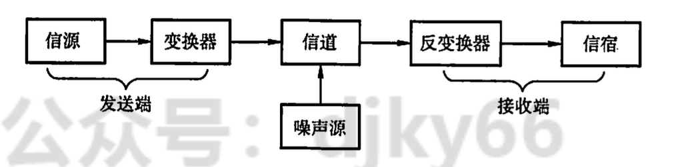
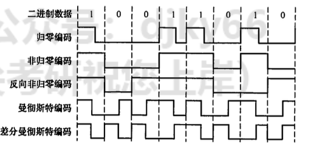
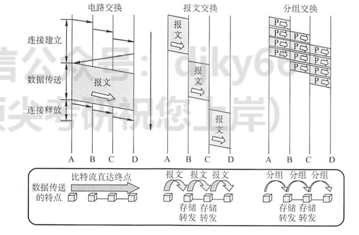

## 2.1 通信基础

### 2.1.1 编码基础

1.  数据, 信号和码元
    -   数据: 传送信息的实体
    -   信号: 是数据在传输过程中的存在形式(电气/电磁)
    -   码元: 用一个固定时长的信号波形（数字脉冲）表示一位 $k$ 进制数字.
        -   二进制表示中有两个码元, 0状态和1状态
2.  信源、信道与信宿
    -   信源: 产生和发送数据的源头。
    -   信宿: 接收数据的终点
    -   信道: 传输信息的途径



3.  交互方式

    -   单项通信: 电视广播
    -   双向通信: 2条信道
        -   半双工通信: 任何一方都不能同时发送和接收信息
        -   全双工通信: 可以同时发送和接收信息

4.  速率、波特与带宽

    -   码元传输速率(波特率): 单位时间内数字通信系统所传输的码元个数 (也可称为脉冲个数或信号变化的次数)，单位是波特 (Baud)。

    -   信息传输速率(信息速率、比特率): 单位时间内数字通信系统传输的二进制码元个数 (即比特数)， 单位是比特/秒(b/s)

    -   若一个码元携带 $n$ 个bit的信息量, 那么$M$波特率的码元传输速率对应的信息传输速率为$Mn$ bit/s.

5.  奈奎斯特定理与香农定理

    -   奈查斯特定理: 在理想低通(没有噪声、带宽有限)的信道中, 为了避免码间串扰, 极限码元传输速率为 $2 W$ 波特, 理想低通信道下的极限数据传输速率 $=2 W \log _2 V$ (单位为 $\mathrm{b} / \mathrm{s}$ )

        -   $W$ 是理想低通信道的带宽。

        -   $V$ 表示每个码元离散电平的数目

        -   推论: 所以要提高数据传输速律，就必须设法使每个码元携带更多比特的信息量，此时就需要采用多元制的调制方法

    -   Shannon定理: 带宽受限且有高斯白噪声干扰的信道的极限数据传输速率，当用信道的极限数据传输速率 $=W \log _2(1+S / N) \quad$ （单位为 $\mathrm{b} / \mathrm{s} ）$进行传输时，可以做到不产生误差。

        -   $W$ 为信道的带宽

        -   $S$ 为信道所传输信号的平均功率

        -   $N$ 为信道内部的高斯噪声功率

        -   $S / N$为信噪比, 即信号的平均功率与噪声的平均功率之比

        ```         
        -   信噪比 $=10 \log _{10}(S / N)$ (单位为 $\mathrm{dB}$ ), 例如当 $S / N=10$ 时, 信噪比为 $10 \mathrm{~dB}$, 而当 $S / N=1000$ 时, 信噪比为 $30 \mathrm{~dB}$ 。
        ```

6.  编码与调制

    -   归零编码RZ: 高1低0, 时钟中间会跳到0(基准时钟)

    -   非归零编码NRZ: 不跳, 但是要校准时钟

    -   反向非归零编码NRZI: 信号翻转=0, 信号不变=1(USB2.0)

    -   曼彻斯特编码: 码元分成两个相等的间隔， 前一个间隔为高电平而后一个间隔为低电平表示码元1. 0相反

        -   以太网

    -   差分曼彻斯特编码:局域网传输，其规则是:若码元为1，则前 半个码元的电平与上一码元的后半个码元的电平相同;

    -   4B/5B编码: 将欲发送数据流的每4 位作为一组，然后按照4B/5B编码规则将其转换成 相应的5 位码。5 位码共32种组合，但只采用其中的16种对应16种不同的4 位码，其 他 16 种作为控制码 (帧的开始和结束、线路的状态信息等)或保留。



### 2.1.2 交换机制



1.  数据交换方式
    -   电路交换: 数据传输前，两个结点之间必须先建立一条专用 (双方独占)的物理通信路径 (由通 信双方之间的交换设备和链路逐段连接而成)，该路径可能经过许多中间结点。这一路径在整个 数据传输期间一直被独占，直到通信结束后才被释放。
        -   在数据传输的过程中，用户始终占用端到端的固定传输带宽。
    -   报文交换
        -   数据交换的单位是报文(有目标地址、源地址等信息)
        -   存储转发的传输方式
    -   分组交换
        -   限制了每次传送的数据块大小的上限，把大的数据块划分为合理的小数据块
        -   加上一 些必要的控制信息 (如源地址、目的地址和编号信息等)，构成分组 (Packet )。
        -   网络结点根据控 制信息把分组送到下 一个结点，下一个结点接收到分组后，暂时保存并排队等待传输，然后根据 分 组 控 制 信 息 选 择 它 的 下 一个 结 点 ， 直 到 到 达 目 的 结 点 。
2.  数据报
    -   含义: 端系统发送 一个报文时拆成若干 带有序号的数据单元，并在网络层加上地址等控制信息后形成数据报分组中间结点存储分组很短一段时间，找到最佳的路由后，尽快转发每个分 组。不同的分组可以走不 同的路径，也可以按不同的顺序到达目的 结点。
    -   过程
        -   主机A先将分组逐个发往与它直接相连的交换结点A，交换结点A缓存收到的分组。
        -   然后查找自己的转发表。由于不同时刻的网络状态不同，因此转发表的内容可能不完全 相同，所以有的分组转发给交换结点C，有的分组转发给交换结点D。
        -   网络中的其他结点收到分组后，类似地转发分组，直到分组最终到达主机B。
3.  虚电路
    -   含义: 将 数 据 报 方式 与 电 路 交 换 方 式 结 合 起 来


## 2.2 物理层设备

1.  设备规范: 机械特性、电气特性、功能特性 、规程特性。
2.  设备
    -   中继器
    -   集线器(hub): 多端口的中继器
