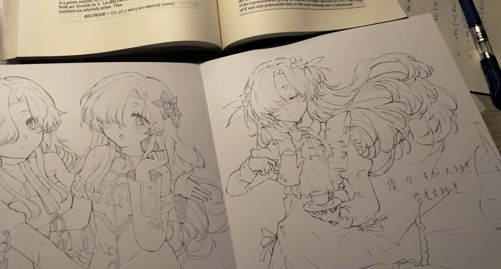
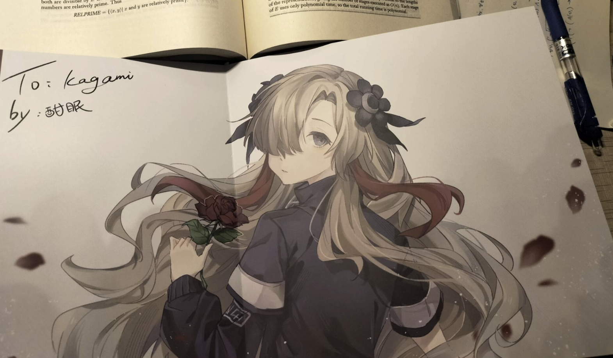
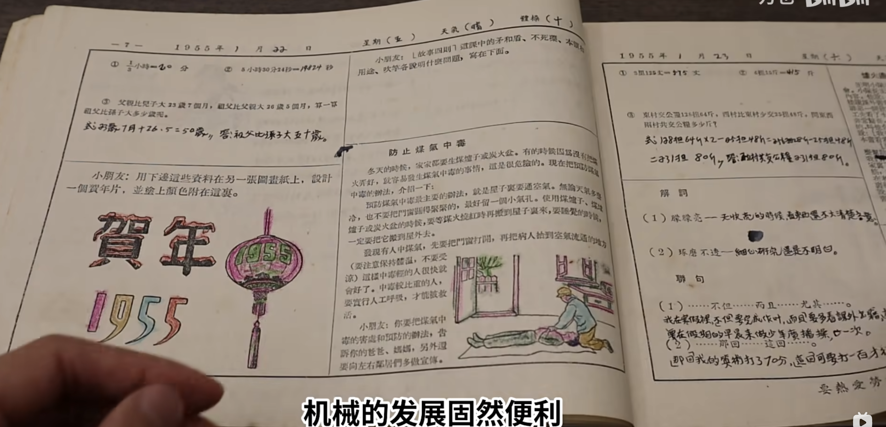
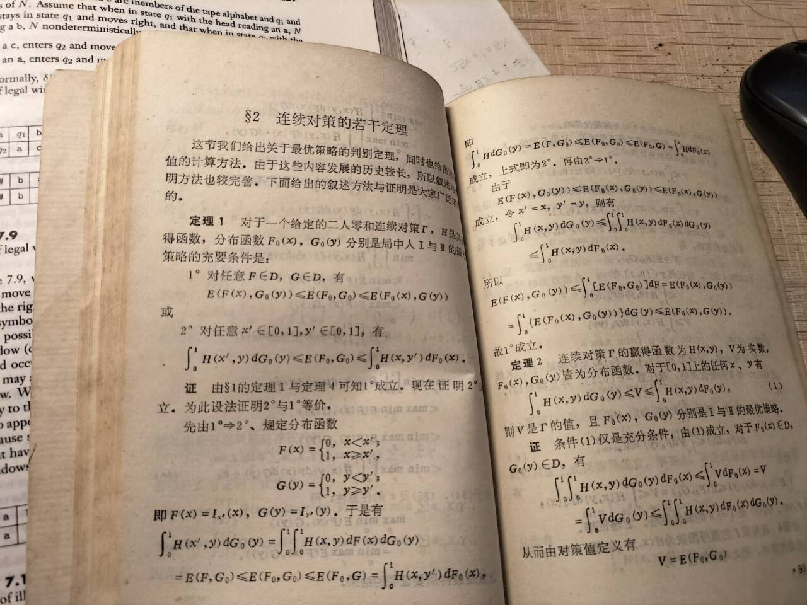

# 那些难以被$\LaTeX$记录下来的

$\LaTeX$是门编程语言. 在设计一门编程语言的时候难免有取舍. 通常, 我会极力赞美使用$\TeX$排印的文档. 公式一多, 使用$\TeX$相较于 MathType, 写着方便, 读着好受. 

最近我接触到了一些不是用$\TeX$排印的书本. 其中给我留下深刻印象的有两类. 

第一类是同学送的插画集. 她自己精心地绘制插画, 来描述自己内心的变化. 对于我这种看到书一样的东西就会不经意地想想怎么用$\TeX$实现的习惯来讲, 无疑是降维打击. 人类的创意是无限的, 计算机程序只能把那一部分机械的内容分担走. 

(画得好棒! 不过可能还需要一部分时间搞清楚表达的情绪, 不要急... 虽然我也很希望我能画点什么, 但是最后只能画一堆示意图, 做一些胡言乱语的标注... )

第二类大概就是计算机排版出现之前的铅印书籍. 其中的句子大多简洁干练, 重点突出, 读起来朗朗上口, 引人入胜. 一定是顶尖的作者倾注了大量的心血, 才能写出这样的文本. 

(1980s的小学生寒假作业, 截取自 一万也@bilibili: [机械时代的诅咒？为什么我国的作业册越来越丑？](https://www.bilibili.com/video/BV1r1421o7of/))

(《对策论基础》张盛开编著, 华中工学院出版社, 1985年6月第一版)