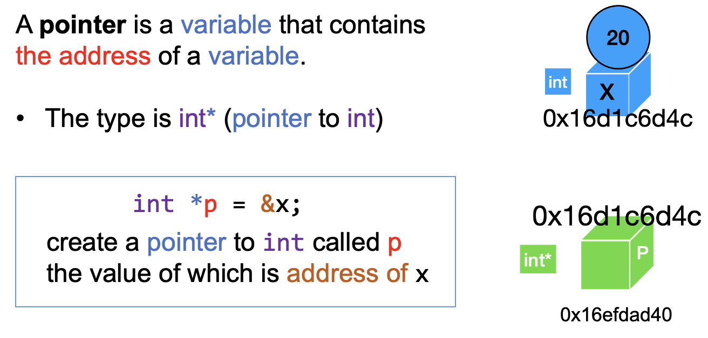
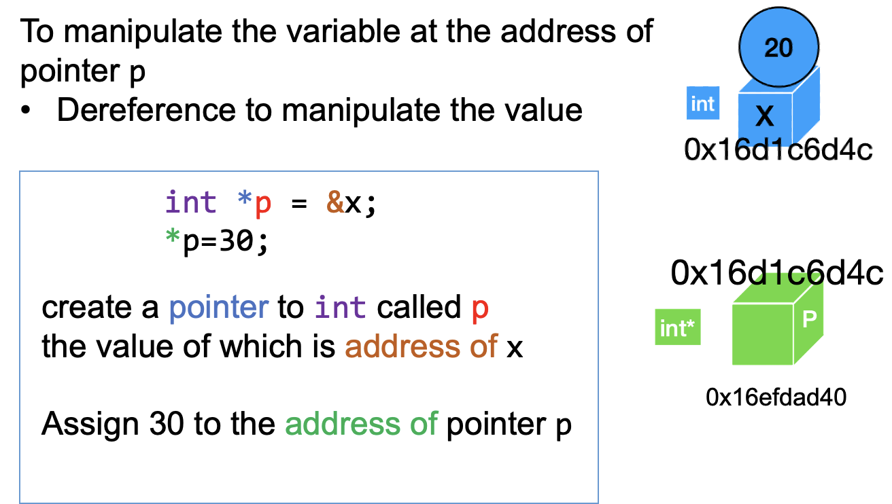
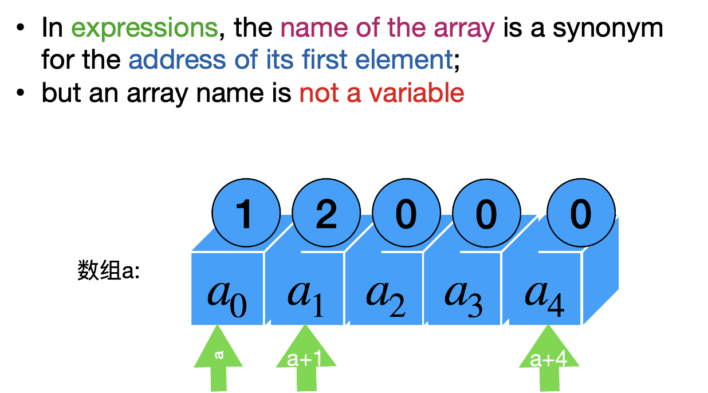
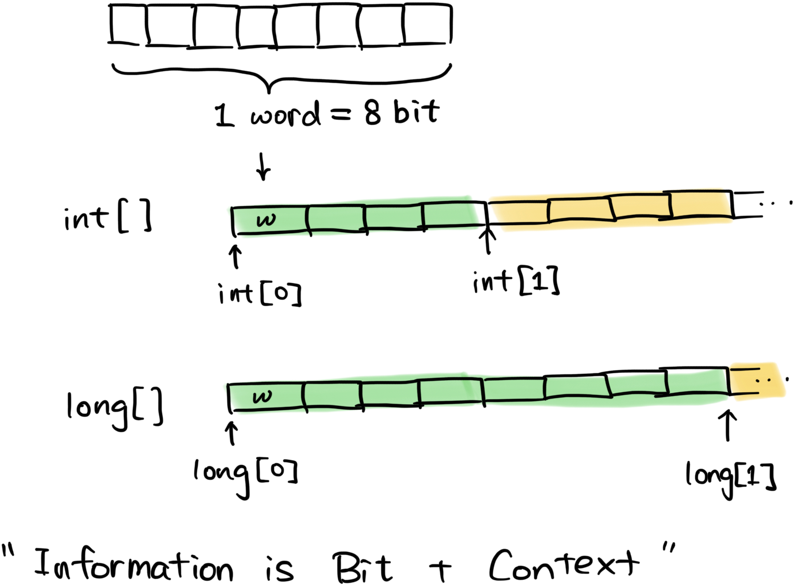
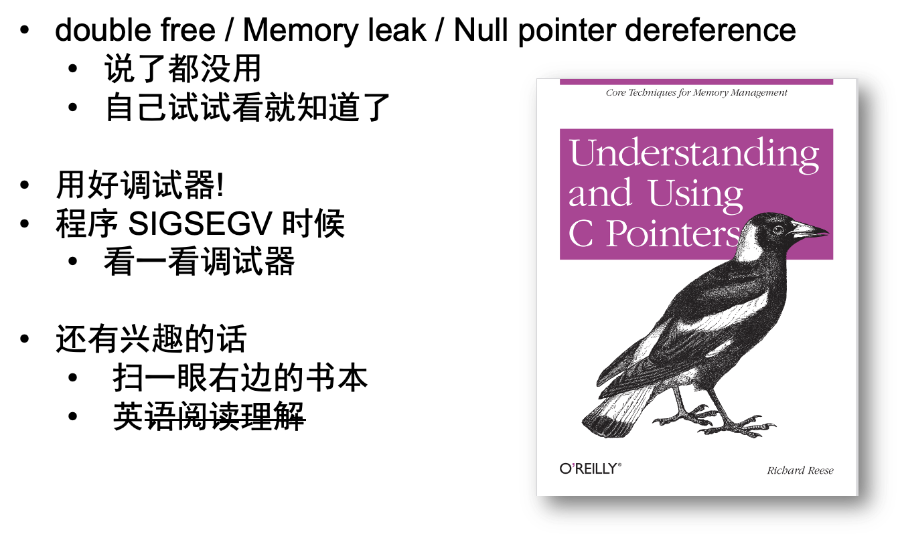
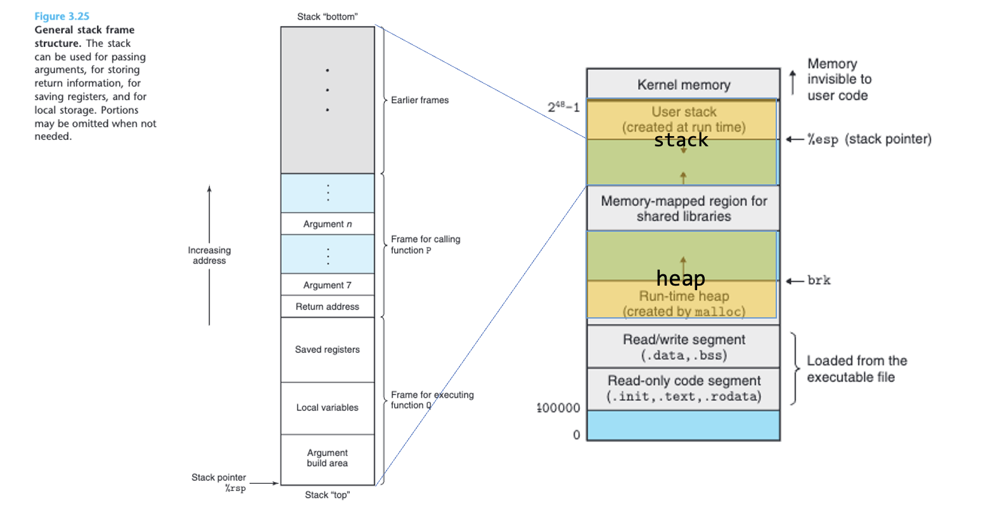
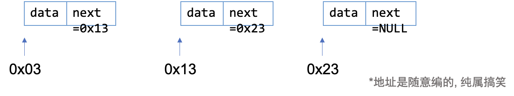
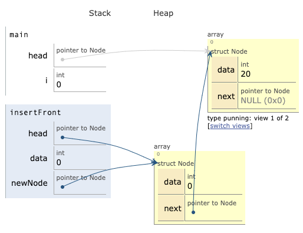

# 01. C 语言回顾

**视频回放**: [1B 链表](https://www.acfun.cn/v/ac43738810?shareUid=56010343)

目标: 回顾 C 语言的一些可能会忘记的比较多的特性. 

## 重新看一眼变量

[例子1] 实现猜数游戏. (review-c/numguess-gpt.c)

- C 程序的`=`不是数学上的`=`. 更像是$\leftarrow$
    - 具有副作用, 影响其他变量

需要注意: 基本的控制语句等

[例子2] 实现交换两个变量的程序. (review-c/swap-w.c)

- 不使用函数的时候 totally fine
- 使用函数的时候: 函数是怎么传参的?

<iframe width="800" height="500" frameborder="0" src="https://pythontutor.com/iframe-embed.html#code=%23include%20%3Cstdio.h%3E%0A%0Avoid%20swap%28int%20x,%20int%20y%29%7B%0A%20%20%20%20int%20tmp%20%3D%20x%3B%0A%20%20%20%20x%20%3D%20y%3B%0A%20%20%20%20y%20%3D%20tmp%3B%0A%7D%0A%0Aint%20main%28%29%7B%0A%20%20%20%20int%20x%3D1,%20y%3D2%3B%0A%20%20%20%20swap%28x,%20y%29%3B%0A%20%20%20%20printf%28%22x%3D%25d,%20y%3D%25d%22,%20x,%20y%29%3B%0A%20%20%20%20return%200%3B%0A%7D&codeDivHeight=400&codeDivWidth=350&cumulative=false&curInstr=0&heapPrimitives=nevernest&origin=opt-frontend.js&py=c_gcc9.3.0&rawInputLstJSON=%5B%5D&textReferences=false"> </iframe>

### About variable.

- A variable has type, value, address
- A variable can be used as a lvalue or a rvalue
    - lvalue = value on the left
    - rvalue = value on the right

{width=500px}

数组表示的时候, 二维数组只是为了方便起见画成二维的  

- 实际上可以把二维的转化为一维的

### 与地址相关的操作: &(address of)、*(pointer deref)

获取变量的地址

{width=500px}

指针解引用

{width=500px}

数组与指针

{width=500px}

更多内容请参看[这里](https://www.bilibili.com/video/BV1aN411M7Fx)

- 上述内容已经足够使用了. 

## 结构体`struct`

二进制内存单元

{width=400}

- 可以用`sizeof`看一个类型占用多少byte(大格子).

结构体: 把各种东西放在一起

例子: 学生成绩管理系统

## 动态分配/释放内存

- 局部变量
    - 随着函数返回销毁
- 全局变量
    - 在函数里面声明 “全局变量” $\rightarrow$ malloc
    - 销毁 $\rightarrow$ free

<iframe width="800" height="500" frameborder="0" src="https://pythontutor.com/iframe-embed.html#code=int%20main%28%29%7B%0A%20%20%20%20int%20*s%3D%20%28int%20*%29malloc%2824%29%3B%0A%20%20%20%20long%20*p%3D%20%28long%20*%29malloc%285*sizeof%28long%29%29%3B%0A%20%20%20%20return%200%3B%0A%7D&codeDivHeight=400&codeDivWidth=350&cumulative=false&curInstr=3&heapPrimitives=nevernest&origin=opt-frontend.js&py=c_gcc9.3.0&rawInputLstJSON=%5B%5D&textReferences=false"> </iframe>

结构体也是一样

<iframe width="800" height="500" frameborder="0" src="https://pythontutor.com/iframe-embed.html#code=%23include%20%3Cstdio.h%3E%0A%0A%23define%20MAX_STUDENTS%205%0A%23define%20NAME_LENGTH%2050%0A%0A//%20%E5%AE%9A%E4%B9%89%E5%AD%A6%E7%94%9F%E7%BB%93%E6%9E%84%E4%BD%93%0Atypedef%20struct%20%7B%0A%20%20%20%20char%20name%5BNAME_LENGTH%5D%3B%0A%20%20%20%20int%20score%3B%0A%7D%20Student%3B%0A%0A//%20%E5%87%BD%E6%95%B0%E5%A3%B0%E6%98%8E%0Avoid%20displayScores%28const%20Student%20students%5B%5D,%20int%20studentCount%29%3B%0Afloat%20calculateAverage%28const%20Student%20students%5B%5D,%20int%20studentCount%29%3B%0A%0Aint%20main%28%29%20%7B%0A%20%20%20%20//%20%E4%BD%BF%E7%94%A8%E9%A2%84%E8%AE%BE%E7%9A%84%E5%AD%A6%E7%94%9F%E6%95%B0%E6%8D%AE%0A%20%20%20%20Student%20students%5BMAX_STUDENTS%5D%20%3D%20%7B%0A%20%20%20%20%20%20%20%20%7B%22%E5%AD%A6%E7%94%9FA%22,%2085%7D,%0A%20%20%20%20%20%20%20%20%7B%22%E5%AD%A6%E7%94%9FB%22,%2092%7D,%0A%20%20%20%20%20%20%20%20%7B%22%E5%AD%A6%E7%94%9FC%22,%2088%7D,%0A%20%20%20%20%20%20%20%20%7B%22%E5%AD%A6%E7%94%9FD%22,%2076%7D,%0A%20%20%20%20%20%20%20%20%7B%22%E5%AD%A6%E7%94%9FE%22,%2090%7D%0A%20%20%20%20%7D%3B%0A%20%20%20%20int%20studentCount%20%3D%20MAX_STUDENTS%3B%0A%0A%20%20%20%20//%20%E6%98%BE%E7%A4%BA%E5%AD%A6%E7%94%9F%E6%88%90%E7%BB%A9%0A%20%20%20%20displayScores%28students,%20studentCount%29%3B%0A%0A%20%20%20%20//%20%E8%AE%A1%E7%AE%97%E5%B9%B6%E6%98%BE%E7%A4%BA%E5%B9%B3%E5%9D%87%E5%88%86%0A%20%20%20%20float%20average%20%3D%20calculateAverage%28students,%20studentCount%29%3B%0A%20%20%20%20printf%28%22%E6%89%80%E6%9C%89%E5%AD%A6%E7%94%9F%E7%9A%84%E5%B9%B3%E5%9D%87%E6%88%90%E7%BB%A9%E6%98%AF%EF%BC%9A%25.2f%5Cn%22,%20average%29%3B%0A%0A%20%20%20%20return%200%3B%0A%7D%0A%0A//%20%E5%AE%9E%E7%8E%B0%E6%98%BE%E7%A4%BA%E5%AD%A6%E7%94%9F%E6%88%90%E7%BB%A9%E7%9A%84%E5%87%BD%E6%95%B0%0Avoid%20displayScores%28const%20Student%20students%5B%5D,%20int%20studentCount%29%20%7B%0A%20%20%20%20printf%28%22%E5%AD%A6%E7%94%9F%E7%9A%84%E6%88%90%E7%BB%A9%E5%A6%82%E4%B8%8B%EF%BC%9A%5Cn%22%29%3B%0A%20%20%20%20for%20%28int%20i%20%3D%200%3B%20i%20%3C%20studentCount%3B%20i%2B%2B%29%20%7B%0A%20%20%20%20%20%20%20%20printf%28%22%25s%3A%20%25d%5Cn%22,%20students%5Bi%5D.name,%20students%5Bi%5D.score%29%3B%0A%20%20%20%20%7D%0A%7D%0A%0A//%20%E5%AE%9E%E7%8E%B0%E8%AE%A1%E7%AE%97%E5%B9%B3%E5%9D%87%E5%88%86%E7%9A%84%E5%87%BD%E6%95%B0%0Afloat%20calculateAverage%28const%20Student%20students%5B%5D,%20int%20studentCount%29%20%7B%0A%20%20%20%20int%20total%20%3D%200%3B%0A%20%20%20%20for%20%28int%20i%20%3D%200%3B%20i%20%3C%20studentCount%3B%20i%2B%2B%29%20%7B%0A%20%20%20%20%20%20%20%20total%20%2B%3D%20students%5Bi%5D.score%3B%0A%20%20%20%20%7D%0A%20%20%20%20return%20%28float%29total%20/%20studentCount%3B%0A%7D&codeDivHeight=400&codeDivWidth=350&cppShowBinary=true&cppShowMemAddrs=true&cumulative=false&curInstr=19&heapPrimitives=nevernest&origin=opt-frontend.js&py=c_gcc9.3.0&rawInputLstJSON=%5B%5D&textReferences=false"> </iframe>

<iframe width="800" height="500" frameborder="0" src="https://pythontutor.com/iframe-embed.html#code=typedef%20struct%20Test%7B%0A%20%20int%20a%3B%20int%20b%3B%20long%20c%3B%20short%20d%3B%0A%7DTest%3B%0A%0Aint%20main%28%29%7B%0A%20%20%20%20struct%20Test%20*s%3D%20%28Test%20*%29malloc%285*sizeof%28Test%29%29%3B%0A%20%20%20%20return%200%3B%0A%7D&codeDivHeight=400&codeDivWidth=350&cumulative=false&curInstr=3&heapPrimitives=nevernest&origin=opt-frontend.js&py=c_gcc9.3.0&rawInputLstJSON=%5B%5D&textReferences=false"> </iframe>

Traps and pitfalls...

{width=400}

事情的全貌: 

## 实现链表

**为什么需要?**

- 数组: 声明之后定好长度
- 链表: 不用定长度, 想多长都可以

**维护什么样的结构?**

- 链表的第一个元素是谁? 
- 任意一个链表元素, 它的下一号元素(`next`)是谁? 

使用数学归纳法, 就可以访问数据结构的所有元素. 

{width=600px}

<iframe width="800" height="500" frameborder="0" src="https://pythontutor.com/iframe-embed.html#code=struct%20Node%7B%0A%20%20struct%20Node%20*nxt%3B%0A%20%20int%20val%3B%0A%7D%3B%0A%0A%23define%20NULL%200%0A%0Aint%20main%28%29%7B%0A%20%20%20%20struct%20Node%20n%20%3D%20%7B%0A%20%20%20%20%20%20.val%20%3D%201,%20%0A%20%20%20%20%20%20.nxt%20%3D%20NULL,%0A%20%20%20%20%7D%3B%0A%20%20%20%20struct%20Node%20n2%20%3D%20%7B%0A%20%20%20%20%20%20.val%20%3D%202,%20%0A%20%20%20%20%20%20.nxt%20%3D%20%26n,%0A%20%20%20%20%7D%3B%0A%20%20%20%20return%200%3B%0A%7D&codeDivHeight=400&codeDivWidth=350&cumulative=false&curInstr=2&heapPrimitives=nevernest&origin=opt-frontend.js&py=c_gcc9.3.0&rawInputLstJSON=%5B%5D&textReferences=false"> </iframe>

**下一步: 让计算机自动维护**

a) 增加节点

<iframe width="800" height="500" frameborder="0" src="https://pythontutor.com/iframe-embed.html#code=typedef%20struct%20Node%20%7B%0A%20%20%20%20int%20data%3B%0A%20%20%20%20struct%20Node*%20next%3B%0A%0A%7D%20Node%3B%0A%0A%0ANode*%20createNode%28int%20data%29%20%7B%0A%20%20%20%20Node*%20newNode%20%3D%20%28Node*%29malloc%28sizeof%28Node%29%29%3B%0A%20%20%20%20%0A%20%20%20%20newNode-%3Edata%20%3D%20data%3B%0A%20%20%20%20newNode-%3Enext%20%3D%200%3B%0A%20%20%20%20return%20newNode%3B%0A%20%20%20%20%0A%7D%0A%0Avoid%20insertFront%28Node*%20head,%20int%20data%29%20%7B%0A%20%20%20%20Node*%20newNode%20%3D%20createNode%28data%29%3B%0A%20%20%20%20newNode-%3Enext%20%3D%20head%3B%0A%20%20%20%20head%20%3D%20newNode%3B%0A%7D%0A%0Aint%20main%28%29%7B%0A%20%20%20%20Node%20*head%20%3D%20createNode%2820%29%3B%0A%20%20%20%20for%28int%20i%3D0%3B%20i%3C10%3B%20i%2B%2B%29%7B%0A%20%20%20%20%20%20%20%20insertFront%28head,%20i%29%3B%0A%20%20%20%20%7D%0A%7D&codeDivHeight=400&codeDivWidth=350&cumulative=false&curInstr=21&heapPrimitives=nevernest&origin=opt-frontend.js&py=c_gcc9.3.0&rawInputLstJSON=%5B%5D&textReferences=false"> </iframe>

{width=600px}

- 啊呀! head随着插入过程跑走了!
- 方法: 
    - 套一个大的结构体(例如链表)
    - 使用双重指针(Urggggh!)

b) 删除节点

- 找到, 删了就行了
- 删的时候: 前面的next粘过来

<iframe width="800" height="500" frameborder="0" src="https://pythontutor.com/iframe-embed.html#code=typedef%20struct%20Node%20%7B%0A%20%20%20%20int%20data%3B%0A%20%20%20%20struct%20Node*%20next%3B%0A%0A%7D%20Node%3B%0A%0A%23define%20NULL%200%0ANode*%20createNode%28int%20data%29%20%7B%0A%20%20%20%20Node*%20newNode%20%3D%20%28Node*%29malloc%28sizeof%28Node%29%29%3B%0A%20%20%20%20%0A%20%20%20%20newNode-%3Edata%20%3D%20data%3B%0A%20%20%20%20newNode-%3Enext%20%3D%200%3B%0A%20%20%20%20return%20newNode%3B%0A%20%20%20%20%0A%7D%0A%0ANode*%20insertFront%28Node*%20head,%20int%20data%29%20%7B%0A%20%20%20%20Node*%20newNode%20%3D%20createNode%28data%29%3B%0A%20%20%20%20newNode-%3Enext%20%3D%20head%3B%0A%20%20%20%20return%20newNode%3B%0A%7D%0A%0ANode*%20deleteNode%28Node*%20head,%20int%20key%29%20%7B%0A%20%20%20%20Node*%20current%20%3D%20head%3B%0A%20%20%20%20Node*%20prev%20%3D%20NULL%3B%0A%0A%20%20%20%20while%20%28current%20!%3D%20NULL%20%26%26%20current-%3Edata%20!%3D%20key%29%20%7B%0A%20%20%20%20%20%20%20%20prev%20%3D%20current%3B%0A%20%20%20%20%20%20%20%20current%20%3D%20current-%3Enext%3B%0A%20%20%20%20%7D%0A%0A%20%20%20%20if%20%28current%20%3D%3D%20NULL%29%20%7B%0A%20%20%20%20%20%20%20%20printf%28%22Key%20%25d%20not%20found%20in%20the%20list.%5Cn%22,%20key%29%3B%0A%20%20%20%20%20%20%20%20return%20head%3B%0A%20%20%20%20%7D%0A%0A%20%20%20%20if%20%28prev%20%3D%3D%20NULL%29%20%7B%0A%20%20%20%20%20%20%20%20//%20If%20the%20key%20is%20in%20the%20first%20node%0A%20%20%20%20%20%20%20%20head%20%3D%20current-%3Enext%3B%0A%20%20%20%20%7D%20else%20%7B%0A%20%20%20%20%20%20%20%20//%20If%20the%20key%20is%20in%20a%20middle%20or%20last%20node%0A%20%20%20%20%20%20%20%20prev-%3Enext%20%3D%20current-%3Enext%3B%0A%20%20%20%20%7D%0A%0A%20%20%20%20free%28current%29%3B%0A%20%20%20%20return%20head%3B%0A%7D%0A%0A%0Aint%20main%28%29%7B%0A%20%20%20%20Node%20*head%20%3D%20createNode%2820%29%3B%0A%20%20%20%20for%28int%20i%3D0%3B%20i%3C10%3B%20i%2B%2B%29%7B%0A%20%20%20%20%20%20%20%20head%20%3D%20insertFront%28head,%20i%29%3B%0A%20%20%20%20%7D%0A%20%20%20%20head%20%3D%20deleteNode%28head,%209%29%3B%0A%7D&codeDivHeight=400&codeDivWidth=350&cumulative=false&curInstr=150&heapPrimitives=nevernest&origin=opt-frontend.js&py=c_gcc9.3.0&rawInputLstJSON=%5B%5D&textReferences=false"> </iframe>

c) 遍历节点

依次顺下去就行了. 

### Aside: 用数组模拟指针

- 干脆开一个数组和计数器, "模拟内存地址". 

<iframe width="800" height="500" frameborder="0" src="https://pythontutor.com/iframe-embed.html#code=%23include%20%3Cbits/stdc%2B%2B.h%3E%0Ausing%20namespace%20std%3B%0A%0A%23define%20MAXN%2020%0Aint%20head,%20idx,%20e%5BMAXN%5D,%20ne%5BMAXN%5D%3B%0A%0Avoid%20init%28%29%7B%0A%20%20head%20%3D%20-1%3B%20idx%20%3D%200%3B%0A%7D%0Avoid%20prep%28int%20x%29%7B%0A%20%20e%5Bidx%5D%20%3D%20x,%20ne%5Bidx%5D%20%3D%20head,%20head%20%3D%20idx%2B%2B%3B%0A%7D%0Avoid%20add%28int%20k,%20int%20x%29%7B%0A%20%20e%5Bidx%5D%20%3D%20x%3B%0A%20%20ne%5Bidx%5D%20%3D%20ne%5Bk%5D%3B%0A%20%20ne%5Bk%5D%20%3D%20idx%2B%2B%3B%0A%7D%0Avoid%20rem%28int%20k%29%7B%0A%20%20if%28k%3D%3D-1%29%20%7B%0A%20%20%20%20head%20%3D%20ne%5Bhead%5D%3B%0A%20%20%20%20return%3B%0A%20%20%7D%0A%20%20ne%5Bk%5D%20%3D%20ne%5Bne%5Bk%5D%5D%3B%0A%7D%0Aint%20main%28%29%7B%0A%20%20int%20m%3B%20cin%3E%3Em%3B%20%0A%20%20init%28%29%3B%20%0A%20%20for%28int%20i%3D1%3B%20i%3C%3DMAXN-1%3B%20i%2B%2B%29%20ne%5Bi%5D%3D-1%3B%0A%20%20%0A%20%20prep%283%29%3B%0A%20%20prep%284%29%3B%0A%20%20prep%285%29%3B%0A%20%20%0A%20%20return%200%3B%0A%20%20%0A%7D&codeDivHeight=400&codeDivWidth=350&cumulative=false&curInstr=16&heapPrimitives=nevernest&origin=opt-frontend.js&py=cpp_g%2B%2B9.3.0&rawInputLstJSON=%5B%5D&textReferences=false"> </iframe>