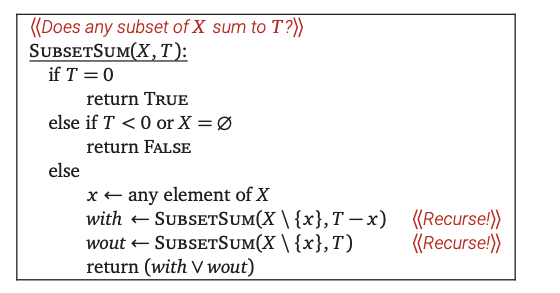

# 04. 栈, 递归, 回溯

视频回看: [4 栈和递归](https://www.acfun.cn/v/ac43755538)

## Stacks

词语本意: 

{width=500px}

- Stack: a large pile (as of hay, straw, or grain) usually shaped like a cone

What is it? 

- A stack, 2 operations
    - Push the item onto the stack
    - Pop the item out of the stack
- *Limited access*: Only push to the top and pop from the top. 

Recursive definition: 

- a stack is either empty or
- it consistes of a top and the rest which is a stack;

!!! Note
    我们并没有要求一个stack里面是怎么实现的(比如使用数组, etc.)

非常简单的实现: 使用数组
```c
#include <stdio.h>
#define MAXN 100010 // a very large number

int sta[MAXN], tp=0;

void add(int x){
    sta[tp] = x;
    tp++;
}

int pop(){
    if(tp == 0) return -1;
    return sta[tp--];
}
```

### 例子1: 表达式求值

目标: 求解`1 + ((2 + 3) * 4 + 5)*6`的值. 

三种表达式:

- 前缀表达式 + 2 5
- 中缀表达式 2+5
- 后缀表达式 2 5 +
    - 不用加括号

第一步: 从前缀表达式转为中缀表达式

- Read in the tokens one at a time
- If a token is an integer, write it into the output
- If a token is an operator, push it to the stack, if the stack is empty. If the stack is not empty, you pop entries with higher or equal priority and only then you push that token to the stack.
- If a token is a left parentheses '(', push it to the stack
- If a token is a right parentheses ')', you pop entries until you meet '('.
- When you finish reading the string, you pop up all tokens which are left there.
- Arithmetic precedence is in increasing order: '+', '-', '*', '/';

!!! Example
    For infix operation `2+(4+3*2+1)/3`
    
    - '2' - send to the output.
    - '+' - push on the stack.
    - '(' - push on the stack.
    - '4' - send to the output.
    - '+' - push on the stack.
    - '3' - send to the output.
    - '*' - push on the stack.
    - '2' - send to the output.

第二步: 求表达式的值

- We read the tokens in one at a time.
- If it is an integer, push it on the stack
- If it is a binary operator, pop the top two elements from the stack, apply the operator, and push the result back on the stack.

### 例子2: 用栈模拟递归

小代码: 

<iframe width="800" height="500" frameborder="0" src="https://pythontutor.com/iframe-embed.html#code=%23include%20%3Cstdio.h%3E%0Avoid%20hanoi%28int%20n,%20char%20from,%20char%20to,%20char%20via%29%20%7B%0A%20%20%20%20if%20%28n%20%3D%3D%201%29%20%7B%0A%20%20%20%20%20%20%20%20printf%28%22%25c%20-%3E%20%25c%5Cn%22,%20from,%20to%29%3B%0A%20%20%20%20%7D%20else%20%7B%0A%20%20%20%20%20%20%20%20hanoi%28n%20-%201,%20from,%20via,%20to%29%3B%0A%20%20%20%20%20%20%20%20hanoi%281,%20%20%20%20%20from,%20to,%20%20via%29%3B%0A%20%20%20%20%20%20%20%20hanoi%28n%20-%201,%20via,%20%20to,%20%20from%29%3B%0A%20%20%20%20%7D%0A%7D%0A%0Aint%20main%28%29%7B%0A%20%20%20%20hanoi%283,%20'A',%20'B',%20'C'%29%3B%0A%7D&codeDivHeight=400&codeDivWidth=350&cumulative=false&curInstr=0&heapPrimitives=nevernest&origin=opt-frontend.js&py=c_gcc9.3.0&rawInputLstJSON=%5B%5D&textReferences=false"> </iframe>

(选自 jyywiki )


不适用递归的代码: 

<iframe width="800" height="500" frameborder="0" src="https://pythontutor.com/iframe-embed.html#code=//%20by%20Yanyan%20Jiang%0A%0Atypedef%20struct%20%7B%0A%20%20int%20pc,%20n%3B%0A%20%20char%20from,%20to,%20via%3B%0A%7D%20Frame%3B%0A%0A%23define%20call%28...%29%20%28%7B%20*%28%2B%2Btop%29%20%3D%20%28Frame%29%20%7B%20.pc%20%3D%200,%20__VA_ARGS__%20%7D%3B%20%7D%29%0A%23define%20ret%28%29%20%20%20%20%20%28%7B%20top--%3B%20%7D%29%0A%23define%20goto%28loc%29%20%28%7B%20f-%3Epc%20%3D%20%28loc%29%20-%201%3B%20%7D%29%0A%0Avoid%20hanoi%28int%20n,%20char%20from,%20char%20to,%20char%20via%29%20%7B%0A%20%20Frame%20stk%5B10%5D,%20*top%20%3D%20stk%20-%201%3B%0A%20%20call%28n,%20from,%20to,%20via%29%3B%0A%20%20for%20%28Frame%20*f%3B%20%28f%20%3D%20top%29%20%3E%3D%20stk%3B%20f-%3Epc%2B%2B%29%20%7B%0A%20%20%20%20n%20%3D%20f-%3En%3B%20from%20%3D%20f-%3Efrom%3B%20to%20%3D%20f-%3Eto%3B%20via%20%3D%20f-%3Evia%3B%0A%20%20%20%20switch%20%28f-%3Epc%29%20%7B%0A%20%20%20%20%20%20case%200%3A%20if%20%28n%20%3D%3D%201%29%20%7B%20printf%28%22%25c%20-%3E%20%25c%5Cn%22,%20from,%20to%29%3B%20goto%284%29%3B%20%7D%20break%3B%0A%20%20%20%20%20%20case%201%3A%20call%28n%20-%201,%20from,%20via,%20to%29%3B%20%20%20break%3B%0A%20%20%20%20%20%20case%202%3A%20call%28%20%20%20%201,%20from,%20to,%20%20via%29%3B%20%20break%3B%0A%20%20%20%20%20%20case%203%3A%20call%28n%20-%201,%20via,%20%20to,%20%20from%29%3B%20break%3B%0A%20%20%20%20%20%20case%204%3A%20ret%28%29%3B%20%20%20%20%20%20%20%20%20%20%20%20%20%20%20%20%20%20%20%20%20%20%20%20break%3B%0A%20%20%20%20%7D%0A%20%20%7D%0A%7D%0A%0Aint%20main%28%29%7B%0A%20%20hanoi%283,%20'A',%20'B',%20'C'%29%3B%0A%7D&codeDivHeight=400&codeDivWidth=350&cumulative=false&curInstr=0&heapPrimitives=nevernest&origin=opt-frontend.js&py=c_gcc9.3.0&rawInputLstJSON=%5B%5D&textReferences=false"> </iframe>

```c
// by Yanyan Jiang

typedef struct {
  int pc, n;
  char from, to, via;
} Frame;

#define call(...) ({ *(++top) = (Frame) { .pc = 0, __VA_ARGS__ }; })
#define ret()     ({ top--; })
#define goto(loc) ({ f->pc = (loc) - 1; })

void hanoi(int n, char from, char to, char via) {
  Frame stk[64], *top = stk - 1;
  call(n, from, to, via);
  for (Frame *f; (f = top) >= stk; f->pc++) {
    n = f->n; from = f->from; to = f->to; via = f->via;
    switch (f->pc) {
      case 0: if (n == 1) { printf("%c -> %c\n", from, to); goto(4); } break;
      case 1: call(n - 1, from, via, to);   break;
      case 2: call(    1, from, to,  via);  break;
      case 3: call(n - 1, via,  to,  from); break;
      case 4: ret();                        break;
      default: assert(0);
    }
  }
}
```

类似地, 所有的递归程序都可以通过这样的方法转化为非递归程序. 

实际验证: 使用调试器观察程序的行为(希望早就已经知道了)

## Backtracking(回溯)

### 玩游戏: $n$皇后问题

Goal: place $n$ queens on $n \times n$ chessboard, so that no two queens are attacking each other.

- attacking means: no two queens are in the same row, the same column, or the same diagonal

Idea: Keep trying, if wrong, return the current stack frame (other stack frames will do their job)


Demonstration on $4\times 4$ chess board:


Backtracking on the problem enables us to "correct mistakes". 

- maybe you are wrong 
- but the one next to you is not, maybe.

And we can play **ANY** game -- 

```
PlayAnyGame(X, player):
  if player has already won the state X
    return GOOD
  if player has already lost in state X
    return BAD
  
  for all legal moves x->y
    if PlayAnyGame(Y, not player) == BAD
      return GOOD
  return BAD
```

## 更多的问题

### Subset sum

Given a set $X$ of positive integers and target integer $T$, is there a subset of elements in $X$ that add up to $T$ ? 

-  $X=\{8,6,7,5,3,10,9\}$ and $T=15$, the answer is TRUE, because the subsets $\{8,7\}$ and $\{7,5,3\}$ and $\{6,9\}$ and $\{5,10\}$ all sum to 15 . 
- if $X=\{11,6,5,1,7,13,12\}$ and $T=15$, the answer is FALSE.

Solution: 

-  consider an arbitrary element $x\in X$, there is a subset of $X$ that sums to $T$
    - There is a subset of $X$ that includes $x$ and whose sum is $T$.
    - There is a subset of $X$ that excludes $x$ and whose sum is $T$.



Correctness: 

- By induction! 

Time analysis:

- $T(n) \leq 2 T(n-1)+O(1) \implies T(n)=O\left(2^n\right).$

### General Pattern

- make a sequence of decisions
- the goal is building a recursively defined structure satisfying certain constraints.

Now we move on to more examples

- Text segmentation 
- Longest Increasing Subsequence

这些问题我们在后面的《动态规划》的一节中会更加详细地看一看. 