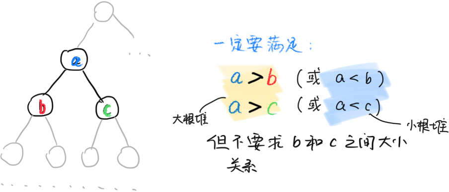

# 05. 队列, 堆和优先队列

## 队列

- 先进先出

模拟方法:

- (Easy take) 直接用数组, 头和尾用两个指针指着... 
- (Hard take) ???

现在: 希望让最大的值首先出来

## Warmup: 二叉树

方法1: 

- 回顾: 链表
    - `Node *`
- 多来几个不就可以了吗?

```c
struct BinaryTree{
    BinaryTree *left, *right;
    int val;
};
```

方法2: 如何二维的变为一维的? 

假设当前节点为$o$, 

- 左孩子: $2\times o$
- 右孩子: $2\times o +1$
- 父亲: $\lfloor o/2 \rfloor$

## 什么是堆

Defn: 

- For a node and its left and right child
    - the node is the biggest(smallest) node
    - left and right child is smaller(bigger) than the node



Helpful when: extracting the max(min) number.

Better to talk about how to *maintain* the structure. 

For convenience, we take the easy appoarch

**存储** 为了方便, 我们用一维数组来存储堆. 我们让 $x$ 的左儿子是 $2x$, 右儿子是 $2x+1$. 

**两个操作.** 以小根堆为例:

- down: 把一个节点往下调整
  - 目标: 某个数变大了, 往下移动
  - 找到自己和左右的儿子中最小者交换
- up: 把一个节点往上调整
  - 某个数变小了, 往上移动
  - 若自己比父亲节点小, 就交换

**使用拼凑**

- 插入元素: 在堆的最后一个地方插入新的数, 不断往上移动. 
- 最小值: 堆中的第一个元素
- 删除最小值: 
  - 把堆的最后一个元素覆盖堆顶的元素;
  - 然后把堆顶往下移动.
- 删除任意一个元素 $k$: 
  - 先与第 $k$ 个元素交换最后一个元素;
  - 分类讨论: 仅会执行下列三种之一:
    - 不变: 不用动
    - 变大: 往下走
    - 变小: 往上走
- 修改任意一个元素 $k$: 就像删除一样.

## 优先队列

这样, 就可以实现优先队列了. 

## 应用: 对顶堆与中位数(running median)

问题描述: 有一序列的数, 希望我们每次读取一个数的时候, 问一问这一序列的数的中位数是多少. 

解法: 

- 维护两个堆: 最大堆和最小堆(最小堆首就是中位数)
- 每当读入数字: 
	- 这个数字比最小堆堆顶元素大? 插入最小堆: 插入最大堆
	- 之后检查堆最大堆是不是超过了$\lfloor n/2 \rfloor$, 最小堆是不是超过了$\lceil n/2\rceil$. 如果超过了, 就取出超出的那个扔到不足的那个堆里面. 

