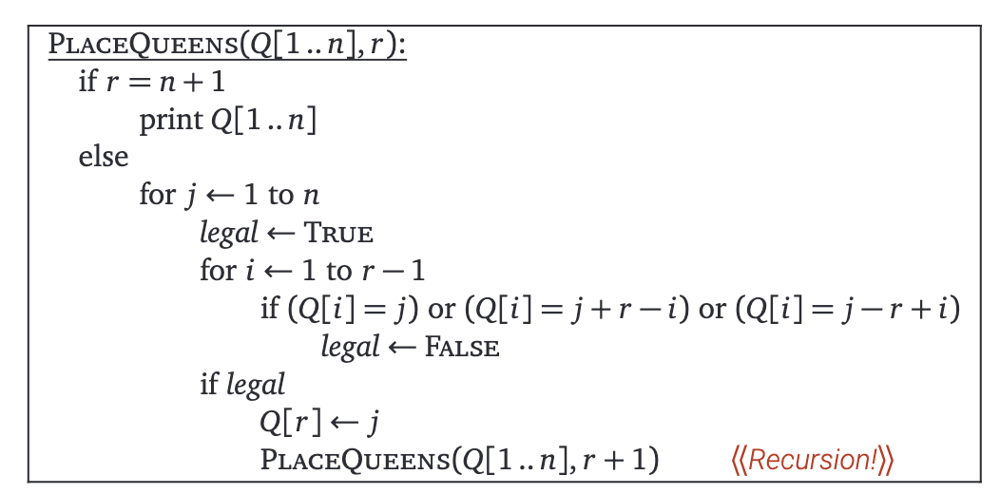
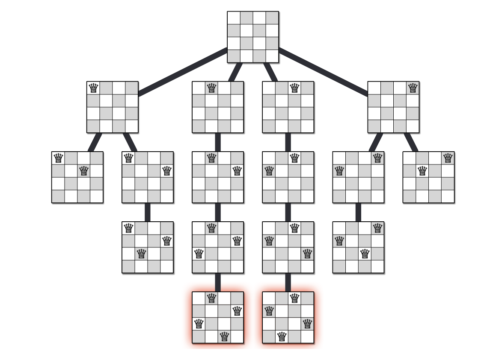

# 栈, 递归, 回溯

## Stacks

词语本意: 

- Stack: a large pile (as of hay, straw, or grain) usually shaped like a cone

What is it? 

- A stack, 2 operations
    - Push the item onto the stack
    - Pop the item out of the stack
- *Limited access*: Only push to the top and pop from the top. 

Recursive definition: 

- a stack is either empty or
- it consistes of a top and the rest which is a stack;

!!! Note
    我们并没有要求一个stack里面是怎么实现的(比如使用数组, etc.)

非常简单的实现: 使用数组
```c
#include <stdio.h>
#define MAXN 100010 // a very large number

int sta[MAXN], tp=0;

void add(int x){
    sta[tp] = x;
    tp++;
}

int pop(){
    if(tp == 0) return -1;
    return sta[tp--];
}
```

### 例子1: 表达式求值

目标: 求解`1 + ((2 + 3) * 4 + 5)*6`的值. 

三种表达式:

- 前缀表达式 + 2 5
- 中缀表达式 2+5
- 后缀表达式 2 5 +
    - 不用加括号

第一步: 从前缀表达式转为中缀表达式

- Read in the tokens one at a time
- If a token is an integer, write it into the output
- If a token is an operator, push it to the stack, if the stack is empty. If the stack is not empty, you pop entries with higher or equal priority and only then you push that token to the stack.
- If a token is a left parentheses '(', push it to the stack
- If a token is a right parentheses ')', you pop entries until you meet '('.
- When you finish reading the string, you pop up all tokens which are left there.
- Arithmetic precedence is in increasing order: '+', '-', '*', '/';

!!! Example
    For infix operation `2+(4+3*2+1)/3`
    
    - '2' - send to the output.
    - '+' - push on the stack.
    - '(' - push on the stack.
    - '4' - send to the output.
    - '+' - push on the stack.
    - '3' - send to the output.
    - '*' - push on the stack.
    - '2' - send to the output.

第二步: 求表达式的值

- We read the tokens in one at a time.
- If it is an integer, push it on the stack
- If it is a binary operator, pop the top two elements from the stack, apply the operator, and push the result back on the stack.

### 例子2: 用栈模拟递归

(选自 jyywiki )

```c
// by Yanyan Jiang

typedef struct {
  int pc, n;
  char from, to, via;
} Frame;

#define call(...) ({ *(++top) = (Frame) { .pc = 0, __VA_ARGS__ }; })
#define ret()     ({ top--; })
#define goto(loc) ({ f->pc = (loc) - 1; })

void hanoi(int n, char from, char to, char via) {
  Frame stk[64], *top = stk - 1;
  call(n, from, to, via);
  for (Frame *f; (f = top) >= stk; f->pc++) {
    n = f->n; from = f->from; to = f->to; via = f->via;
    switch (f->pc) {
      case 0: if (n == 1) { printf("%c -> %c\n", from, to); goto(4); } break;
      case 1: call(n - 1, from, via, to);   break;
      case 2: call(    1, from, to,  via);  break;
      case 3: call(n - 1, via,  to,  from); break;
      case 4: ret();                        break;
      default: assert(0);
    }
  }
}
```

类似地, 所有的递归程序都可以通过这样的方法转化为非递归程序. 

## Backtracking(回溯)

### $n$皇后问题

Goal: place $n$ queens on $n \times n$ chessboard, so that no two queens are attacking each other.

- attacking means: no two queens are in the same row, the same column, or the same diagonal

Idea: Keep trying, if wrong, return the current stack frame (other stack frames will do their job)



Demonstration on $4\times 4$ chess board:

