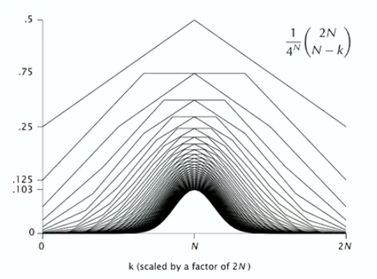
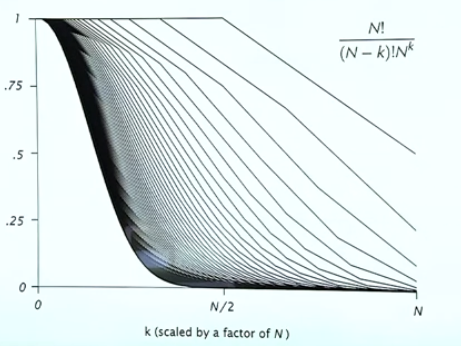

# Bivariate Asymptotics

Sometimes it's needed for 2 parameters. 

- size and cost

Challenges:

- asymptotics depends on relative values of variables
- may need to approximate sums over whole range of relative values.


Example 1: Binomial distribution $\quad \frac{1}{4^N}{2N\choose N-K}$. 

- $\sim \frac{1}{\sqrt{\pi N}}$ for $k=0$ 
- exponentially small for $k$ close to $N$

Example 2: Q distribution $N! \over (N-k)!N^k$
- $\sim 1$ for $k=0$
- exponentially small for $k$ close to $N$. 


{width=600px}



{width=600px}

## Q-distribution

With Stirling approx. we have $\ln N !=\left(N+\frac{1}{2}\right) \ln N-N+\ln \sqrt{2 \pi}+O\left(\frac{1}{N}\right)$. Then 
$\frac{N !}{(N-k) ! N^k}=\exp (\ln N !-\ln (N-k) !-k \ln N)$ yields 

$$
\begin{aligned}= & \exp \left(\left(N+\frac{1}{2}\right) \ln N-N+\ln \sqrt{2 \pi}\right. \\ & \left.\quad-\left(N-k+\frac{1}{2}\right) \ln (N-k)+N-k-\ln \sqrt{2 \pi}-k \ln N+O\left(\frac{1}{N}\right)\right) \\ = & \exp \left(-\left(N-k+\frac{1}{2}\right) \ln \left(1-\frac{k}{N}\right)-k+O\left(\frac{1}{N}\right)\right)\end{aligned}
$$

Expand by $\ln \left(1-\frac{k}{N}\right)=-\frac{k}{N}-\frac{k^2}{2 N^2}+O\left(\frac{k^3}{N^3}\right)$, yields 

$$
\begin{aligned} & =\exp \left(k+\frac{k^2}{2 N}-\frac{k^2}{N}-k+O\left(\frac{k^3}{N^2}\right)+O\left(\frac{k}{N}\right)\right) \\ & =e^{-k^2 / 2 N}\left(1+O\left(\frac{k^3}{N^2}\right)+O\left(\frac{k}{N}\right)\right)\end{aligned}
$$

## Binomial Distribution

${2 N \choose N-k}=\exp (\ln (2 N !)-\ln (N-k) !-\ln (N+k) !)$

Using Stirling's approximation, yielding 

$$
\begin{aligned}
= & \exp \left(\left(2 N+\frac{1}{2}\right) \ln (2 N)-2 N+\ln \sqrt{2 \pi}+O(1 / N)\right. \\
& -\left(N-k+\frac{1}{2}\right) \ln (N-k)-N+k-\ln \sqrt{2 \pi}+O(1 / N) \\
& \left.-\left(N+k+\frac{1}{2}\right) \ln (N+k)-N-k-\ln \sqrt{2 \pi}+O(1 / N)\right) \\
= & \exp \left((2 N) \ln 2-\ln \sqrt{\pi N}-\left(N-k+\frac{1}{2}\right) \ln \left(1-\frac{k}{N}\right)-\left(N+k+\frac{1}{2}\right) \ln \left(1+\frac{k}{N}\right)+O(1 / N)\right)
\end{aligned}
$$

Rearrange them 

$$
\begin{aligned}
& =\exp (2 N) \ln 2-\ln \sqrt{\pi N} \\
& \left.\quad-\left(N+\frac{1}{2}\right)\left(\ln \left(1-\frac{k}{N}\right)+\ln \left(1+\frac{k}{N}\right)\right)+k\left(\ln \left(1-\frac{k}{N}\right)-\ln \left(1+\frac{k}{N}\right)\right)+O(1 / N)\right)
\end{aligned}
$$

Expand $\ln(1-k/N)$ and $\ln (1+k/N)$ yields 

$$
=\exp \left((2 N) \ln 2-\ln \sqrt{\pi N}-\frac{k^2}{N}+O\left(\frac{k^4}{N^3}\right)+O\left(\frac{1}{N}\right)\right)
$$

That is, 

$$
\frac{e^{-k^2 / N}}{\sqrt{\pi N}}\left(1+O\left(\frac{k^4}{N^3}\right)+O\left(\frac{1}{N}\right)\right)
$$

## Fundamental Bivariate approximations

| Name | Kind | uniform | central |
| -- | -- | -- | -- |
| normal | $2N \choose N-k$ | $\frac{e^{-R^2 / N}}{\sqrt{\pi N}}+O\left(\frac{1}{N^{3 / 2}}\right)$ |$\frac{\mathrm{e}^{-k^2 / N}}{\sqrt{\pi N}}\left(1+O\left(\frac{1}{N}\right)+O\left(\frac{k^4}{N^3}\right)\right)$|
| Poisson | ${N \choose k}\left(\frac{\lambda}{N}\right)^k\left(1-\frac{\lambda}{N}\right)^{N-k}$ | $\frac{\lambda^k \mathrm{e}^{-\lambda}}{k !}+o(1)$ | $\frac{\lambda^k e^{-\lambda}}{k !}\left(1+O\left(\frac{1}{N}\right)+O\left(\frac{k}{N}\right)\right)$ |
| Q | $\frac{N !}{(N-k) ! N^k}$ | $e^{-k^2 /(2 N)}+O\left(\frac{1}{\sqrt{N}}\right)$ | $\mathrm{e}^{-k^2 /(2 N)}\left(1+O\left(\frac{k}{N}\right)+O\left(\frac{k^3}{N^2}\right)\right)$ | 

## Approximating sums via Bivariate asymptotics

Example: Q function 

$$
Q(N) := \sum_{1 \leq k \leq N} \frac{N !}{(N-k) ! N^k}
$$

Observatiens:

- nearly 1 for small k
- negligable for large $k$
- bivariate asymptotics needed to give different estimates in different rasges.

**Laplace Method**. To approximate a sum:

- Restrict the range to an area that contains the largest summands.
- find approximate to summand 
- extend the range by bounding the tails to get a simpler sum 

Restrict the range to an area that contains the largest summands.

$$ 
Q(N)=\sum_{1 \leq k \leq h_0} \frac{N !}{(N-k) ! N^k}+\sum_{k_0<k \leq N} \frac{N !}{(N-k) ! N^k}
$$

Take $k_0=o\left(N^{2 /3}\right)$ to make tail exponentially small.

Approximate the summand, yielding 

$$
\sum_{1 \leq k \leq h_0} \frac{N !}{(N-k) ! N^k} \sim \sum_{1 \leq k \leq k_0} e^{-k^2 / 2 N}
$$

Extending the range by bounding the tails to get simpler sum 

$$
Q(N) \sim \sum_{k \geq 1} e^{-k^2 / 2 N}
$$

Approximate the new sum using an integral

$$
Q(N) \sim \sqrt{N} \int_0^{\infty} e^{-x^2 / 2} d x=\sqrt{\pi N / 2}
$$

## Exercises 

Exercise 4.9 if $\alpha<\beta$, show that $\alpha^N$ is exponentially amall relative to $\beta^N$. For $\beta= 1.2$ and $\alpha=1.1$, find the absolute and relative error whea $\alpha^N+\beta^N$ is approximated by $\beta^N$, for $N=10$ and $N=100$.

We can do this by finding the ratio: $\beta^N/\alpha^N=0$ as $N\to \infty$. 

```
In[2]:= RealVal[n_] := 1.1^n + 1.2^n

In[3]:= ApproxFunc[n_] := 1.2^n

In[4]:= Ratio[n_] := Abs[RealVal[n] - ApproxFunc[n]]/RealVal[n]

In[5]:= Ratio[10]

Out[5]= 0.295231

In[6]:= Ratio[100]

Out[6]= 0.000166369
```

-----

Exercise 4.71 Show that
$$
P(N)=\sum_{k \geq 0} \frac{(N-k)^k(N-k) !}{N !}=\sqrt{\pi N / 2}+O(1)
$$

The bounding changed to $e^{-k^2/2(N-k)}.$ Integrate to get the same result. 

------

