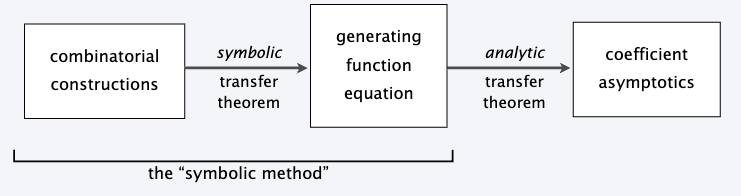
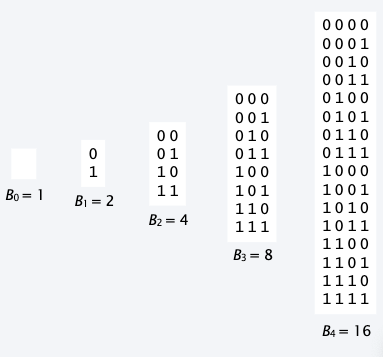
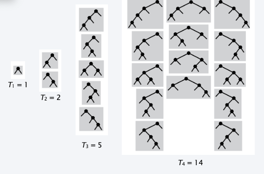
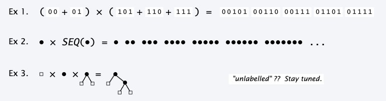
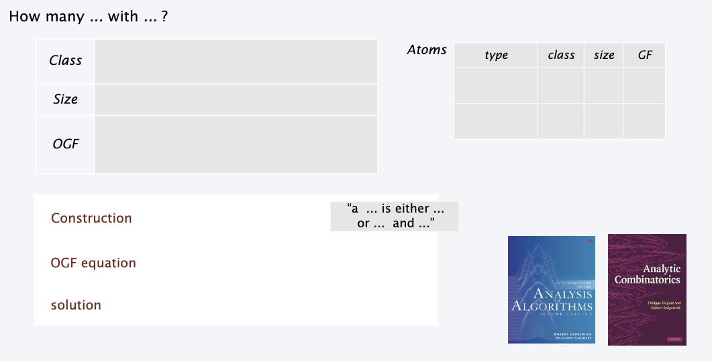

# The Symbolic Method

Analytic combinatorics is a calculus for the quantitative study of large combinatorial structures. 

{width=600px}

## Translate to *GF equations*

- Define a *class* of combinatorial objects.
- Define a notion of *size*.
- Define a *GF* whose coefficients count objects of the same size.
- Define *operations* suitable for constructive definitions of objects.
- Develop *translations* from constructions to operations on GFs.

Formal basis:

- A combinatorial class is a set of objects and a size function.
- An atom is an object of size 1 .
- An neutral object is an atom of size 0 .
- A combinatorial construction uses the union, product, and sequence operations to define a class in terms of atoms and other classes.

| notation | denotes | contains |
| :---: | :---: | :---: |
| $Z$ | atomic   class | an atom |
| $E$ | neutral   class | neutral   object |
| $\boldsymbol{\phi}$ | empty   class | nothing |

### Unlabeled Eg. Nat numbers 

Def: A nat number is a set (sequence) of atoms. 

| $\bullet$ | $\bullet \bullet$ | $\bullet \bullet \bullet$ | $\bullet \bullet \bullet \bullet$ | $\bullet \bullet \bullet \bullet \bullet$ |
| :---: | :---: | :---: | :---: | :---: |
| $I_1=1$ | $I_2=1$ | $I_3=1$ | $I_4=1$ | $I_5=1$ |

| counting sequence | OGF |
| :---: | :---: |
| $I_N=1$ | $\frac{1}{1-Z}$ |

$$
\sum_{N \geq 0} z^N=\frac{1}{1-z}
$$

- Useful when partitions of nat nums.

### Unlabeled Eg 2. Bitstrings 

Def: A bitstring is a seq of 0 or 1 bits. 

{width=600px}

| counting sequence | OGF |
| :---: | :---: |
| $B_N=2^N$ | $\frac{1}{1-2 z}$ |

$$
\sum_{N \geq 0} 2^N z^N=\sum_{N \geq 0}(2 z)^N=\frac{1}{1-2 z}
$$

### Unlabeled Eg 3. Binary Trees 

Def. A Binary tree is empty or a sequence of a node and two Binary trees

{width=600px}

| counting sequence | OGF |
| :---: | :---: |
| $T_N=\frac1{N+1}\binom{2N}N$ | $\frac1{2z}(1-\sqrt{1-4z})$ |

Catalan numbers: 

$$
T(z) = 1+zT(z)^2
$$

## Combinatorial constructions for unlabelled classes

A and B are combinatorial classes of unlabelled objects:

| construction | notation | semantics |
| :---: | :---: | :---: |
| disjoint union | $A+B$ | disjoint copies of objects from $A$ and $B$ |
| Cartesian product | $A \times B$ | ordered pairs of copies of objects,   one from $A$ and one from $B$ |
| sequence | $\operatorname{SEQ}(A)$ | sequences of objects from $A$ |

{width=600px}

**Transfer theorem**. Let $A$ and $B$ be combinatorial classes of unlabelled objects with OGFs $A(z)$ and $B(z)$. Then

| construction | notation | semantics | OGF |
| :---: | :---: | :---: | :---: |
| disjoint union | $A+B$ | disjoint copies of objects from $A$ and $B$ | $A(z)+B(z)$ |
| Cartesian product | $A \times B$ | ordered pairs of copies of objects,   one from $A$ and one from $B$ | $A(z) B(z)$ |
| sequence | $S E Q(A)$ | sequences of objects from $A$ | $\frac{1}{1-A(z)}$ |

??? Proof
    For $A+B$:

    $$
    \sum_{\gamma \in A+B} z^{|\gamma|}=\sum_{\alpha \in A} z^{|\alpha|}+\sum_{\beta \in B} z^{|\beta|}=A(z)+B(z)
    $$

    For $A\times B$

    $$
    \sum_{\gamma \in A \times B} z^{|\gamma|}=\sum_{\alpha \in A} \sum_{\beta \in B} z^{|\alpha|+|\beta|}=\left(\sum_{\alpha \in A} z^{|\alpha|}\right)\left(\sum_{\beta \in B} z^{|\beta|}\right)=A(z) B(z)
    $$

    For $\texttt{SEQ}(A)$

    $$
    \begin{aligned}
    S E Q(A) \equiv & \epsilon+A+A^2+A^3+A^4+\ldots \\
    & 1+A(z)+A(z)^2+A(z)^3+A(z)^4+\ldots=\frac{1}{1-A(z)}
    \end{aligned}
    $$

### Binary trees 

How many binary trees with $N$ nodes?

| Class | $T$, the class of all binary trees |
| :--- | :--- |
| Size | $\|t\|$, the number of internal nodes in $t$ |
| OCF | $T(z)=\sum_{t \in T} z^{\|t\|}=\sum_{N \geq 0} T_N Z^N$ |

Atoms: 

| type | class | size | $G F$ |
| :---: | :---: | :---: | :---: |
| external node | $Z_{\square}$ | 0 | 1 |
| internal node | $Z_{\bullet}$ | 1 | $Z$ |

Construction: a binary tree is an external node or an internal node connected to
two binary trees: 

Construction
$$
T=Z_{\square}+T \times Z_{\bullet} \times T
$$

OGF equation
$$
T(z)=1+z T(z)^2
$$

Then we have $\left[z^N\right] T(z)=\frac{1}{N+1}\binom{2N}N \sim \frac{4^N}{\sqrt{\pi N^3}}$. 

### Binary Trees Take 2

How many binary trees with $N$ *external* nodes?

| Class | $T$, the class of all binary trees |
| :--- | :--- |
| Size | $\boxed{t}$, the number of internal nodes in $t$ |
| OCF | $T^\square(z)=\sum_{t \in T} z^{\boxed{t}}$|

Atoms 

| type | class | size $G F$ |
| :---: | :---: | :---: |
| external node | $Z_{\square}$ | 1 |
| internal node | $Z_{\bullet}$ | 0 |

$$
\begin{array}{ll}
\text { Construction } & T=Z_{\square}+T \times Z_{\bullet} \times T \\
\text { OGF equation } & T^{\square}(z)=z+T^{\square}(z)^2
\end{array}
$$

$$
\begin{gathered}
T^{\square}(z)=z T(z) \\
{\left[z^N\right] T^{\square}(z)=\left[z^{N-1}\right] T(z)=\frac{1}{N}\left(\begin{array}{c}
2 N-2 \\
N-1
\end{array}\right)}
\end{gathered}
$$

### Binary Strings 

Warmup: How many binary strings with $N$ bits?

| Class | $B$, the class of all binary strings |
| :--- | :--- |
| Size | $\|b\|$, the number of bits in $b$ |
| OGF | $B(z)=\sum_{b \in B} z^{\|b\|}=\sum_{N \geq 0} B_N Z^N$ |

Atoms: 

| type | class | size | GF |
| :---: | :---: | :---: | :---: |
| 0 bit | $Z_0$ | 1 | $\mathrm{z}$ |
| $\mathrm{l}$ bit | $Z_1$ | 1 | $\mathrm{z}$ |

Definition: a binary string is a sequence of 0 bits and 1 bits

Construction
$$
B=\operatorname{SEQ}\left(Z_0+Z_1\right)
$$

OGF equation
$$
B(z)=\frac{1}{1-2 z}
$$

$\left[z^N\right] B(z)=2^N \quad \checkmark$

### Binary Strings Alternate

Construction
$$
B=E+\left(Z_0+Z_1\right) \times B
$$

OGF equation
$$
B(z)=1+2 z B(z)
$$

Solution
$$
\begin{aligned}
& B(z)=\frac{1}{1-2 z} \\
& {\left[z^N\right] B(z)=2^N}
\end{aligned}
$$

### Binary Strings Take 2.

How many $N$-bit binary strings have no two consecutive 0s?

| Class | $B_{00}$, the class of binary strings with no 00 |
| :--- | :--- |
| Size | $\|b\|$, the number of bits in $b$ |
| OGF | $B_{00}(z)=\sum_{b \in B_{00}} z^{\|b\|}$ |

Atoms: 

| type | class | size | $G F$ |
| :---: | :---: | :---: | :---: |
| 0 bit | $Z_0$ | 1 | $z$ |
| 1 bit | $Z_1$ | 1 | $\mathrm{z}$ |

Definition: a binary string with no 00 is either empty or 0 or it is 1 or 01 followed by a binary string with no 00

$$
\begin{array}{ll}
\text { Construction } & B_{00}=E+Z_0+\left(Z_1+Z_0 \times Z_1\right) \times B_{00} \\
\text { OGF equation } & B_{00}(z)=1+z+\left(z+z^2\right) B_{00}(z) \\
\text { solution } & B_{00}(z)=\frac{1+z}{1-z-z^2}
\end{array}
$$

$$
\left[z^N\right] B_{00}(z)=F_N+F_{N+1}=F_{N+2}
$$

### The general Pattern

