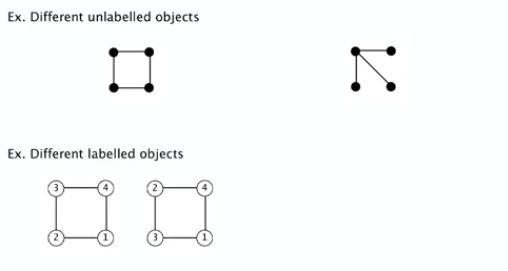
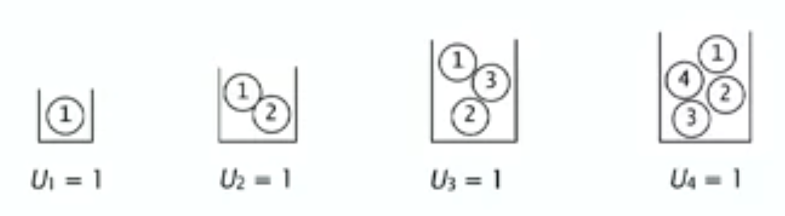
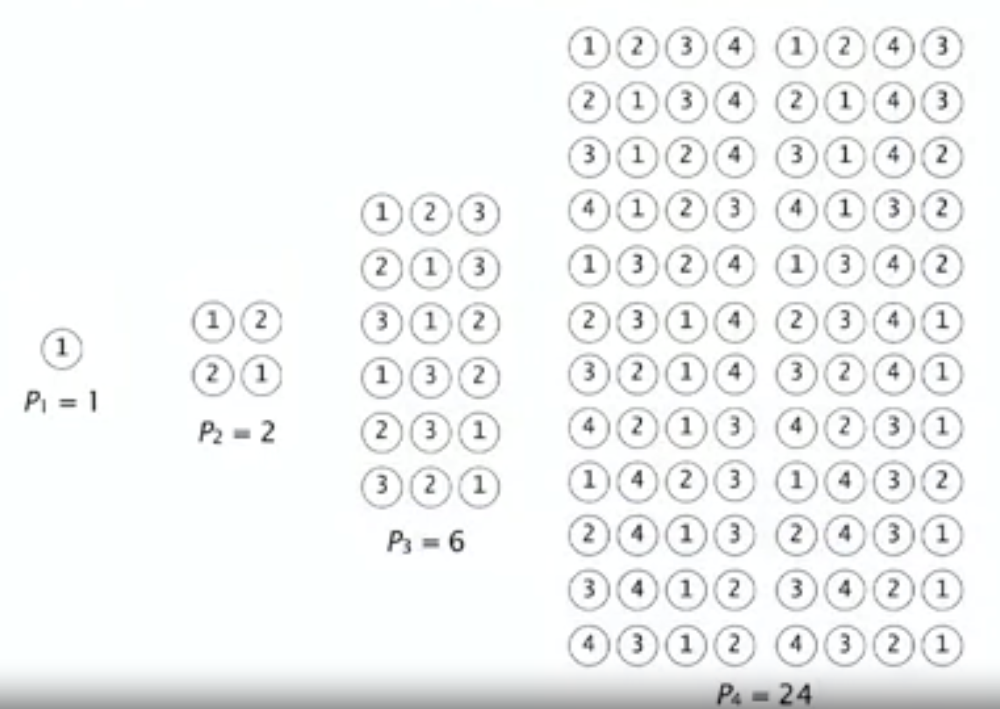
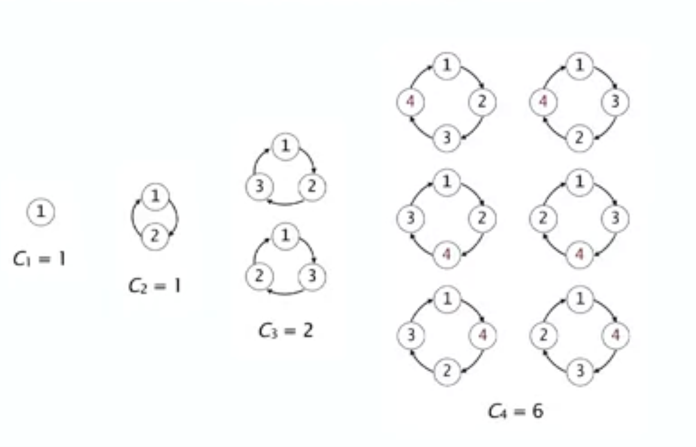

# Labelled objects 

Labelled combinatorial classes have objects composed of $N$ atoms, Labelled with the integers from 1 through $N$. 

{width=500px}

## Example 1. Urns

Def. An *urn* is a set of labelled atoms 

{align=right, width=500px}

| Counting seq | EGF | 
| -- | -- | 
| $U_N=1$ | $e^z$ |

## Example 2. permutations 

Def. A permutation is a sequence of labelled atoms. 

| Counting seq | EGF | 
| -- | -- | 
| $P_N=N!$ | $1/(1-z)$ |

$$
\sum_{N \geq 0} \frac{N ! z^N}{N !}=\sum_{N \geq 0} z^N=\frac{1}{1-z}
$$

## Example 3. cycles 

Def. A *cycle* is a cyclic sequence of labelled atoms

| Counting seq | EGF | 
| -- | -- | 
| $C_N=(N-1) !$ | $\ln \frac{1}{1-z}$ |

$$
\sum_{N \geq 1} \frac{(N-1) ! z^N}{N !}=\sum_{N \geq 1} \frac{z^N}{N}=\ln \frac{1}{1-z}
$$

