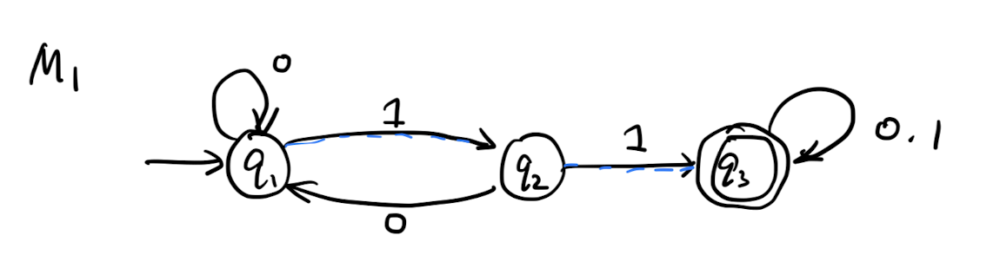
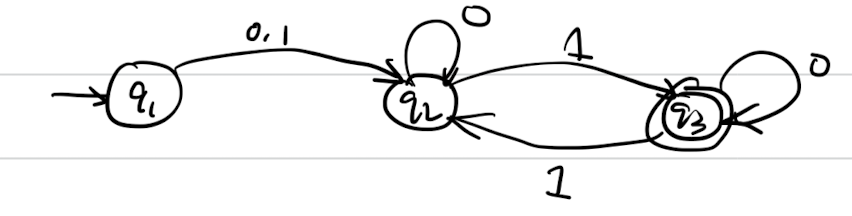
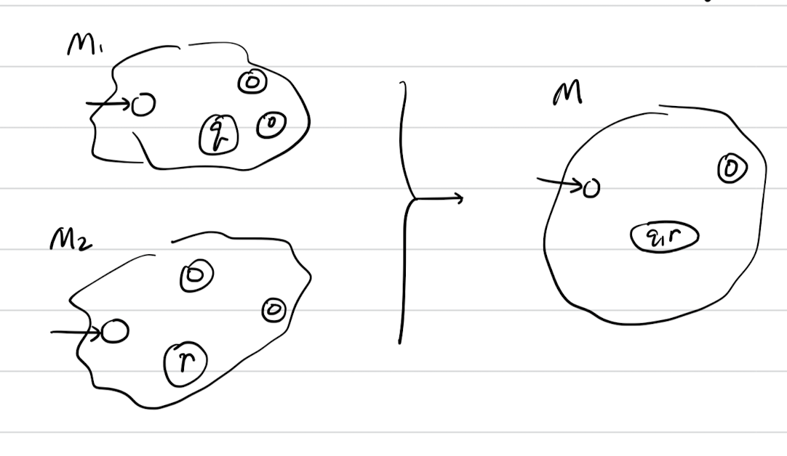
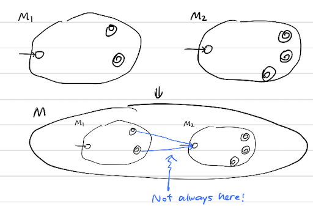
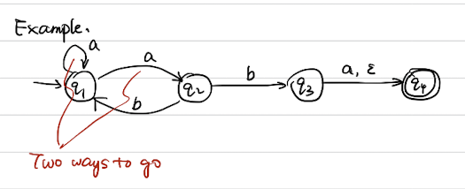
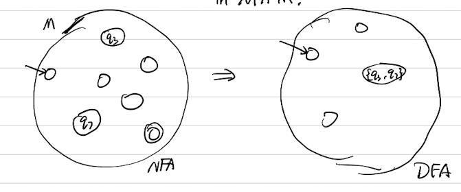
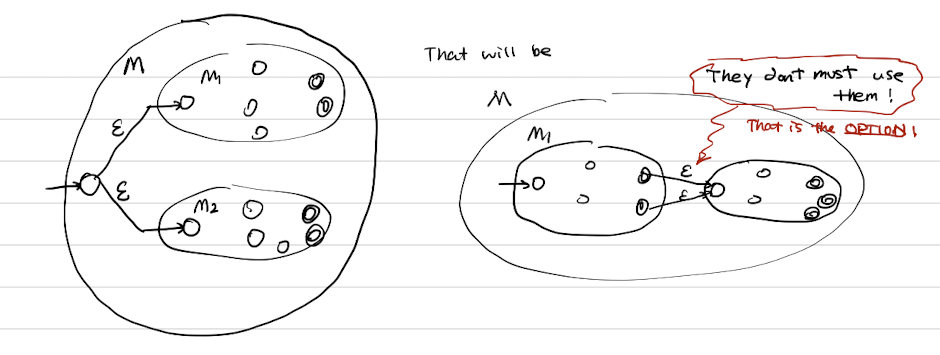
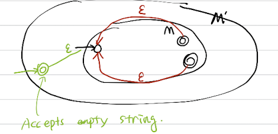

# 2. Finite Automata and Regex expression

Example of FSM 

{.width=600px}

This is a FSM with states $q_1, q_2, q_3$, transitions is shown as the edges, start state is the arrow pointing towards it, and the accepted state is the state that has double circle on it. 

- Input: finite string
- Output: Accept or Reject
- Computation: Begin at start, read input, follow transition graph
- Accept if reach state accept, Reject ow.

## Finite Automata

Def 1 (Finite Automaton). A finite automaton is a 5-tuple $\left(Q, \Sigma, \delta, q_0, F\right)$, where

1. $Q$ is a finite set called the states,
2. $\Sigma$ is a finite set called the alphabet,
3. $\delta: Q \times \Sigma \longrightarrow Q$ is the transition function, ${ }^1$
4. $q_0 \in Q$ is the start state, and
5. $F \subseteq Q$ is the set of accept states. ${ }^2$

Strings and languages: 

- a string is a finite seq of symbols in $\sigma$
- a language is a set of strings (finite or infinite)

Empty string $\varepsilon$ is the string of length 0
The empty language $\varnothing$ is the set of no strings

Def 2 (Accepts). $M$ accepts string $w=w_1 w_2 \ldots w_n$ each $w_i \in \sigma$, if there is a sequence of states $r_0, r_1, \cdots, r_n \in Q$ where

1) $r_0=a_0$
2) $r_i=\delta\left(r_{i-1}, w_i\right)$ for $1 \leqslant i \leqslant n$
3) $r_n \in F$.

Def 3 (Regular language). A langrage is regular if some finite automaton recognizes it. 

Note: Some equivalent ways of saying ``recognizing language''

- $L(M)=\{w| M \text { accepts }w\}$;
- $L(M)$ is the language of $M$;
- $M$ recognizes $L(M)$. 

Example 3-1. Let $B=\{\omega \mid \omega$ has even number of $1 s\}$. $B$ is regular. 

{.width=600px}

Example 3-2. Let $C=\{\omega \mid \omega$ has equal numbers of $O s$ and $1 s\}$, $C$ is not regular.

## Regular language 

Def 4 (Regular operations). Let $A, B$ be languages,

- Union $A \cup B=\{\omega \mid \omega \in A \vee \omega \in B\}$
- Concentration $A \circ B=\{x y \mid x \in A \wedge y \in B\}$
- Star. $A^*=\left\{x_1 \cdots x_k \mid\right.$ each $x_i \in A$ for $\left.k>0\right\}$. and $\varepsilon \in A^*$ always.

Example 4-1. $A=\{\operatorname{good}$, bad $\}, B=\{$ boy , girl $\}$. $A^*$ is going to be infinite language if $A \neq \varnothing$. 

Regular Expression revisited. 

- Built from $\Sigma$, members $\Sigma, \varnothing, \varepsilon$ [Atomic]
- By using $\cup, \circ, * \quad$ [Composite]

Example 4-2. 

- $(O \cup 1)^*=\Sigma^*$ gives all strings over $\sum$
- $\Sigma^* 1$ gives all strings ends with 1 .
- $\Sigma^* 11 \Sigma^*=$ all strings contain - $1 1=L\left(M_1\right)$.

We shall show Finite Automata(FA) $\Leftrightarrow$ Regex . 

Th 1. (Closure for Regex Language) If $A_1, A_2$ are regular language, so is $A_1 \cup A_2$. 

Proof. Let $M_1=\left(Q_1, \Sigma, \delta_1, q, F_1\right)$ recognize $A_1$, $M_2=\left(Q_2, \Sigma, \delta_2, q_2, F_2\right)$ recognizes $A_2$. Construct $M=\left(Q, \Sigma, \delta, q_0 . F\right)$ recognize $A_1 \cup A_2$
M should accept input $w$ if either $M_1$ or $M_2$ accept $M$.

We construct 

- $Q=Q_1\times Q_2$
- $q_0=(q_1, q_2)$
- $\delta((q,r),a)=(\delta_1(q,a),\delta_2(r,a))$
- $F=\left(F_1 \times Q_2\right) U\left(Q_1 \times F_2\right)$.

Th 2. (Closed under $\circ$) If $A_1, A_2$ are regular language, so is $A_1 \circ A_2$.

Primary thought: $M$ should accept w if
$w=x y$ where $M_1 \operatorname{acc} x$ and $M_2$ acc $y$.

But we dont know where to split $x$ and $y$! 

We will prove this statement later after introducing Non-deterministic finite automata. 

## Non-deterministic Finite Automata 

Example.

- Multiple paths possible
- $\varepsilon$-transition is a "free" move without reading input
- Accept if some part leads to accept.

$$
\begin{aligned}
\text { Input } a b & \Rightarrow \text { Accept! } \\
a a & \Rightarrow \text { Reject! } \\
a b a & \Rightarrow \text { Accept! } \\
a b b & \Rightarrow \text { Reject! }
\end{aligned}
$$

This do not correspond to the real machine, but helpful mathematically. 

Def 5 (Nondeterministic finite automata). A nondeterministic finite automate (NFA) is a 5 -tuple $(Q, \Sigma, \delta, q_0, F)$. The definition for them is the same except 

$$
\delta: Q \times \underbrace{\sum_{\varepsilon}}_{\Sigma U\{\varepsilon\}} \rightarrow P(Q) \text {. }
$$

Th 3 (NFA recognizes regex language). If NFA recognizes $A$, then $A$ is regular.

Proof idea: DEA $M^{\prime}$ keeps track of the subset of possible states in NFA $M$.

Construction
$$
\begin{aligned}
Q^{\prime} & =\mathcal P(Q) \\
\delta^{\prime} & =(\underbrace{R}_{R \in Q^{\prime}}, a) \\
& =\left\{q \mid q \in \delta(r, a) \text { for sone } q^{\prime}\right\} \\
q_0^{\prime} & =\left\{q_0\right\} . \\
F^{\prime} & =\left\{R \in Q^{\prime} \mid R \cap F\right\} .
\end{aligned}
$$

We shall now look at Closed under $\circ$ theorem's proof: 

Gives DFAs $M_1, M_2$, recognizing $A_1$ and $A_2$ Construct $M$ recognizing $A_1 \cup A_2$.

Th 4 (Closed under star). If $A$ is a regular language, so is $A^*$.

Proof idea: Given DFA $M$ recognizing $A$ construct NFA $M^{\prime}$ recognizing $A^*$.

$M^{\prime}$ should accept $w$ if $w=x_1 x_2 \cdots$. $k \geq 0 . M$ accepts $x_i$ each.

## Regular language to NFA 

Th 5. If $R$ is a regular exp and $A=L(R)$, then $A$ is regular.

Proof. Convert $R$ to equivalent NFA $M$. 

- If $a$ is atomic: 
    $$
    \begin{aligned}
    R=a & \text { for } a \in \Sigma & \Leftrightarrow &~~~ \rightarrow \circ \rightarrow \boxed\circ \\
    R=\varepsilon & & \Leftrightarrow &~~~\rightarrow \boxed\circ \\
    R=\varnothing & & \Leftrightarrow &~~~\rightarrow \circ
    \end{aligned}
    $$
- If $a$ is composite, Use closure constructions.

