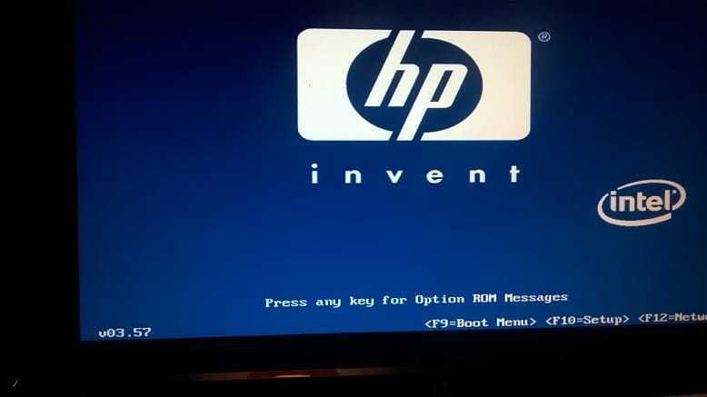
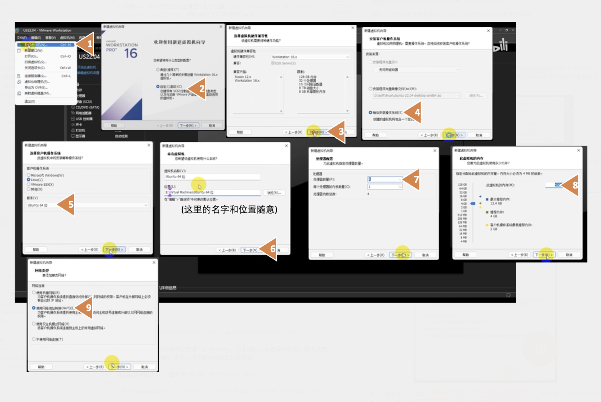
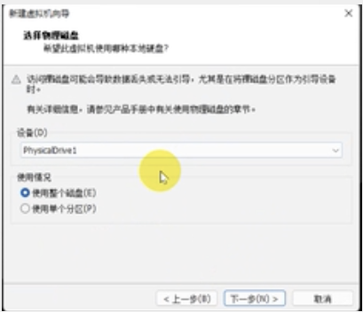
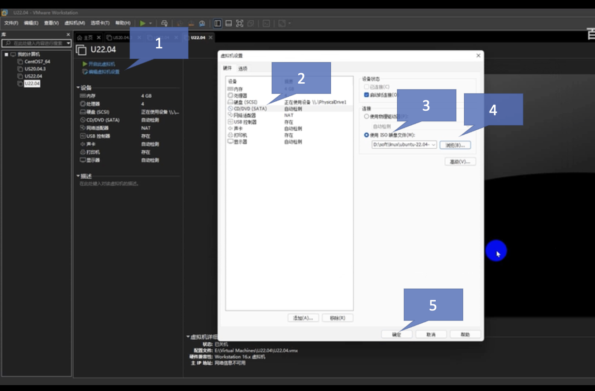
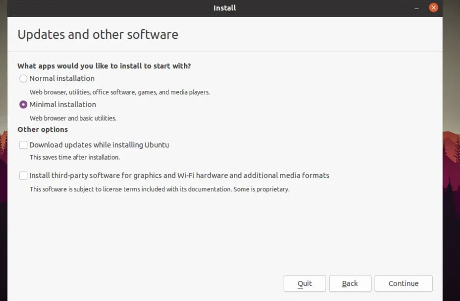
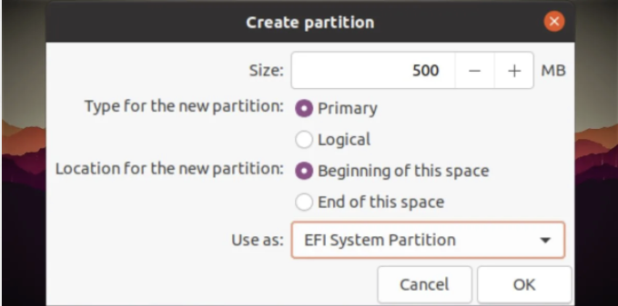
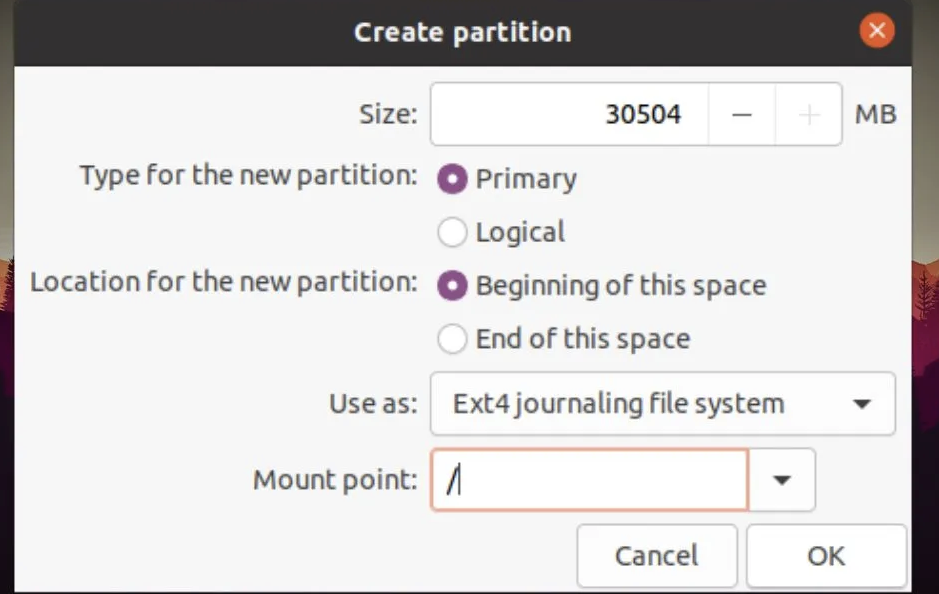

# 可以直接从U盘启动的系统

## 计算机如何启动

从一个固定好的状态开始, 处理器是无情的执行指令的机器。

Firmware

- 初始化硬件
- 选择操作系统
    - 扫描所有的磁盘, 满足某种特定模式 = 可启动

造一个 = 往U盘里面写一些特殊的数据

存储设备

- 就是存储一堆0和1嘛

问题: 怎么往存储设备里面写0和1?

- DiskGenius用来查看存储设备存了什么
    - 用手写 – 显然不applicable(几个G的数据)
- 运行系统安装程序, 把系统安装到U盘里面
    - 直接开机干肯定不行
    - 虚拟机! 

## 虚拟机

- 计算机科学是人造的科学
    - 用于建模/仿真各种物理的东西
    - 能不能模拟它自己?
        - Yes! 

在电脑里面模拟了电脑

- 天才程序员[Fabrice Bellard](https://en.wikipedia.org/wiki/Fabrice_Bellard)发明的QEMU
- 后来有了更多有趣的东西

探索的时候: 电脑中又多了一台电脑, 想一想可以改电脑的哪些方面? 

### 虚拟机VMWare

VMWare 是有图形化界面的

- 回顾上节的法则: 图形化界面的探索方法: 抽一个下午, 遍历所有的按钮
- 可能失败: VMWare的东西/新术语太琐碎了
    - 是给有一定计算机科学基础的同学用的, 名词不直观

从简单的例子开始了解起. 

- 只负责给出操作过程, 并不负责解释这些操作相关的细节和原理. 如果你要了解它们, 请在互联网上搜索相关内容.

#### (a) 安装Ubuntu虚拟机

网络上当然有很多关于如何安装虚拟机的视频教程. 

- 搜索“虚拟机Ubuntu 22.04 安装教程”

- ##### 选择语言时选择English, 不要选择中文

    - 中文社区和英文社区割裂非常明显, 会加大错误排查的难度

#### (b) 安装Ubuntu到U盘

**提示**. 我们推荐大家使用机房的电脑安装. 因为机房的电脑带有自动还原的保护卡, 因此如果有什么问题, 格式化U盘之后, 重启计算机即可. 

A) 首先完成一些基本设定. 

- 关键的一步骤: 选择安装虚拟机的磁盘为这个U盘. (往U盘里面写)

- 之后, 选择插入的USB. $\color{red}\boxed{一定再三确认这个盘就是你要装的盘. }$ 当只有一个的USB的时候, 一般会显示`PhysicalDrive1`, 并且选择使用整个磁盘. 

- 然后一路下一步, 直到完成即可. 虚拟机的环境准备完毕.

B) 下载Ubuntu镜像

- 在Ubuntu的[官方网站](https://ubuntu.com/download/desktop)上可以下载镜像. 稍微等一等, 应该不算慢.
- 之后, 把Ubuntu的镜像装到VMWare的虚拟机里面. 在编辑虚拟机设置里面, 选择CD/DVD, 把刚刚的ISO文件放进去.

- 点击开启虚拟机.
- 弹出桌面之后, 在安装界面选择Try Ubuntu. 我们建议大家选择英文版, 因为英文版的报错信息很明确, 上网上搜索解决问题会比较快速.
- 在出现安装的时候, 选择"Minimal Installation".

- 还要对于整个内容分区. 先删掉U盘的所有分区, 创建第一个分区为Boot, 设置为如下的:注意这个大小需要修改为500MB.(用于启动)

- 剩下的就是EFI文件系统了. 再新建一个分区如图, 这个大小不用修改.

### 启动计算机

- 进入BIOS界面
- 选择并且启动

