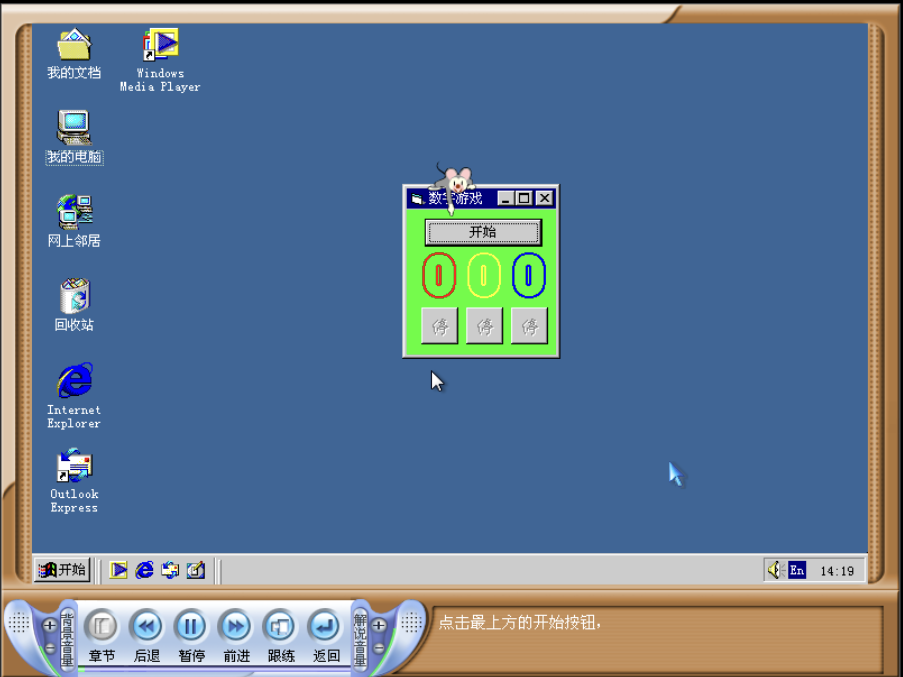
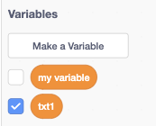
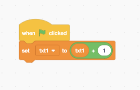
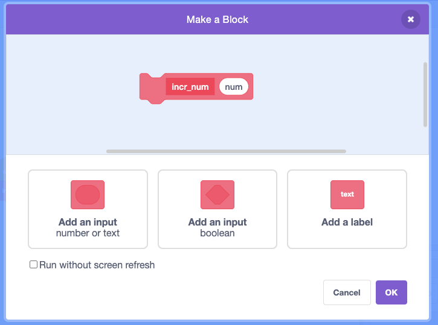
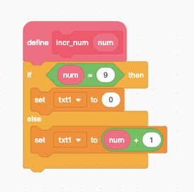
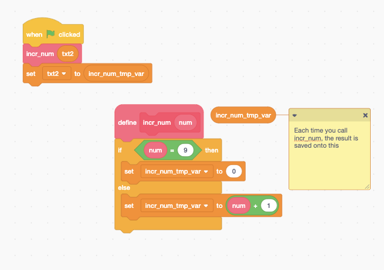
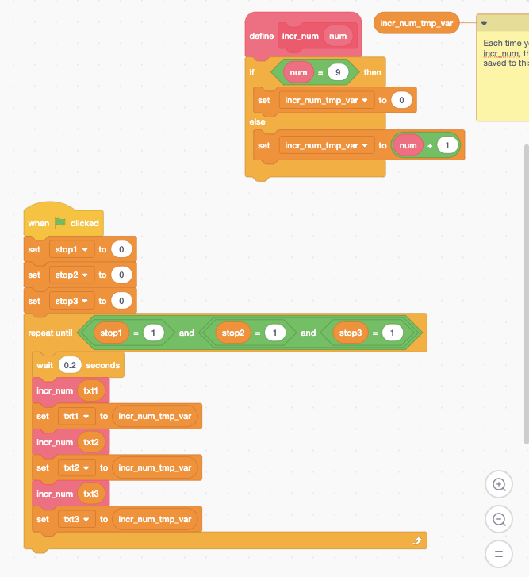
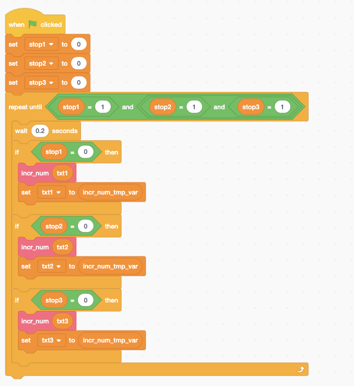
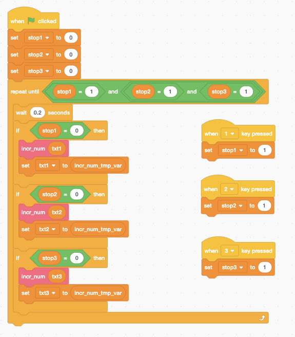
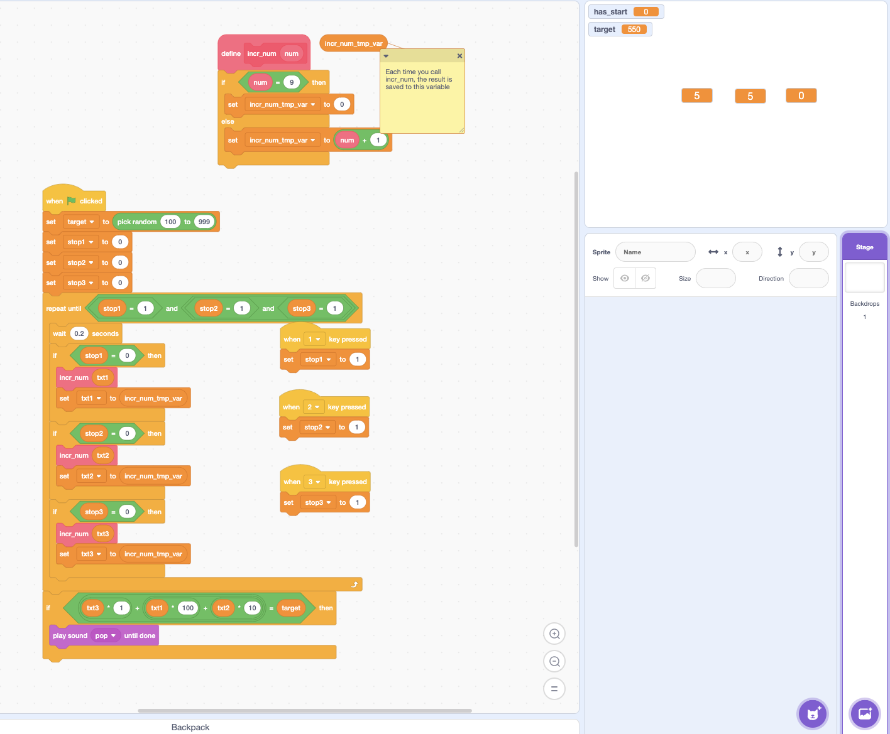

# 使用Scratch表达逻辑

## 介绍

## 数字游戏

(致敬洪恩教育)

目标

- 三个数字, 三个停止按钮
- 数字跳动, 让跳动的数字等于一给定值

### 做法

#### 创建变量

希望每触发一次, 变量的值+1, 如果是9的话变为0

- 变量的值+1

  

- 如果是9, 就设置为0

设置好了一个, 如果有三个怎么办?

- a) 复制三份, 分别把每个的txt1改为txt2, txt3
  - 坏处: 未来改增加的逻辑, 都要改
- b) 造一个新的积木

- 问题: 为什么没办法设置num为0?
  - num只是复制下来的, 对num赋值没有任何作用(按值引用)
- 解决方法
  - 设置一个临时变量
  - 每次把要覆盖的值写给这一临时变量
  - 在执行调用之后从临时变量里面读取

### 接下来: 定时增加

需要循环

- 只要游戏还没结束, 就把他们三个+1
- 新设置三个变量stop1, stop2, stop3
- 如果游戏不结束, 就一直循环

当然只有在不该停的时候才可以继续

### 增加按下按键停止数字跳动

还需要增加一个目标的数字. 最后在结束的时候只要判定是不是赢了就行了. 

