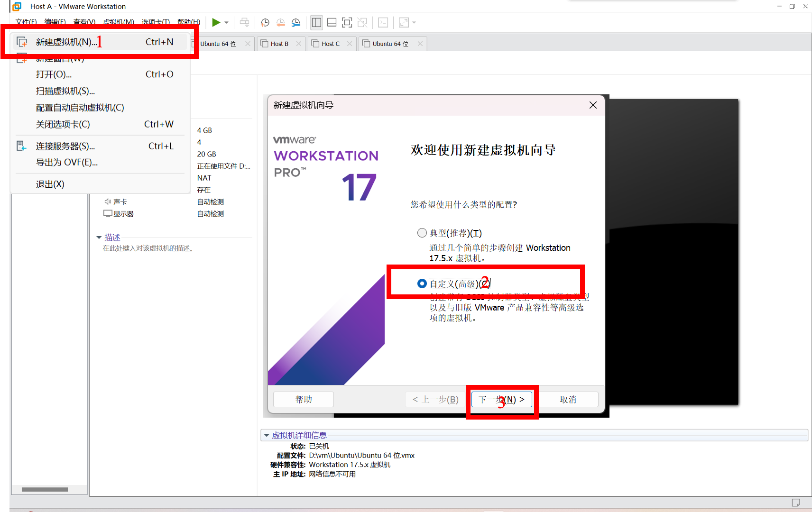
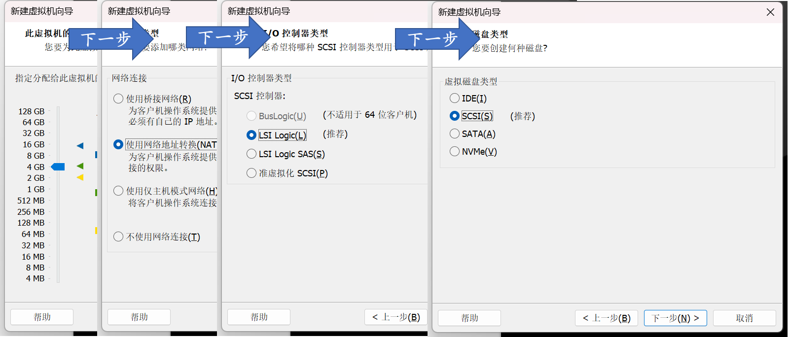
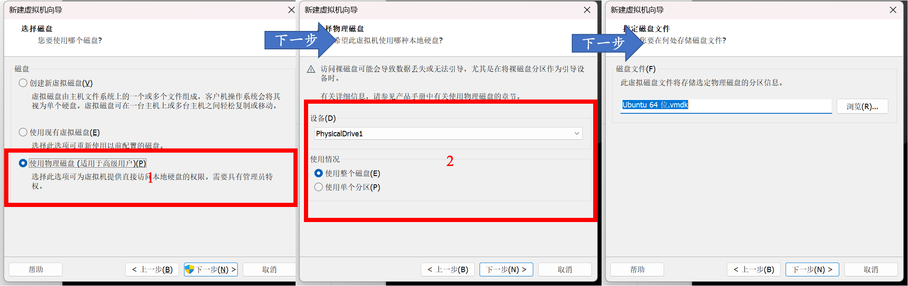
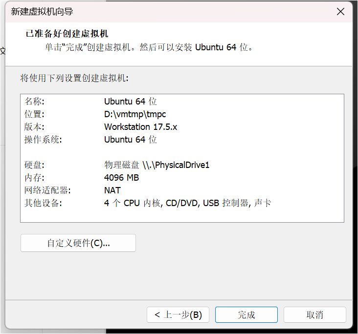
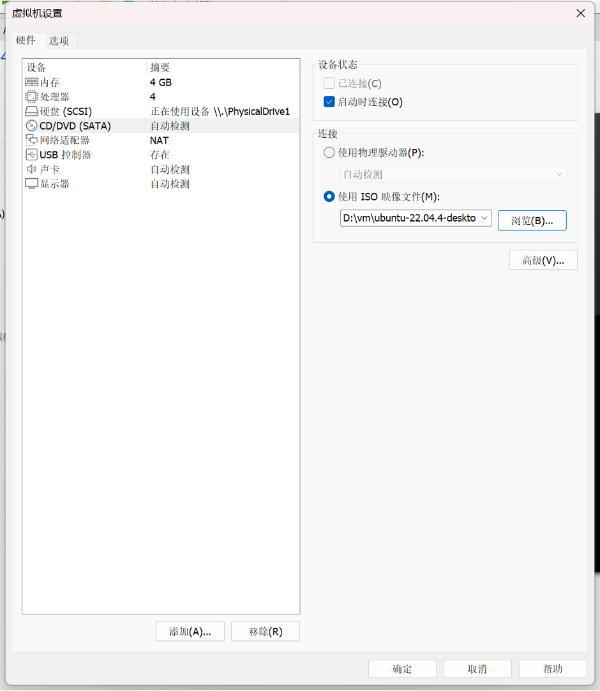
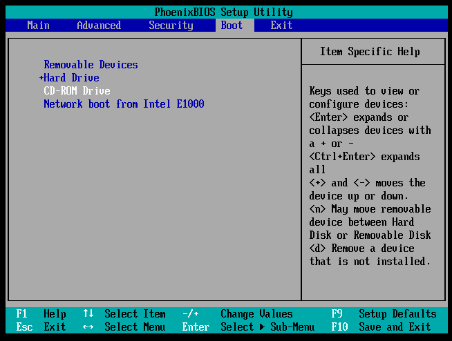
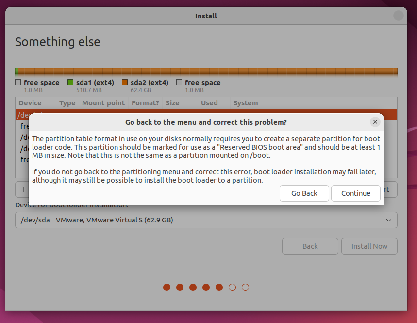
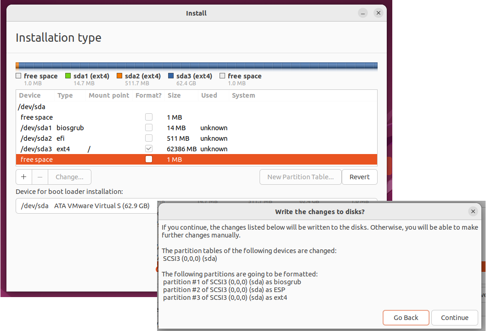

## 按下电源键之后

你是否留意过, 在按下电源键之后, 电脑需要一段时间才可以启动完成. 那么, 在这一会儿过程中, 到底发生了什么? 这个实验的过程中, 我们会简单介绍. 最后, 我们会带领大家做一个可以直接从USB启动的系统.

理解机械的计算机世界, 很多时候可以采用类比的方法. 实际上, 这些系统在某些大的原则和设计上和人类世界很相似. 如果你还没有对它有最基本的印象, 可以参考[《开天辟地: 电脑急救与安装篇》的P3](https://www.bilibili.com/video/BV1et411y7cH?p=3)的头几分钟. 作为复习,

-   电脑有输入(如键盘, 鼠标)和输出设备(如屏幕), 可以与外界交互.
-   CPU是电脑的 "大脑".
-   在电脑运行过程中, CPU只能操作内存中的数据. 通常程序的数据会保存在内存中. 内存存储速度非常快, 远远超过硬盘. 但是在没有电的时候内存中的数据会全部消失.

如果类比做一个人的日常的话, 人的输入是五官感受到的, 输出是嘴巴说出来、行动做出来的. 但是更恰当的描述是, 这人每天早上起来就会忘记自己记住的所有的东西. 为了弥补这一点, 他有一本《每天早上醒来请读这个》的笔记. 于是在醒来之后他会阅读这个文档, 来完成一些基础的认知操作, 并且在一天中把有趣的事情记录下来. 这样后面就可以知道发生了什么了.

::: gossip
这里直接偷了 **白石定規** 对于《魔女の旅々》第四卷[艾姆妮西亚](https://zh.moegirl.org.cn/%E8%89%BE%E5%A7%86%E5%A6%AE%E8%A5%BF%E4%BA%9A)(アムネシア)的设定. 有时候会发现有些艺术创作还是可以取材于实际生活的更加抽象的部分的.
:::

我们本次主要做的事情是看一看《每天早上醒来请读这个》写了什么. 对于一个人来讲, 这需要首先知道一些基本信息, 然后搞明白自己接下来要干什么. 比如, 把这份笔记通读一遍, 然后按照"对目标的要求"继续行事.

在计算机的世界里面, 这《每天早上醒来请读这个》有一个专门的名字, 通常叫做"固件(firmware)". 这是因为早些时候, 这一小段指令会写死在这本书(一个特定的芯片)里面, 不能修改. 如果想要升级必须要换芯片. 固件的功能大体上来说有两个

-   我是谁? 我在哪? (运行程序前进行计算机系统配置): CPU电压 ...

-   接下来该干啥? (不严格地说, 加载操作系统)

第一个主要部分现在还太过琐碎. 这个实验里面我们主要来看第二个部分.

### 接下来可以交给谁?

对于计算机而言, 接下来可以干的事情是把控制权交给一个更大的程序 -- 通常装在硬盘里面. 通常, 有这样更大的程序的硬盘的头512个字节有一些特殊的标记. 这样, 固件接下来就知道应该交给谁管理了.

问题是, 要是有多个可以启动的设备应该如何办? 实际上, 在固件的设置中可以指定启动的顺序. 系统会从第一个设备开始启动, 如果失败了, 就到第二个, 以此类推.

也就是说, 只要我们的U盘的某些字节被标记为一些特定的样式, 我们当然可以从U盘启动. 实际上, 你新买了一个U盘之后, 里面真的什么都没有吗? 我们可以使用工具Disk Genius来查看这个U盘里面到底有什么.

显然, 只要把这种硬盘的所有的位都写成每一个特定值, 那这U盘肯定可以被操作系统识别, 从而启动了. 但是一个\~64GiB的U盘一共有158456325028528675187087900672个bit, 要是手写那可真的要死人了! 于是, 我们总是可以使用一个操作系统的安装程序来帮助我们写这个U盘, 填入给定的值.

如果大家经历过装系统的话, 会记得操作系统的安装程序是在计算机开机之前启动的 – 连操作系统都没有, 自然没有办法在已经有操作系统的条件下运行... 未必! 天才程序员[Fabrice Bellard](https://en.wikipedia.org/wiki/Fabrice_Bellard)发明的QEMU让我们可以在计算机上面模拟另一个计算机硬件执行. 因此, 如果让虚拟机的硬盘部件连接到实体机外接的U盘, 剩下的还是接上虚拟的硬件, 那不就好了吗? 确实是这样! 计算机系统没有魔法.

实际上, 计算机科学是人造的科学, 可以用于建模/仿真各种物理的东西. 自然, 它也可以模拟它自己. 这是一个很重要的信息, 在后续和计算机打交道的过程中会体会得更深刻.

## 实验步骤

### 新建虚拟机

首先, 在计算机中插入U盘, 以管理员身份启动VMware Workstation. 紧接着, 要配置上面说的新建一个虚拟机. 这就相当于在几十年前的时候购买了新的电脑硬件, 然后把他们组装起来, 形成一台裸机(bare metal). 中由于把硬盘选到物理的USB的行为不是虚拟机制造者的一个很常见的动作, 所以我们选择自定义安装.

由于现在模拟的是把所有的电脑配件买回来 – 即配置一个架子, 那么除了 “安装客户机操作系统” 选项中选择 “稍后安装操作系统”, 以及选对要安装的系统类型(Ubuntu 64位)之外, 一路继续点下一步, 直到设置内存和磁盘的步骤.

设置内存之后, 立刻会让设置虚拟机的网络, I/O(输入/输出)设备的控制器类型的选项. 我们保持默认问题不大.

重点在于, 我们要选择物理插入的USB盘. 因此, 选择使用物理磁盘, 然后使用整个磁盘. 一般而言, 新插入的USB设备往往是设备列表的最后一项. 一定要再三确定这个设备就是你要选择安装的设备. 由于要安装系统, U盘上面的所有文件都要被格式化. 若选错了盘将会造成几乎不可逆的数据损失!

如果你不放心, 可以在没有插U盘的时候重新启动虚拟机进行到这一步, 看一看这个设备列表少了什么. 然后再插入U盘重新启动, 选择刚刚没有出现的那一项.

这样子我们就把虚拟机的架子搭好了. VMWare Workstation会给出一个总结画面.

### 安装系统

上面的操作就相当于早些时候(\~2000年)我们把电脑主机买回家了. 接下来要做的是给电脑上装上操作系统. 操作系统是我们和计算机交互的主要方式. 早些时候, 我们可以通过插入操作系统安装盘来安装整个系统. 如果BIOS决定从CD启动, 我们就可以对磁盘进行读写, 进而把操作系统安装到物理磁盘上了.

我们如何在虚拟机中插入光盘呢? 实际上, 有这样的选项, 可以让我们插入光盘的镜像(.iso). 现在是2024年了, 带有光驱的计算机已经不多见了, 所以很多光盘文件都是用文件的形式扩散出去了. 自然, 只要选择对应的光盘文件放到虚拟机的CD/DVD光驱里面就好了.

如何获得Ubuntu的安装盘? 由于Ubuntu是开源的, 官网上肯定能下载. 但是问题在于, 官网上下载速度太慢了! 这是因为这些服务器大多数设置在境外, 访问自然不算顺畅. 有没有人在境内搭有服务器, 但是可以提供类似的下载服务呢? 这就是镜像站的作用了. 比如可以去清华大学的镜像站下载我们要的软件, 然后把它插入虚拟机的虚拟光驱中.

启动虚拟机, 你可能已经可以看到Linux的启动画面了.

如果不行的话, 就要在开机的时候按下F2, 把光驱的启动顺序放在第一位. 因为现在我们的硬盘中没有任何东西, 肯定不能从硬盘启动. 作法是选中CD-ROM Drive然后使用+键让它出现在第一位.

在启动界面中选择Try or install Ubuntu.

然后点击Install Ubuntu, 为了减少负担, 在安装的时候要选择Minimal Installation, 并且把install updates的选项去掉. 我们推荐大家不修改系统的语言设置. 因为英文的报错信息更全面, 网络上关于这些问题的回答也更多.

如果你对于计算机才刚刚了解, 在Installation Type中我们建议使用Erase disk and install Ubuntu. 这样子安装程序会自动帮助我们完成分区操作, 并且就可以跳过下一个可选的部分. 如果你对于计算机已经有了一些了解, 自己试着分区也不错.

#### (可选) 对硬盘分区

如果选择了第二项, 你就需要自己手动分区了. 分区就是对硬盘做划分. 做划分的目的是让信息更快速地被找到. 通常来讲需要预留不少于\~1MB的空间分给BIOS GRUB(启动界面), \~512MB留给EFI, 剩下的就可以留作系统使用了. 注意Linux的文件系统是ext4. 在添加这个分区的时候通常把挂载点(mount point)设置为/(根目录).

我是怎么知道都有啥的? 实际上, 如果你的分区不正确, Ubuntu在继续的时候会弹出警告, 让你加入正确的分区. 比如, 如果我们忘记给BIOS的GRUB分配空间, 就会有这样的警告信息.

在完成分区之后我们点击下一步. 如果没有警告, 我们就可以继续了!

### 安装系统: 回顾

然后接着一路下一步, 完成一些必要的设置, 我们就可以进入安装界面了.

-   [分区与格式化是什么?](https://www.bilibili.com/video/BV1QC4y1d7KR)
-   [启动时CMOS怎么设置?](https://www.bilibili.com/video/BV1et411y7cH)
-   [Windows XP时代, 大家怎么装电脑](https://www.bilibili.com/video/BV1ru4y1s7jt)

### 从USB启动

安装完之后, 可以重启现实生活中的计算机, 进入BIOS界面选择从USB启动. 然后应该就可以看到会出现Ubuntu的图标在那里了. 接着, Ubuntu就可以启动了.
