# 3 链路层

## 3.1 主要功能

1.  为网络层提供服务
    -   无确认无连接
    -   有确认无连接
    -   有确认面向连接
2.  链路管理
3.  帧定界. 帧同步. 透明传输
    -   将一段数 据的前后分别添加首部和尾部，就构成了顿。
    -   网络层的分组封装成帧，以帧的格式进行传送。

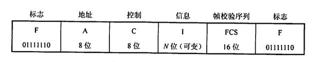

4.  流量控制: 限制发送方的数据流量，使其发送速率不超过接收方的接收能力(跟上自己)
    -   得 发 送 方 知 道 在 什 么 情 况 下 可 以 接 着 发 送 下 一帧 ， 而 在 什 么 悄 况 下 必 须 暂 停 发 送

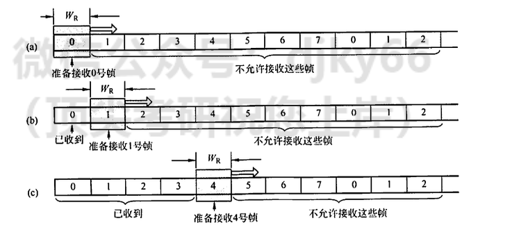

5.  差错控制
    -   使发送方确定接收方是否 正确收到由其发送的数据

## 3.2 成帧

-   字符计数

    -   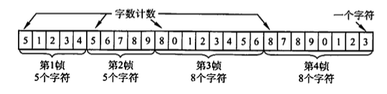
    -   问题: 计数出错, 全部白瞎

-   字符填充, 但是带转义符

    -   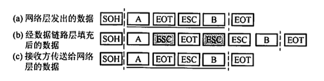

-   0bit填充收尾标志: 即01111110来标志 一帧的开始和结束。为了不使 信息位中出现的比特流01111110 被误判为帧的首尾标志，发送方的数据链路层在信息位中遇到5 个 连 续 的 “ 1 ” 时 ， 将 自 动 在 其 后 插 入 一个 “ 0 ” ; 而 接 收 方 做 该 过 程 的 逆 操 作 ， 即 每 收 到 5 个 连 续的“]”时，自动删除后面紧跟的“0”，以恢复原信息。

    -   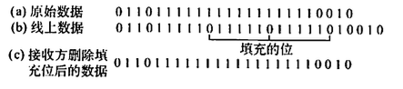

    -   性能较优

-   违规编码法: 借用这些编码的时候不允许的(没有使用的)编码序列来定界帧的起始 和 终 止, 局域网

## 3.3 差错控制

检查出错

-   奇偶校验

    -   它由$n-1$位信息元 和1位校验元组成

    -   校验码 = $\oplus_{i=1}^n a_i$.

-   循环冗余码

    -   给定一个 $m$ bit 的帧或报文, 发送器生成一个 $r$ bit, 的序列, 称为帧检验序列

        -   由 $m+r$ 比特组成

    -   发送方和接收方事先商定一个多项式 $G(x)$ (最高位和最低位必须为 1 ), 使得带检验码的帧正好被$G(x)$ 整除.

纠错: Hamming Code

-   确定位数: 设 $n$ 为有效信息的位数, $k$ 为校验位的位数, 则信息位 $n$ 和校验位 $k$ 应满足 $n+k \leq 2^k-1$ (若要检测两位错, 则需再增加 1 位校验位, 即 $k+1$ 位)

-   确定分布: 规定校验位 $P_t$ 在海明位号为 $2^{i-1}$ 的位置上, 其余各位为信息位

    -   $P_1$ 的海明位号为 $2^{i-1}=2^0=1$, 即 $H_1$ 为 $P_1$ 。 $P_2$ 的海明位号为 $2^{i-1}=2^1=2$, 即 $H_2$ 为 $P_2$ 。 $P_3$ 的海明位号为 $2^{i-1}=2^2=4$, 即 $H_4$ 为 $P_3$ 。 将信息位按原来的顺序插入, 则海明码各位的分布如下: $$
        \begin{array}{lllllll}
        H_7 & H_6 & H_5 & H_4 & H_3 & H_2 & H_1 \\
        D_4 & D_3 & D_2 & P_3 & D_1 & P_2 & P_1
        \end{array}
        $$

    -   分组以形成校验关系: 被校验数据位的海明位号等于校验该数 据位的各校验位海明位号之和。另外，校验位不需要再被校验。

        -   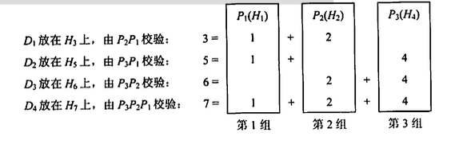

    -   得到校验值

    -   原理:

        每个校验组分别利用校验位和参与形成该校验位的信息位进行奇偶校验检查, 构成 $k$ 个校验方程: $$
        \begin{aligned}
        & S_1=P_1 \oplus D_1 \oplus D_2 \oplus D_4 \\
        & S_2=P_2 \oplus D_1 \oplus D_3 \oplus D_4 \\
        & S_3=P_3 \oplus D_2 \oplus D_3 \oplus D_4
        \end{aligned}
        $$

        若 $S_3 S_2 S_1$ 的值为 “ 000 ”, 则说明无错; 否则说明出错, 且这个数就是错误位的位号, 如 $S_3 S_2 S_1=001$,说明第 1 位出错, 即 $H_1$ 出错, 直接将该位取反就达到了纠错的目的。

## 3.4 流量控制, 可靠传输机制

流量控制

-   停止-等待流量控制: 发送方每发送一帧，都要等待接收方的应答信号，之后才能发送下一帧:接收方每接收 一帧， 都要反馈 一个应答信号，表示可接收下一帧，如果接收方不反馈应答信号，那么发送方必须一直等 待。

-   滑动窗口流量控制:

    -   在任意时刻，发送方都维持一组连续的允许发送的帧的序号，称为发送窗口(大小固定)
    -   接收方也 维持一组连续的允许接收帧的序号，称为接收窗口
    -   发送窗口的大小 $W_{\mathrm{T}}$ 代表在还未收到对方确认信息的情况下发送方最多还可以发送多少个数据帧。
    -   在接收端设置接收窗口是为了控制可以接收哪些数据帧和不可以接收哪些帧。
    -   只有收到的数据帧的序字号落入接收窗又内时，才允许将该数据帧收下。若接收到的数据帧落在接 收窗又之外，则一律将其丢弃。

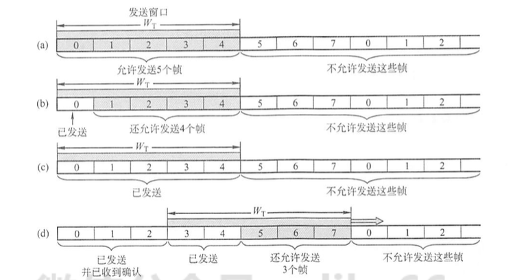

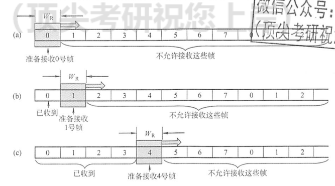

-   确认: 接收方可以让发送方知道哪些内容被正确接收。有些情况下为了提高传输效 率，将确认捎带在一个回复帧中，称为捎带确认。

-   超时重传: 发送方在发送某个数据帧后就开 启一个计时器，在一定时间内如果没有得到发送的数据帧的确认帧，那么就重新发送该数据帧， 直到发送成功为止。

-   自动重传请求(ARQ, Automatic Repeat Request): 接 收 方 请 求 发 送 方 重 传 出 错 的 数 据 帧 来恢复出错的帧，是通信中用 于处理信道所带来差错的方法之一。

具体协议

-   停止-等待协议

    -   数据帧丢失

    -   数据frame被损坏: 不ack

    -   确认frame被损坏: 接收到的时候重新ack, 0 1 bit交错

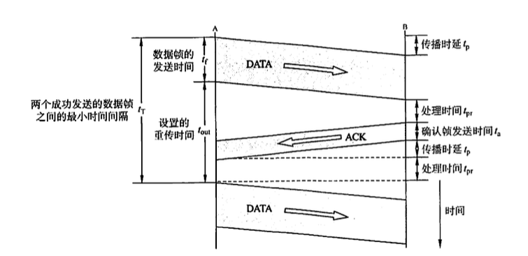

-   多帧 滑 动 窗 又 与 后 退 N 帧 协 议

    -   发 送 方 无须 在 收 到 上一 个帧 的 A C K 后 才 能 开 始 发 送 下一 帧 ， 而 是 可以连续发送帧。当接收方检测出失序的信息帧后，要求发送方重发最后一个正确接收的信息帧 之后的所有未被确认的帧;或者当发送方发送了N 个帧后，若发现该N 个帧的前一个帧在计时器 超时后仍未返回其确认信息，则该帧被判为出错或丢失，此时发送方就不得不重传该出错帧及随 后的 N 个帧。

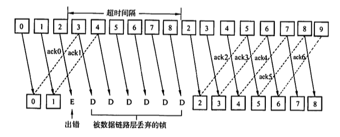

-   多帧滑动窗又与选择重传协议

    -   可设法只重传出现差错的数据帧或计时器超时的数据帧，但此 时必须加大接收窗又，以便先收下发送序号不连续但仍处在接收窗又中的那些数据帧。等到所缺 序号的数据帧收到后再一并送交主机。

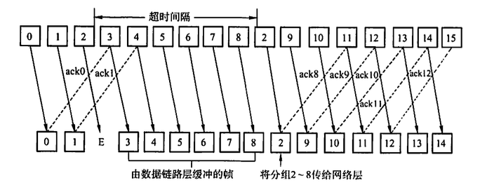

信道相关名称

-   信道效率是对发送方而言的，是指发送方在一个发送周期的时间内，有效地发送数据所需要的时间占整个发送周期的比率。

    -   例如, 发送方从开始发送数据到收到第一个确认帧为止, 称为一个发送周期, 设为 $T$, 发送方在这个周期内共发送 $L$ 比特的数据, 发送方的数据传输速率为 $C$, 则发送方用于发送有效数据的时间为 $L / C$, 在这种情况下, 信道的利用率为 $(L / C) / T$ 。

-   信道吞吐率 $=$ 信道利用率 $\times$ 发送方的发送速率。

## 3.5 介质访问控制
