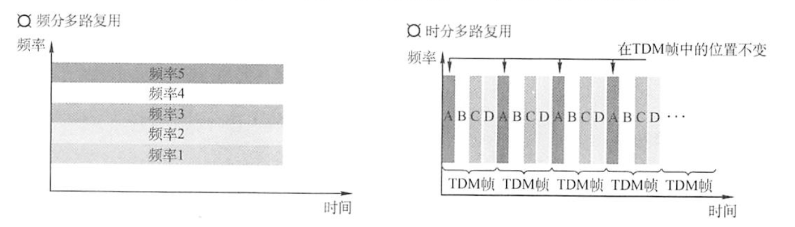
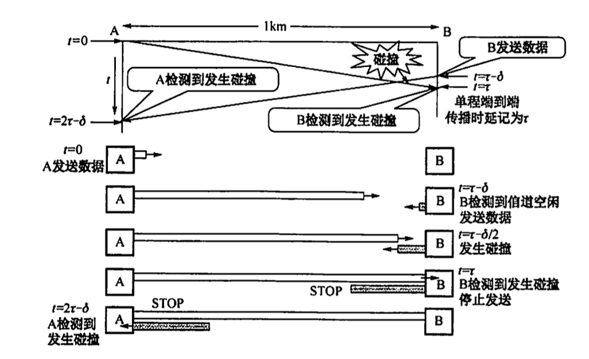
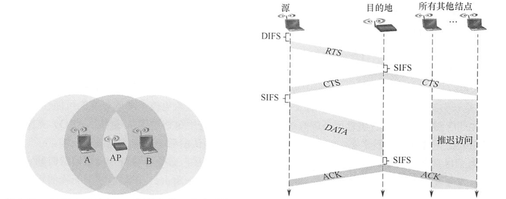
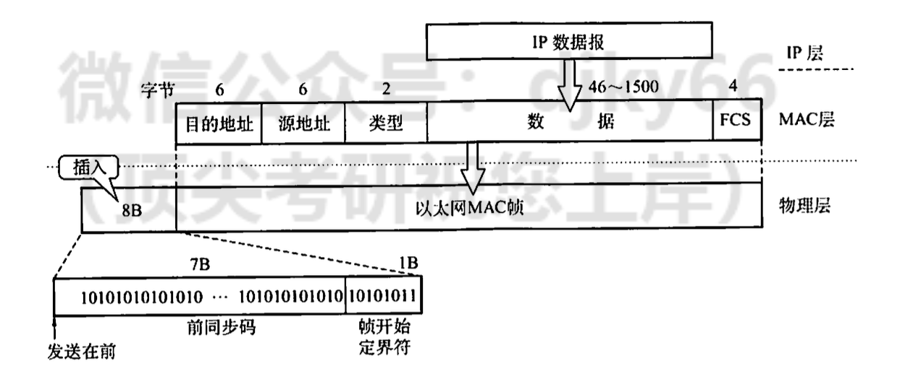

# 链路层

## 3.1 主要功能

1.  为网络层提供服务
    -   无确认无连接
    -   有确认无连接
    -   有确认面向连接
2.  链路管理
3.  帧定界. 帧同步. 透明传输
    -   将一段数 据的前后分别添加首部和尾部，就构成了顿。
    -   网络层的分组封装成帧，以帧的格式进行传送。

1.  流量控制:
    限制发送方的数据流量，使其发送速率不超过接收方的接收能力(跟上自己)
    -   得 发 送 方 知 道 在 什 么 情 况 下 可 以 接 着 发 送 下 一帧 ，
        而 在 什 么 悄 况 下 必 须 暂 停 发 送

1.  差错控制
    -   使发送方确定接收方是否 正确收到由其发送的数据

## 3.2 成帧

-   字符计数

    -   
    -   问题: 计数出错, 全部白瞎

-   字符填充, 但是带转义符

    -   

-   0bit填充收尾标志: 即01111110来标志 一帧的开始和结束。为了不使
    信息位中出现的比特流01111110
    被误判为帧的首尾标志，发送方的数据链路层在信息位中遇到5 个 连 续 的
    “ 1 ” 时 ， 将 自 动 在 其 后 插 入 一个 “ 0 ” ; 而 接 收 方 做 该
    过 程 的 逆 操 作 ， 即 每 收 到 5 个 连
    续的“\]”时，自动删除后面紧跟的“0”，以恢复原信息。

    -   

    -   性能较优

-   违规编码法:
    借用这些编码的时候不允许的(没有使用的)编码序列来定界帧的起始 和 终
    止, 局域网

## 3.3 差错控制

检查出错

-   奇偶校验

    -   它由$n-1$位信息元 和1位校验元组成

    -   校验码 = $\oplus_{i=1}^n a_i$.

-   循环冗余码

    -   给定一个 $m$ bit 的帧或报文, 发送器生成一个 $r$ bit, 的序列,
        称为帧检验序列

        -   由 $m+r$ 比特组成

    -   发送方和接收方事先商定一个多项式 $G(x)$ (最高位和最低位必须为 1
        ), 使得带检验码的帧正好被$G(x)$ 整除.

纠错: Hamming Code

-   确定位数: 设 $n$ 为有效信息的位数, $k$ 为校验位的位数, 则信息位 $n$
    和校验位 $k$ 应满足 $n+k \leq 2^k-1$ (若要检测两位错, 则需再增加 1
    位校验位, 即 $k+1$ 位)

-   确定分布: 规定校验位 $P_t$ 在海明位号为 $2^{i-1}$ 的位置上,
    其余各位为信息位

    -   $P_1$ 的海明位号为 $2^{i-1}=2^0=1$, 即 $H_1$ 为 $P_1$ 。 $P_2$
        的海明位号为 $2^{i-1}=2^1=2$, 即 $H_2$ 为 $P_2$ 。 $P_3$
        的海明位号为 $2^{i-1}=2^2=4$, 即 $H_4$ 为 $P_3$ 。
        将信息位按原来的顺序插入, 则海明码各位的分布如下: $$
        \begin{array}{lllllll}
        H_7 & H_6 & H_5 & H_4 & H_3 & H_2 & H_1 \\
        D_4 & D_3 & D_2 & P_3 & D_1 & P_2 & P_1
        \end{array}
        $$

    -   分组以形成校验关系: 被校验数据位的海明位号等于校验该数
        据位的各校验位海明位号之和。另外，校验位不需要再被校验。

        -   

    -   得到校验值

    -   原理:

        每个校验组分别利用校验位和参与形成该校验位的信息位进行奇偶校验检查,
        构成 $k$ 个校验方程: $$
        \begin{aligned}
        & S_1=P_1 \oplus D_1 \oplus D_2 \oplus D_4 \\
        & S_2=P_2 \oplus D_1 \oplus D_3 \oplus D_4 \\
        & S_3=P_3 \oplus D_2 \oplus D_3 \oplus D_4
        \end{aligned}
        $$

        若 $S_3 S_2 S_1$ 的值为 “ 000 ”, 则说明无错; 否则说明出错,
        且这个数就是错误位的位号, 如 $S_3 S_2 S_1=001$,说明第 1 位出错,
        即 $H_1$ 出错, 直接将该位取反就达到了纠错的目的。

## 3.4 流量控制, 可靠传输机制

流量控制

-   停止-等待流量控制:
    发送方每发送一帧，都要等待接收方的应答信号，之后才能发送下一帧:接收方每接收
    一帧， 都要反馈
    一个应答信号，表示可接收下一帧，如果接收方不反馈应答信号，那么发送方必须一直等
    待。

-   滑动窗口流量控制:

    -   在任意时刻，发送方都维持一组连续的允许发送的帧的序号，称为发送窗口(大小固定)
    -   接收方也 维持一组连续的允许接收帧的序号，称为接收窗口
    -   发送窗口的大小 $W_{\mathrm{T}}$
        代表在还未收到对方确认信息的情况下发送方最多还可以发送多少个数据帧。
    -   在接收端设置接收窗口是为了控制可以接收哪些数据帧和不可以接收哪些帧。
    -   只有收到的数据帧的序字号落入接收窗又内时，才允许将该数据帧收下。若接收到的数据帧落在接
        收窗又之外，则一律将其丢弃。

-   确认:
    接收方可以让发送方知道哪些内容被正确接收。有些情况下为了提高传输效
    率，将确认捎带在一个回复帧中，称为捎带确认。

-   超时重传: 发送方在发送某个数据帧后就开
    启一个计时器，在一定时间内如果没有得到发送的数据帧的确认帧，那么就重新发送该数据帧，
    直到发送成功为止。

-   自动重传请求(ARQ, Automatic Repeat Request): 接 收 方 请 求 发 送 方
    重 传 出 错 的 数 据 帧 来恢复出错的帧，是通信中用
    于处理信道所带来差错的方法之一。

具体协议

-   停止-等待协议

    -   数据帧丢失

    -   数据frame被损坏: 不ack

    -   确认frame被损坏: 接收到的时候重新ack, 0 1 bit交错

-   多帧 滑 动 窗 又 与 后 退 N 帧 协 议

    -   发 送 方 无须 在 收 到 上一 个帧 的 A C K 后 才 能 开 始 发 送
        下一 帧 ， 而 是
        可以连续发送帧。当接收方检测出失序的信息帧后，要求发送方重发最后一个正确接收的信息帧
        之后的所有未被确认的帧;或者当发送方发送了N 个帧后，若发现该N
        个帧的前一个帧在计时器
        超时后仍未返回其确认信息，则该帧被判为出错或丢失，此时发送方就不得不重传该出错帧及随
        后的 N 个帧。

-   多帧滑动窗又与选择重传协议

    -   可设法只重传出现差错的数据帧或计时器超时的数据帧，但此
        时必须加大接收窗又，以便先收下发送序号不连续但仍处在接收窗又中的那些数据帧。等到所缺
        序号的数据帧收到后再一并送交主机。

信道相关名称

-   信道效率是对发送方而言的，是指发送方在一个发送周期的时间内，有效地发送数据所需要的时间占整个发送周期的比率。

    -   例如, 发送方从开始发送数据到收到第一个确认帧为止,
        称为一个发送周期, 设为 $T$, 发送方在这个周期内共发送 $L$
        比特的数据, 发送方的数据传输速率为 $C$,
        则发送方用于发送有效数据的时间为 $L / C$, 在这种情况下,
        信道的利用率为 $(L / C) / T$ 。

-   信道吞吐率 $=$ 信道利用率 $\times$ 发送方的发送速率。

## 3.5 介质访问控制

主要任务

-   为使用介质的每个结点隔离来自同一信道上其他结点
    所传送的信号，以协调活动结点的传输。

常见方法

-   频分多路复用(FDM): 多 路 基 带 信 号 调 制 到 不 同频 率 载 波 上 ，
    再 叠加 形 成 一 个 复 合 信 号 的 多 路复用技术。

-   时分多路复用(TDM): 将一条物理信道按时间分成若干时间片，轮流地分配给
    多个信号使用。每个 时 间 片 由 复 用 的 一 个 信 号 占 用 ， 而 不
    像 F D M 那 样 ， 同 一 时 间 同 时 发 送 多 路信 号

-   波 分 多 路 复 用 (W D M ): 波分多路复用即光的频分多路复用，它在一根
    光纤中传输多种不 同波长(频率)的光信号: 于 波 长 (频 率 ) 不 同 ， 各
    路 光 信 号 互 不 干 扰 ， 最 后 再 用 波 长 分 解 复 用 器 将 各 路
    波 长 分 解 出 来 。 由 于
    光波处于频谱的高频段，有很高的带宽，因而可以实现多路的波分复用

-   码分多路复用(CDM): 采用不同的编码来区分各路原始信号的一种复用方式,
    共享频率和时间. 在码分复用情况下，黄
    豆与绿豆放在同一辆车上运送，到达C后，由C站负责把车上的黄豆和绿豆分开。因此，黄豆和
    绿豆的运送，在码分复用的情况下，既共享了空间，也共享了时间。

    -   等价的词语: 码分多址(CDMA)

        -   比特时间再划分成m个短的时间槽, 称为码片(m=64, 128通常)

        -   发送1时，站点发送它的码片序列;
            发送0时，站点发送该码片序列的反码。

        -   当两个或多个站点同时发送时，各路数据在信道中线性
            相加。为从信道中分离出各路信号，要求各个站点的码片序列相互正交。

访问控制:
上文的不采用集中控制方式解决发送信息的次序问题，所有用户能根据自己的
意愿随机地发送信息，占用信道全部速率。下面为了解决随机接入发生的碰撞，每个用户需要按照一定的规则反复地重传它的帧，直到该帧
无碰撞地通过。 胜利者通过争用获得信道，
从而获得信息的发送权。(争用形协议)

-   ALOHA

    -   纯ALOHA协议:
        当网络中的任何一个站点需要发送数据时，可以不进行任何检测就发送数据。如果在一段时间内未收到确认，那么该站点就认为传输过程中发生了冲突。发
        送站点需要等待 一段时间后再发送数据，直至发送成功。

    -   时隙 A L O H A 协 议: 时 隙 A L O H A 协 议 把 所 有 各 站 在 时
        间 上 同 步 起 来 ，并 将 时 间 划 分 为 一 段 段 等 长 的 时 隙
        (S l o t )， 规定只能在每个时隙开始时才能发送 一个帧。

-   CSMA: 载 波 侦 听 多 路 访 问

    -   1-坚持CSMA(I-persistent CSMA)的基本思想是:
        一个结点要发送数据时，首先侦听信道;
        如果信道空闲，那么立即发送数据;如果信道忙，那么等待，同时继续侦听直至信道空闲:如果
        发生冲突，那么随机等待一段时间后，再重新开始侦听信道。

    -   非坚持CSMA (Non-persistent
        CSMA)的基本思想是:一个结点要发送数据时，首先侦听信
        道:如果信道空闲，那么立即发送数据:如果信道忙，那么放弃侦听，等待
        一个随机的时间后再 重复上述过程。

    -   p - 坚 持 C S M A: 一个结点要发送数据时，
        首先侦听信道:如果信道忙
        ，就持续侦听”，直至信道空闲:如果信道空闲，那么以概率P
        发送数据，以概率1 -p
        推迟到下一个时隙:如果在下一个时隙信道仍然空闲，那么仍以概率p
        发送数 据，以概率1 -P推迟到下一个时隙:这个过程
        一直持续到数据发送成功或因其他结点发送数据而
        检测到信道忙为止，若是后者，则等待下一个时隙再重新开始侦听。

-   CSMA/CD協议: 载 波 侦 听 多 路 访 问 / 碰 撞 检 测 (C a r r i e r S
    e n s e M u l t i p l e A c c e s s w i t h C o l l i s i o n D e t
    e c t i o n)

    -   先听后发，边听边发，冲突停发，随机重发

    -   二进制指 数退避算法来解决碰撞问题

        -   1）确定基本退避时间, 一般取两倍的总线端到端传播时延 $2 \tau$
            (即争用期)。

        -   2）定义参数 $k$, 它等于重传次数, 但 $k$ 不超过 10 , 即
            $k=\min [$ 重传次数, 10\]。当重传次数不超过 10 时, $k$
            等于重传次数; 当重传次数大于 10 时, $k$ 就不再增大而一直等于
            10 （这个条件往往容易忽略, 请读者注意)。

        -   1.  从离散的整数集合 $\left[0,1, \cdots, 2^k-1\right]$
                中随机取出一个数 $r$, 重传所需要退避的时间就是 $r$
                倍的基本退避时间, 即 $2 r \tau$ 。

        -   1.  当重传达 16 次仍不能成功时, 说明网络太拥挤,
                认为此帧永远无法正确发出, 拋弃此帧并向高层报告出错
                (这个条件也容易忽略, 请读者注意)。

-   CSM A/ CA(Collision Avoidance，CA)。 协议:
    协议的设计要尽量降低碰撞发生的概率

    -   用于局域网

    -   使用链路层确认/重传(ARQ)方案，即
        站点每通过无线局域网发送完一帧，就要在收到对方的确认顿后才能继续发送下一帧。

    -   所 有 的 站 完 成 发 送 后 ， 必 须 再 等 待 一 段 很 短 的 时
        间 (继 续
        监听)才能发送下一帧。这段时间称为帧间间隔(InterFrameSpace,
        IFS)。

    -   任何
        一个站要发送数据帧，不仅都要等待一个时间间隔，而且要进入争用窗又，计算随机退避时间以
        便再次试图接入信道，因此降低了碰撞发生的概率。当且仅当检测到信道空闲且这个数据帧是要
        发送的第
        一个数据帧时，才不使用退避算法。其他所有情况都必须使用退避算法，具体为:1在
        发送第一个帧前检测到信道忙:2每次重传
        :3每次成功发送后要发送下一帧。

-   处理隐蔽站问题

    -   源站要发送数据帧之前先广播一个 很短的请求发送RTS
        (RequestToSend)控制帧，它包括源地址、目的地址和这次通信 (含相
        应的确认帧)所持续的时间，该帧能被其范围内包括AP
        在内的所有站点听到。若信道空闲， 则AP广播一个允许发送CTS(Clear
        ToSend)控制帧，它包括这次通信所需的持续时间(从 R T S 帧 复 制
        )，该 帧 也 能 被 其 范 围 内 包 括 A 和 B 在 内 的 所 有 站 点
        听 到 。

    -   B 和 其 他 站 听 到 C T S 后
        ，在CTS帧中指明的时间内将抑制发送，如图3.24所 示。CTS
        帧有两个目的:1给源站明确的 发 送 许 可 ; 2 指 示 其 他 站 点 在
        预 约 期 内 不 要 发 送。

轮询访问: 用户不能随机地发送信息，而要通过
一个集中控制的监控站，以循环方式轮
询每个结点，再决定信道的分配。当某结点使用信道时，其他结点都不能使用信道。典型的轮询
访问介质访问控制协议是令牌传递协议，它主要用在令牌环局域网中。

-   网络空闲时，环路中只有令牌帧在循环传递。

-   令牌传递到有数据要发送的站点时，该站点就修改令牌中的一个标志位，并在令牌中附
    加自己需要传输的数据，将令牌变成
    一个数据帧，然后将这个数据帧发送出去。

-   数据帧沿着环路传输，接收到的站点一边转发数据，一边查看帧的目的地址。如果目的
    地址和自己的地址相同，那么接收站就复制该数据帧以便进一步处理。

-   数据帧沿着环路传输，直到到达该帧的源站点，源站点收到自己发出去的帧后便不再转
    发。同时，通过检验返回的帧来查看数据传输过程中是否出错，若有错则重传。

-   源 站 点 传 送 完 数 据 后 ， 重 新 产 生 一个 令 牌 ， 并 传 递 给
    下 一 站 点 ， 以 交 出 信 道 控 制 权 。

## 3.6 局域网

局域网(LocalAreaNetwork,
LAN)是指在一个较小的地理范围(如一所学校)内，将各种
计算机、外部设备和数据库系统等通过双绞线、同轴电缆等连接介质互相连接起来，组成资源和
信息共享的计算机互联网络。

以太网(IEEE802.3)

-   总说
    -   逻辑上采用总线形拓扑结构，以太网中的所有计算机共享同一条总线，信息以广播方
        式发送。为了保证数据通信的方便性和可靠性，以太网简化了通信流程并使用了CSMA/
        CD方式 对总线进行访问控制。
    -   采用两项措施以简化通信:1
        采用无连接的工作方式，不对发送的数据帧编号，也
        不要求接收方发送确认，即以太网尽最大努力交付数据，提供的是不可靠服务，对于差错的纠正
        则 由 高 层 完 成 :2 发 送 的 数 据 都 使 用 曼 彻 斯 特 编 码
        的 信 号 ， 每 个 码 元 的 中 间 出 现 一 次 电 压 转 换 ，
        接收端利用这种电压转换方便地把位同步信号提取出来。
-   网络接口卡: 进行数据的串
    并转换。网卡不仅能实现与局域网传输介质之间的物理连接和电信号匹配，还涉及帧的发送与接收、
    帧的封装与拆封、介质访问控制、数据的编码与解码及数据缓存功能等。具有介质访问控制(MAC)地址.
-   MAC地址
    -   物理地址
    -   长6 字节，一般用由连字符 (或冒号)分 隔的12个十六进制数表示
    -   网卡从网络上每收到一个MAC帧，首先要用硬件检查
        MAC帧中的MAC地址。如果是发往本站的帧，那么就收下，否则丢弃。
    -   MAC帧有开始没有结束

