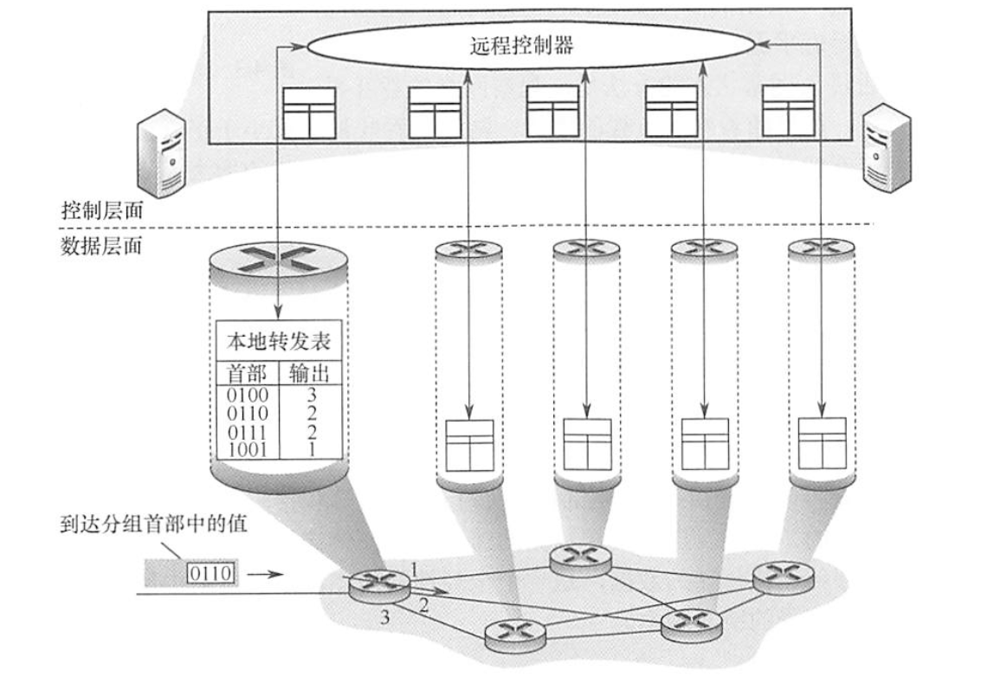
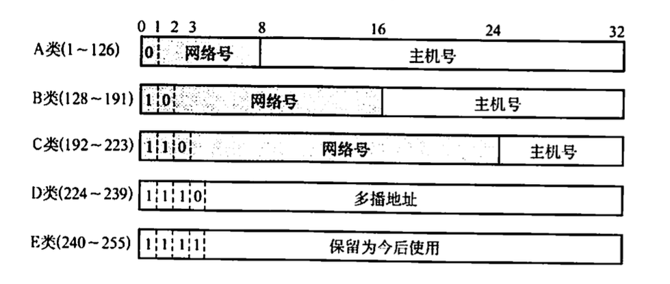
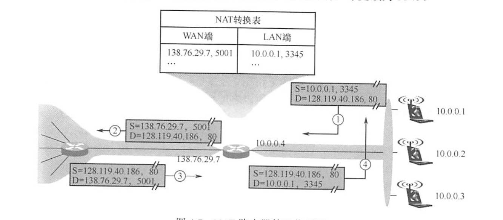

# 4. 网络层

## 4.1 功能介绍

中继系统

-   物理层中继系统:转发器，集线器。

-   数据链路层中继系统:网桥或交换机。

-   网络层中继系统:路由器。

-   网 络 层 以 上的 中 继 系 统 : 网 关 。

网络层 SDN(Software Defined Network):

-   转发, 路由选择

-   好处: 1全局集中式控制和分布式高速转发，既利于控制层面的全局优化，又利于高 性能的网络转发。2灵活可编程与性能的平衡，控制和转发功能分离后，使得网络可以由专有的 自动化工具以编程方式配置。3降低成本，控制和数据层面分离后，尤其是在使用开放的接又协 议后，就实现了网络设备的制造与功能软件的开发相分离，从而有效降低了成本。

-   坏处: 1安全风险，集中管理容易受攻击，如果崩溃，整个网络会受到影响。2瓶颈 问题，原本分布式的控制层面集中化后，随着网络规模扩大，控制器可能成为网络性能的瓶颈。

拥塞控制

-   在通信子网中，因出现过量的分组而引起网络性能 下降 的现象称为拥塞。

    -   例如, 某个路由器所在链路的带宽为 $R \mathrm{~B} / \mathrm{s}$,如果 IP 分组只从它的某个端口进入, 那么其速率为 $r_{\text {in }} \mathrm{B} / \mathrm{s}$ 。当 $r_{\mathrm{in}}=R$ 时, 可能看起来是件 “好事”, 因为链路带宽被充分利用。但是, 如图 4.3 所示, 当分组到达路由器的速率接近 $R$ 时, 平均时延急剧增加, 并且会有大量的分组被丢弃（路由器端口的缓冲区是有限的), 整个网络的吞吐量会骤降, 源与目的地之间的平均时延也会变得近乎无穷大。

-   判定方法: 开环在设计网络时事先将有关发生拥塞的因素考虑周到, 闭环事先不考虑有关发生拥塞的各种因素，采用监测网络系统去监视，及时检测 哪里发生了拥塞，然后将拥塞信息传到合适的地方，以便调整网络系统的运行，并解决 出现的问题。

## 4.2 IPv4

IPv4分组的格式

-   版本。指 IP 协议的版本, 目前广泛使用的版本号为 4 。

-   首部长度。占 4 位, 可以表示的最大十进制数是 15 。以 32 位为单位, 最大值为 $60 \mathrm{~B}$ (15×4B)。最常用的首部长度是 20B, 此时不使用任何选项（即可选字段）。

-   总长度。占 16 位。指首部和数据之和的长度, 单位为字节, 因此数据报的最大长度为 $2^{16}-1=65535 B$ 。以太网帧的最大传送单元 (MTU) 为 $1500 \mathrm{~B}$, 因此当一个 $\mathbb{P}$ 数据报封装成帧时, 数据报的总长度（首部加数据）一定不能超过下面的数据链路层的 MTU 值。

-   标识。占 16 位。它是一个计数器, 每产生一个数据报就加 1 , 并赋值给标识字段。但它并不是 “序号” (因为 IP 是无连接服务)。当一个数据报的长度超过网络的 MTU 时, 必须分片, 此时每个数据报片都复制一次标识号, 以便能正确重装成原来的数据报。

-   标志。占 3 位。标志字段的最低位为 $\mathrm{MF}, \mathrm{MF}=1$ 表示后面还有分片, $\mathrm{MF}=0$ 表示最后一个分片。标志字段中间的一位是 DF, 只有当 $\mathrm{DF}=0$ 时才允许分片。

-   片偏移。占 13 位。它指出较长的分组在分片后, 某片在原分组中的相对位置。片偏移以 8 个字节为偏移单位。除最后一个分片外, 每个分片的长度一定是 $8 \mathrm{~B}$ 的整数倍。

-   生存时间 (TTL)。占 8 位。数据报在网络中可通过的路由器数的最大值, 标识分组在网络中的寿命, 以确保分组不会永远在网络中循环。路由器在转发分组前, 先把 TTL 减 1。若 TTL 被减为 0 , 则该分组必须丢弃。

-   协议。占 8 位。指出此分组携带的数据使用何种协议, 即分组的数据部分应上交给哪个协议进行处理, 如 TCP、UDP 等。其中值为 6 表示 TCP, 值为 17 表示 UDP。

-   首部校验和。占 16 位。首部校验和只校验分组的首部, 而不校验数据部分。

-   源地址字段。占 4B, 标识发送方的 IP 地址。

-   目的地址字段。占 4B, 标识接收方的 IP 地址。

分片: 个链路层数据报能承载的最大数据量称为最大传送单元(MTU)。因为IP数据报被封装在 链路层数据报中，因此链路层的MTU 严格地限制着IP 数据报的长度，而且在 IP 数据报的源与 目的地路径上的各段链路可能使用不同的链路层协议，有不同的MTU。例如，以太网的MTU 为 1 5 0 0 B ， 而 许 多 广 域 网 的 M T U 不 超 过 5 7 6 B 。 当 I P 数 据 报 的 总 长 度 大 于链 路 M T U 时 ， 就 需 要 将 IP 数据报中的数据分装在多个较小的IP 数据报中，这些较小的数据报称为片。片在目的地的网络层被重新组装。

NAT与IPv4: 连接到因特网上的每台主机(或路由器)都分配一个32 比特的全球唯一标识符，即IP 地址。 IP地址由互联网名字和数字地址分配机构ICANN进行分配。

-   无论哪类 IP 地址, 都由网络号和主机号两部分组成。即 IP 地址:: $=\{<$ 网络号\>, \<主机号 $>\}$ 。

    -   主机 号 全 为 0 表 示 本 网 络 本 身 ， 如 2 0 2 . 9 8 . 1 7 4 . 0 。

    -   主机号全为1表示本网络的广播地址，又称直接广播地址，如202.98.174.255。

    -   127.×.X.×保留为环回自检(LoopbackTest)地址，此地址表示任意主机本身，目的地址为 环回地址的IP数据报永远不会出现在任何网络上。

    -   3 2 位 全 为 0 ， 即 0 . 0 . 0 . 0 表 示 本 网 络 上的 本 主 机 。

    -   32位全为1，即255.255.255.255表示整个TCP/IP网络的广播地址，又称受限广播地址。 实际使用时，由于路由器对广播域的隔离，255. 255.25.255等效为本网络的广播地址。

### 4.2.2 子网划分

基本思路

-   子网划分纯属一个单位内部的事情。单位对外仍然表现为没有划分子网的网络。

-   从主机号借用若干比特作为子网号，当然主机号也就相应减少了相同的比特。三级IP地 址的结构如下:IP 地址= {\<网络号\>，\<子网号\>，\<主机号\>}。

-   凡是从其他网络发送给本单位某台主机的IP数据报，仍然是根据IP数据报的目的网络号， 先找到连接到本单位网络上的路由器。然后该路由器在收到IP数据报后，按目的网络号 和子网号找到目的子网。最后把IP 数据报直接交付给目的主机。

子网掩码: 告诉主机或路由器对一个A类、B 类、C 类网络进行了子网划分，使用子网掩码来表达 对原网络中主机号的借位。

-   与 I P 地 址 相 对 应 的 、长 3 2 b i t 的 二 进 制 串 ，它 由 一 串 1 和 跟 随 的 一 串 0 组 成 。 其 中 ， 1 对 应 于 I P 地 址 中 的 网 络 号 及 子网 号 ， 而 0 对 应 于 主机 号 。 计 算 机 只 需 将 I P 地 址 和 其对 应的子网掩码逐位“ 与” (逻辑AND运算)，就可得出相应子网的网络地址。

-   使用子网掩码:

    -   一台主机在设置IP 地址信息的同时，必须设置子网掩码。

    -   同属于一个子网的所有主机及路由器的相应端又，必须设置相同的子网掩

    -   路由器的路由表中，所包含信息的主要内容有目的网络地址、子网掩码、下一跳地址。

无分类编址CIDR

-   CIDR 是在变长子网掩码的基础上提出的一种消除传统A、B、C 类网 络划分，并且可以在软件的支持下实现超网构造的一种IP地址的划分方法。

-   最长前缀匹配(最佳匹配):使用CIDR时，路由表中的每个项目由“网络前缀” 和“ 下一 跳地址” 组成。在查找路由表时可能会得到不止一个匹配结果。此时，应当从匹配结果中选择具 有最长网络前缀的路由，因为网络前缀越长，其地址块就越小，因而路由就越具体。

分组转发过程

-   从收到的 IP 分组的首部提取目的主机的 IP 地址 $D$ (即目的地址)。

-   若查找到特定主机路由 (目的地址为 $D$ ), 就按照这条路由的下一跳转发分组; 否则从转发责中的下一条 (即按前缀长度的顺序) 开始检查, 执行步骤 3)。

-   将这一行的子网掩码与目的地址 $D$ 进行按位与运算。若运算结果与本行的前缀匹配, 则查找结束, 按照 “下一跳” 指出的进行处理 (或者直接交付本网络上的目的主机, 或通过指定接口发送到下一跳路由器)。否则, 若转发表还有下一行, 则对下一行进行检查,重新执行步骤 3)。否则, 执行步骤 4)。

-   若转发表中有一个默认路由, 则把分组传送给默认路由; 否则, 报告转发分组出错。

-   得到下一跳路由器的 IP 地址后，并不是直接将该地址填入待发送的数据报，而是将该 I P 地 址 转 换 成 M A C 地 址 (通 过 A R P )， 将 此 M A C 地 址 放 到 M A C 帧 首 部 中 ， 然 后 根 据 这 个 MAC地址找到下一跳路由器。在不同网络中传送时，MAC帧中的源地址和目的地址要发生变化， 但是网桥在转发帧时，不改变帧的源地址，请注意区分。

ARP, DHCP, ICMP

-   ARP: 主机A欲向本局域网上的某台主机B发送IP数据报 时 ， 先 在 其 A R P 高 速 缓 存 中 查 看 有 无 主机 B 的 I P 地 址 。 如 果 直 ， 就 可 查 出 其 对 应 的 硬 件 地 址 ， 再将此硬件地址写入MAC帧，然后通过局域网将该MAC 帧发往此硬件地址。如果没有，那么 就 通 过 使 用 目 的 M A C 地 址 F F - F F - F F - F F - F F - F F 的 帧 来 封 装 并 广 播 A R P 请 求 分 组 (广 播 发 送 )， 使同 一个局域网里的所有主机都收到此ARP请求。主机B收到该ARP请求后，向主机A发出 A R P 响 应 分 组 (单 播 发 送 )， 分 组 中 包 含 主机 B 的 I P 与 M A C 地 址 的 映 射 关 系 ， 主机 A 收 到 A R P 响应分组后就将此映射写入ARP 缓存，然后按查询到的硬件地址发送MAC帧。ARP 由于“看到 了” IP地址，所以它工作在网络层，而NAT路由器由于“看到了” 端又，所以它工作在传输层。

-   DHCP:

    -   ) D H C P 客 户 机 广 播 “ D H C P 发 现 ” 消 息 ， 试 图 找 到 网 络 中 的 D H C P 服 务 器 ，以 便 从 D H C P 服务器获得一个IP地址。源地址 0.0.0.0，目 的地址为255.255.255.25。

    -   DHCP 服务器收到“DHCP 发现” 消息后，广播 “DHCP 提供” 消息，其中包括提供给 DH CP客户机的IP地址。源地址 DHCP 服务器地址，目的 地址为255.255.255.255。

    -   D H C P 客 户 机 收 到 “ D H C P 提 供 ” 消 息 ， 如 果 接 受 该I P 地 址 ， 那 么 就 广播 “ D H C P 请 求” 消息向DHCP服务器请求提供IP 地址。源地址为0. 0.0.0，目的 地址为255.255.255.255。

    -   DHCP服务器广播“DHICP确认” 消息，将IP地址分配给DHCP 客户机。源地址为DHCP 服务器地址，目的地址为255.255.255.255。

    -   TCP需要建立连接，如果 连对方的IP 地址都不知道，那么更不可能通过双方的套接字建立连接。

-   网际控制报文协议 (ICMP)
