# 往年习题

D =\> B: 开放互联系统参考模型

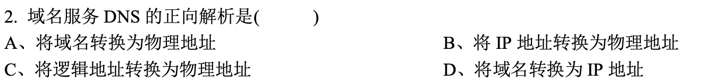

D

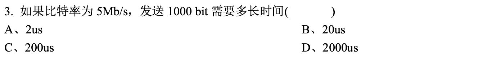

B

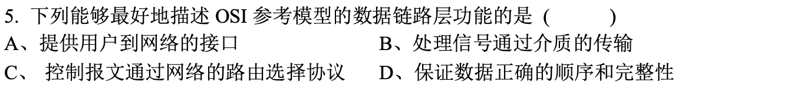

UNKNOWN =\> B

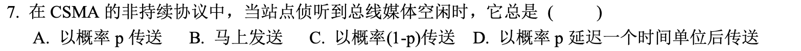

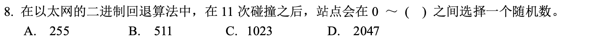

C

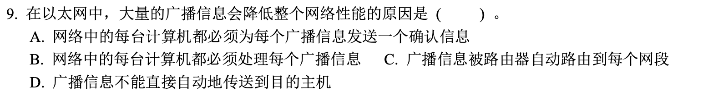

C=\>B

B

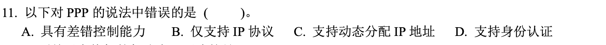

A

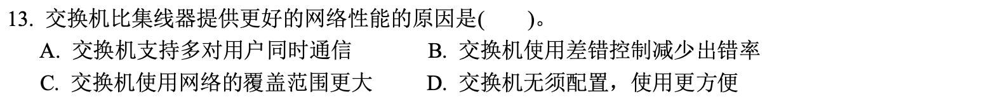

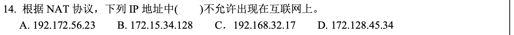

C

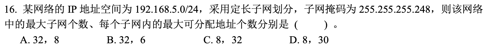

D=\>B

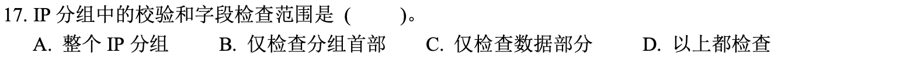

D

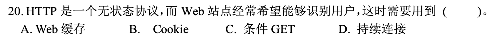

B

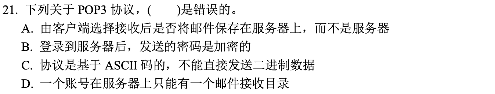

C=\>B

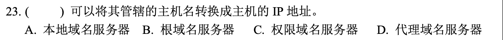

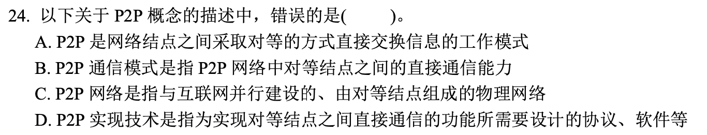

C

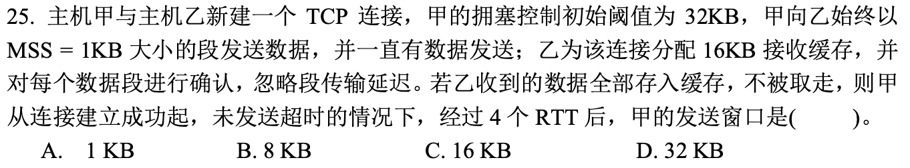

D=\>B

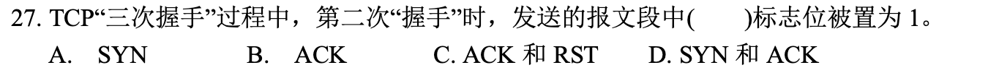

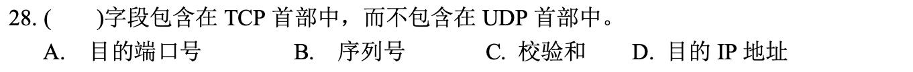

C=\>B

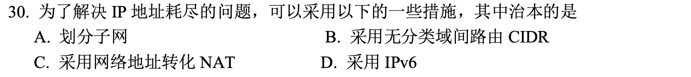

C=\>D

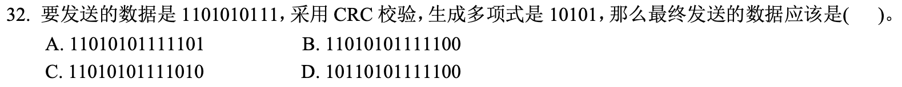

UNK=\>B

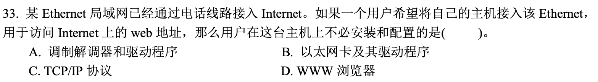

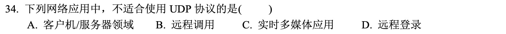

D

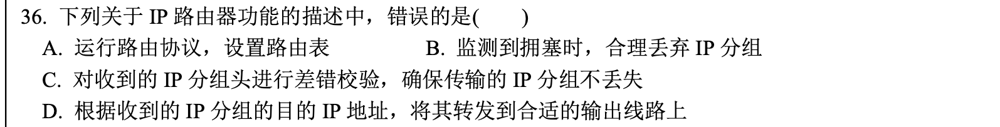

C

A

](images/clipboard-3437677229.png)

C=\>B

## 缩写词汇库

### 高频词汇

-   HTTP: Hyper Text Transfer Prot. 超文本传输协议

-   SMTP: Simple Mail Transfer Protocol. 简单邮件传输协议

-   RTP: Real-Time Transpo*rt P*rotocol, 实时传送协议

-   QUIC: *Quic*k UDP Internet Connections, 快速UDP互联网连接协议

-   DASH: Dynamic Adaptive Streaming over HTTP: 基于HTTP的动态自适应推流

-   TCP: Transfer Control Prot. 传输控制协议

-   UDP: User Datagram Prot. 用户报文协议

-   NAT: Network Address Translation, 网络地址转换

-   IP: Internet Protocol, 网际互连协议

-   **NFV: Network Functions Virtualization, 网络功能虚拟化**

-   PPP: Point to point protocol, 点对点协议

-   *PDCP:* Packet Data Convergence Protocol, 分组数据汇聚协议

-   *Wi-Fi:* 移动热点

-   DNS: Domain Name System 域名系统

-   URL: Uniform Res Locator, 统一资源定位符

-   ISP: Internet Service Provider, 互联网服务提供商

-   CSMA: Carrier Sense Multiple Access: 载波侦听多路存取

    -   CD: Collision Detection, 碰撞检测

    -   CA: Collision Avoidance, 碰撞避免

-   ICMP: Internet Control Message Protocol, Internet控制报文协议

### 相对低频词汇

-   DSL, Digital Subscription Line, 数字用户线

-   HFC, Hybrid Fiber Coax, 混合光纤同轴

-   CMTS, Cable Modem Termination System, 电缆调制解调器端接系统

-   FTTH, Fiber to the home, 光线到户

-   LAN, 局域网

-   LTE, Long term evolution, 长期演进

-   FDM, Freq Division Multiplexing, 频分复用

-   TDM, Time divi Multiplexing, 时分复用

## 大题

### 大题1

一个单位从ISP申请到一个地址块211.156.2.0/24，该单位的网络拓扑图如图2所示。其中网络1有100台主机，网络2和网络3各有50台主机。 请分析与计算下列问题：

1)  每个网络的网络地址(形为a.b.c.d/x)是什么？(3分) 这是不等长的子网划分问题，需要从IP地址的第四个字节分别借出0、10和11比特表示网络1、网络2和网络3的子网号，那么网络1、网络2和网络3的网络号和子网号一起分别总占用25比特、26比特和26比特。 对于网络1来说，IP地址的第4个字节就可以表示为0\*\*\*\*\*\*\*，星号“*”表示某个比特的取值1或0。那么第四个字节的取值范围为0～127，于是211.156.2.0表示网络1的子网络地址，211.156.2.127表示网络1的直接广播地址，该网络的网络地址块可以表示为211.156.2.0/25。 对于网络2来说，IP地址的第4个字节就可以表示为10*\*\*\*\*\*，星号“*”表示某个比特的取值1或0。那么第四个字节的取值范围为128～191，于是211.156.2.128表示网络1的子网络地址，211.156.2.191表示网络2的直接广播地址，该网络2的网络地址块可以表示为211.156.2.128/26。 对于网络3来说，IP地址的第4个字节就可以表示为11*\*\*\*\*\*，星号“\*”表示某个比特的取值1或0。那么第四个字节的取值范围为192～255，于是211.156.2.192表示网络1的子网络地址，211.156.2.255表示网络3的直接广播地址，该网络3的网络地址块可以表示为211.156.2.192/26。
2)  若给每个网络中的网关地址分配该网络的最小可分配IP，则连接网络1\~3的路由器接口IP和掩码分别为多少？(2分) 依据拓扑图可知，eth0、eth1和eth2分别是网络1、网络2和网络3的下一跳的接口，于是网络1\~3的路由器接口IP地址分别为211.156.2.1、 211.156.2.129和211.156.2.193，掩码分别是/25、/26和/26。
3)  为了使得主机A、B、C都能互相通信，画表说明一下路由器2的路由表应该是怎样的？(每条路由表包括目的网络地址，掩码，下一跳) (3分) 由示意图可以看出，总有5个子网，其中包含路由器2和路由器1直接连接的网络以及路由器2和路由器3直接连接的网络。
    1)  目的网络地址 掩码 下一跳
    2)  192.168.1.0 /24 直接交付 接口为eth2
    3)  192.168.2.0 /24 直接交付，接口为eth4
    4)  211.156.2.0 /25 192.168.1.1
    5)  211.156.2.128 /26 直接交付，接口为eth3
    6)  211.156.2.192 /26 192.168.2.2
4)  根据你的划分结果说明，当路由器2收到某个部门发出的一个目的地址为211.156.2.102的IP分组，应该向哪个接口转发？ (2分) 将211.156.2.102分别与上述的路由表中/24、/25和/26相“与”运算。发现与路由表中的第3个表项匹配。 即211.156.2.102 and /25 = 211.156.2.0，于是路由器2向接口eth2转发，下一跳是192.168.1.1。

### 大题2

(1)、假定站点A和B在同一个10Mbit/s以太网网段上。这两个站点之间的传播时延为225比特时间。现假定A开始发送一帧，并且在A发送结束之前B也发送一帧。 (1) 如果A发送的是以太网所容许的最短的帧，那么A在检测到和B发生碰撞之前能否把自己的数据发送完毕？请写出计算过程。（4分） 提示：在计算时应当考虑到每一个以太网帧在发送到信道上时，在MAC帧前面还要增加前同步码和帧定界符。

在问题(1)中的站点A和B在t=0时同时发送了数据帧。当t=225比特时间，A和B同时检测到发生了碰撞，并且在t=225+48=273比特时间完成了干扰信号的传输。A和B在CSMA/CD算法中选择不同的r值退避。假定A和B选择的随机数分别是RA=0和RB=1。试问： ①A和B各在什么时间开始重传其数据帧？（2分） ②A重传的数据帧在什么时间到达B？（2分） ③A重传的数据会不会和B重传的数据再次发送碰撞？（1分） ④B会不会在预定的重传时间停止发送数据？（1分）

第一小题：最小帧长为64字节，前同步码和帧定界符的长度为8字节，那么最小帧长的帧所需要的传输时间为: (64+8)*8=576比特时间；两个站点之间的传播时延为225比特时间，如有碰撞的话，那么冲突信号到达站点时间的最长值为：225*2=450比特时间。(此外，冲突信号到达站点的时间最小值接近0，但没有实际意义)。 576 大于 450，因而，A在检测到和B发生碰撞之前不能把自己的数据发送完毕。 第二小题： (1) 在t=225+48=273比特时间完成了干扰信号的传输，但需要再经过时间t =225比特时间使得信道上无信号在传播。虽然“基本退避时间为争用期为2t ，具体的争用时间为512比特时间(最小帧长64字节的传输时间)”，但在具体实践中取传播时延t是符合真实的场景的。 在t=225+48+225=498比特时间时，链路上无信号。 由于A和B选择的随机数分别是RA=0和RB=1，则有： 在t=225+48+225=498比特时间时，A开始重传其数据帧。这种传输时刻也可以理解为：t=225+48+0*t 比特时间侦听信道(B也在发送干扰信号)，此时信道忙，再经历225比特时间后空闲。 在t=498比特时间 + 1*225比特时间，B开始侦听信道，由于此时A的信号刚到达B，此时信道忙。由于CSMA/CD采用1-持续的侦听方式，再经历576比特时间[(64+8)\*8=576)]后，也就说在t=498比特时间+1*225比特时间(传播时延)+576比特时间(传输时延) =1299比特时间，信道空闲，B开始传输。 (2) 由上述分析可知，A重传的数据帧在t=498比特时间 + 1*225比特时间 = 723比特时间开始到达B。\
(3) A重传的数据不会和B重传的数据再次发送碰撞 (4) 由于没有冲突的发生，B不会在预定的重传时间停止发送数据。
