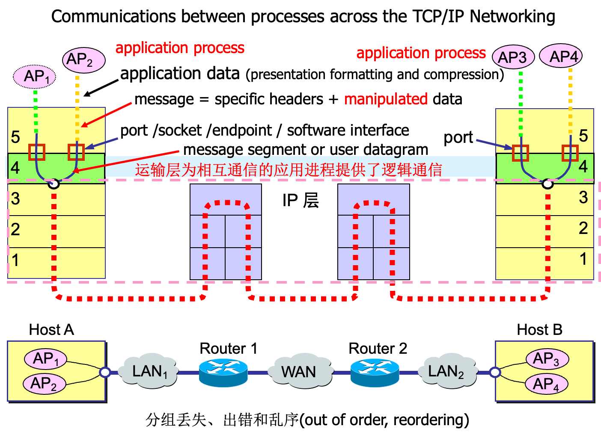
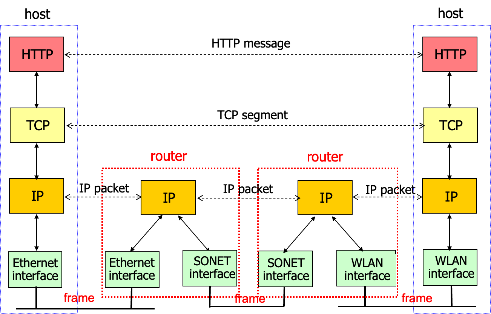

# 考试题型

## 名词解释(1分10个)

15个里面选10个

-   RFC 请求凭证
-   TCP 传输控制协议
-   DNS: 域名系统
-   Qos: Quality of Service: 服务质量

## 选择题(3分10个)

从文档里面抽6个出来

-   7\~10 4个 ABCD均会选的(是ABCD的一个排列)

## 计算题(10分3个)

-   TCP: 书后
-   IP
-   数据链路层 data link
-   6-19的图 发送数据报到子网之外
-   TCP/UDP中源地址放在前面, 目的地址放在后面. ETH中放在前面, 目的是快速转发

书本

-   第三章
-   第四章
-   第六章

## 看图简答题(10分3个)

-   P147
-   3.6.1拥塞控制 原因 代价 如何解决
    -   P173 图3-46 $R/2, R/3$​如何计算的?
        -   $\lambda_{in}, \lambda_{out}$​\
-   发的My insights十分

## 报告

-   packet交互/linux
-   结果分析
    -   输出
    -   文件
    -   展示

## 题目

第一章 1.1-1.5

第二章 选择题, DASH 不考2.5, 2.6

第三章 全是重点 拥塞控制(3.4-3.5), 3.4, 3.5之间考察计算

第四章 全是重点 子网掩码

第五章 仅有5.6 ICMP

第六章 6.5, 6.6不考 6.7复习重点 P337 6.7 24步骤

BDCBD BBCBB BAACA BBDDB

