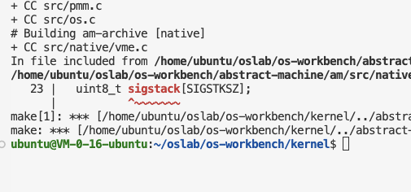

# 偷偷进群聊

# Bugs 

### 编译`NATIVE`的时候变长数组



解决方法: 将SIGSTKSZ改为类似4096的数字. 

### `AM`难以处理多个CPU

(同学) 目前为止遇到的问题和解决方案：https://blog.rijuyuezhu.top/posts/aba214cc/

(助教) 关于CPU只有一个的问题：

TL;DR: abstract-machine和xv6都通过读MP tables来得到CPU核心数的值，这个值对应QEMU中的sockets数量。如果发现am只找到了一个核，在abstract-machine/scripts/platform/qemu.mk里面的QEMU_FLAGS里把-smp设置成-smp “cores=1.sockets=$(smp)”即可。

原因：QEMU6.1之前的版本的策略是prefer sockets over core，所以指定-smp $(smp)相当于指定-smp cpus=n,cores=1,sockets=n；>6.1的某个版本策略变成了prefer core,所以这时候指定-smp $(smp)相当于指定-smp cpus=n,cores=n,sockets=1。在不改配置的情况下 一种比较hack的方式是在trm.c的__am_lapic_init()里面调cpuid指令，然后把拿到的logical cpu count赋值给__am_ncpu。


## 实验技巧

### 下载jyy服务器内容

```
REMOTE="ftp://jyywiki.cn/"
LOCAL="$HOME/Code/os/jyy-demo"

lftp -e "mirror --delete --parallel=2 --use-pget-n=5 /os $LOCAL; exit" "$REMOTE"
```


## 杂谈

### 关于梦境

W: 今天突然好奇jyy的mbti是什么

S: 猜一手intp

C: 远见的鹰 善战的狼

众: ostep goat unix stfw atfc noip jsoi 

A: miar(machine is always right)

J: eism（everything is a state machine）

W: 人是不是能看成是一个状态机呢🤔

C: gpa (grade point average)

W: 我们以为自己有思维，可是说不定只是gene在无情地执行指令

A: (Reply to W) 可以的, 后面会提到这个

H: 人是不是也适用于 church turing thesis）所以人不能计算停机问题

A: 大体上可以((

C: (Reply to H)为何不能？只要有机会，人随时都可以shutdown任何特定的人@H

X: 他说的是算法停机问题吧 能不能判断一个算法能否停机（

CH: 感觉人更像一个神谕图灵机(

L: @三体秦始皇

