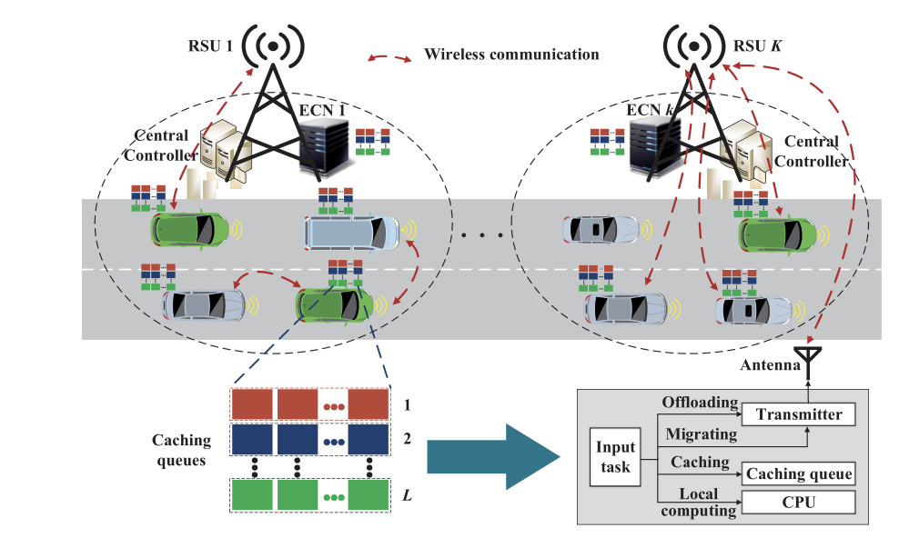

# VEC Scheduling

## Collaborative Data Scheduling for Vehicular Edge

Computing via Deep Reinforcement Learning

文章主要研究

- 车辆边缘计算(**vehicular edge computing**, VEC)
- 道路单元(**roadside unit**, RSU)

可以存在

- **vehicle-to-vehicle (V2V) communications**的通讯
- V2I的通讯

### 前人的工作

- 目的: 要支持车载的内容
- 组件
  - edge computational nodes(ECNs) - 信号塔上的, RSU的, 互联自动驾驶车

本作

- 模型: 均匀VEC网络, 数据在本地处理, 使用缓存队列
- 算法: TBD
- 验证: TBD

### 系统模型

|              Notation              | Explanation                                                  |
| :--------------------------------: | :----------------------------------------------------------- |
|                $K$                 | 路段的数量 Number of road segments                           |
|        $C_{\mathrm{V} 2I}$         | #V2I communication (车辆到塔台)                              |
|   $C_{\mathrm{V} 2 \mathrm{~V}}$   | #V2V communication(车辆到车)                                 |
|                $B$                 | Bandwidth of each licensed channel                           |
|               $R_k$                | Coverage radius of RSU(信号塔) $k$                           |
|          $R^{\mathrm{V}}$          | Coverage radius of vehicles(车)                              |
|               $N_k$                | Number of vehicles within RSU $k$                            |
|             $\Delta t$             | Duration of a time-slot                                      |
|                $M$                 | Number of data types                                         |
|               $D_i$                | Amount of type-i data                                        |
|                $c$                 | Processing density of data                                   |
|       $f_n^{\text {local }}$       | Processing capability of vehicle $n$                         |
|        $f_k^{\text {ECN }}$        | Processing capability of RSU $k$                             |
|        $\kappa_1, \kappa_2$        | Effective switched capacitance related to the chip  architecture in vehicles and RSUs |
|                $d$                 | Distance between transmitter and receiver                    |
|            $\vartheta$             | Path loss exponent                                           |
|                $h$                 | Channel fading coefficient                                   |
|             $\omega_0$             | White Gaussian noise power                                   |
|            $P_n^{t r}$             | Transmission power of vehicle $n$                            |
| $\alpha_{n, k}^t, \beta_{n, k}^t$  | Local computing and data offloading indicators for   vehicle $n$ running on road segment $k$ at time-slot $t$ |
| $\gamma_{n, k}^t, \delta_{n, k}^t$ | Data migrating and receiving indicators for vehicle $n$   running on road segment $k$ at time-slot $t$ |
|             $\mu_n^t$              | Data processing indicator for RSU $n$ at time-slot $t$       |
|               $\xi$                | Penalty coefficient                                          |
|      $q_{n, l}^t, g_{k, l}^t$      | Length of data cached in queue $l$ of vehicle $n$ and   RSU $k$ at time-slot $t$ |
|       $c^l, c^{\mathrm{V}}$        | Cost for using licensed V2I and V2V channels                 |
|            $c^{E C N}$             | Cost for RSU processing data                                 |
|             $\varrho$              | Cost for energy consumption                                  |

$\newcommand{\K}{\mathbb{K}}$

- 路分为$K$段, 用$\K$表示. 每一段由RSU和ECN组成
  - RSU(Roadside Unit)的覆盖范围: $\{R_1, ..., R_k\}$​, 
  - 把时间划分为$\Delta t$(很短), 无线信道在每一个$\Delta t$之间保持不变. 在一段时间的开始产生. 
- 板载机器的运算性能差
  - Latency-sensitive的任务: 丢给信号塔/丢给其他空闲的车
  - 一共有$M$类东西, 有两个属性$D_i, T_i$表示数据量, 数据传输的延迟