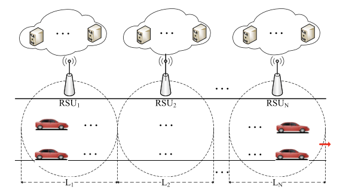

# Paper2

## Dependency Aware Task Scheduling in VEC

This passage 

- a VEC architecture which consists of multiple vehicles, multiple RSUs, and multiple MEC(mobile-edge computing) servers.
  - V has computation-intensive and delay-sensitive apps
  - Each RSU is equipped with multiple MEC servers
  - V offload compint dlsens apps to MEC servers on RSUs 
  - for execution where applications are independent of each other but tasks (belonging to the same application) have processing dependence.
- formalize the task scheduling decision problem as an optimization problem which is NP-hard

- We evaluate the proposed task scheduling algorithm with extensive simulations

Notations

| Notation          | Description                                         |
| :---------------- | :-------------------------------------------------- |
| $\mathcal{M}, M$  | set / number of vehicles                            |
| $\mathcal{N}, N$  | set / number of RSUs                                |
| $\mathcal{R}, R$  | set / number of MEC servers on each RSU             |
| $m$               | the vehicle index $m \in \mathcal{M}$               |
| $n$               | the RSU index $n \in \mathcal{N}$                   |
| $r$               | the MEC server index $r \in \mathcal{R}$            |
| $T_m$             | the $m$ th application                              |
| $T_{m, i}$        | the $i$ th task of application $T_m$                |
| $\mathcal{I}, I$  | set / number of tasks of application $T_m$          |
| $i$               | the task index $i \in \mathcal{I}$                  |
| $x_{m, i, r}$     | the scheduling decision variable of task $T_{m, i}$ |
| $R T_{m, i}$      | the ready time of task $T_{m, i}$                   |
| $A F T_{m, i}$    | the actual completion time of task $T_{m, i}$       |
| $E S T_{m, i, r}$ | the earliest start time of task $T_{m, i}$          |
| $E F T_{m, i, r}$ | the earliest finish time of task $T_{m, i}$         |

### System Model

#### Network Model

- $M$车在某个路(没有方向)的起点, $N$ RSUs. 
  - each RSU is equipped with $R$​ MECs
- 按照覆盖范围把路分为$\left\{{L}_1, {L}_2, \ldots, {L}_N\right\}$
- 车以$v$​的速度跑, 在$n$路段的车可以访问第$n$​个RSU
- 每一个app $T_m=\left\{d_m, b_m, t_m^{\max }\right\}, m \in \mathcal{M}$
  - $d_m$是输入数据的大小
  - $b_m$是计算的多少
  - $t_m^{\max }$完成它的最大延迟

#### App Model

- 每一个应用可以分割为一个依赖图$\mathcal{G}=\langle\mathcal{I}, \mathcal{E}\rangle$
  - 任务节点
  - 边节点
- $T_{m, i}$表示表示$m$个任务的第$i$个子任务

#### Comput. Model

- model the execution process of every application
- 