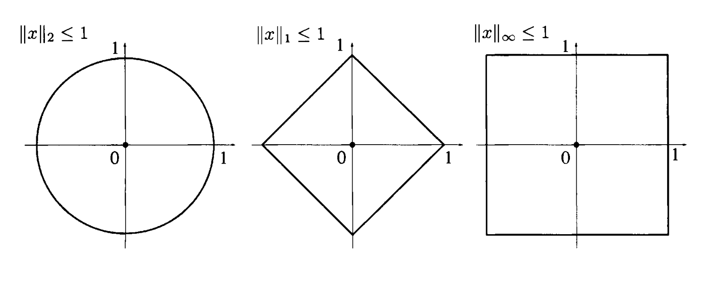
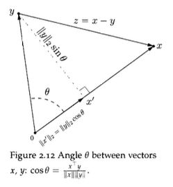
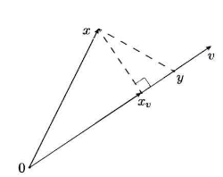
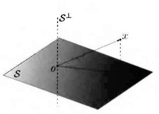
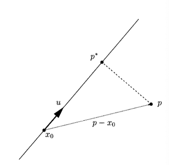

# Chapter 2. Vector and functions

## Vectors

-   **Vectors as collections of numbers**

-   **Vector spaces**

    -   **Sum and scalar multiplication of vectors**
    -   **Subspaces and span.**
    -   **Direct sum**
    -   **Independence, bases, and dimensions.**
    -   **Affine sets.**$\mathcal{A}=\left\{x \in \mathcal{X}: x=v+x^{(0)}, v \in \mathcal{V}\right\}$,
        -   $x^{(0)}$ is a given point and $\mathcal{V}$ is a given subspace of $\mathcal{X}$.

-   **Norms and** $\ell$-p norms

    -   Norm means: A function from $\mathcal{X}$ to $\mathbb{R}$ is a norm, if

        -   $\|x\| \geq 0 \forall x \in \mathcal{X}$, and $\|x\|=0$ if and only if $x=0$;
        -   $\|x+y\| \leq\|x\|+\|y\|$, for any $x, y \in \mathcal{X}$ (triangle inequality);
        -   $\|\alpha x\|=|\alpha|\|x\|$, for any scalar $\alpha$ and any $x \in \mathcal{X}$.

    -   $\ell$-p norm means $\|x\|_p \doteq\left(\sum_{k=1}^n\left|x_k\right|^p\right)^{1 / p}, \quad 1 \leq p<\infty$

    -   Norm balls: $\mathcal{B}_p=\left\{x \in \mathbb{R}^n:\|x\|_p \leq 1\right\}$

    

-   Inner product

    -   Inner product: on a (real) vector space $\mathcal{X}$ is a real-valued func maps any pair of elems $x, y \in \mathcal{X}$ to scalar, denoted as $\langle x, y\rangle$. Satisfying
        -   $\begin{aligned} & \langle x, x\rangle \geq 0 ; \\ & \langle x, x\rangle=0 \text { if and only if } x=0 ; \\ & \langle x+y, z\rangle=\langle x, z\rangle+\langle y, z\rangle \\ & \langle\alpha x, y\rangle=\alpha\langle x, y\rangle \\ & \langle x, y\rangle=\langle y, x\rangle .\end{aligned}$
    -   Some implementations
        -   standard inner product: $\langle x, y\rangle=x^{\top} y=\sum_{k=1}^n x_k y_k$ in $\R^n$

-   Norm: $\sqrt{\langle x, x\rangle}$

    -   Denote as $\|x\|=\sqrt{\langle x, x\rangle}=\|x\|_2$.
    -   可以把$\sum x_iy_i$写成内积的形式, 就是$\vec x^T\vec y$
    -   期望值: $p^Tx$

-   Angles: $\cos \theta=\frac{x^{\top} y}{\|x\|_2\|y\|_2}$.

-   Cauchy-Schwartz: $\left|x^{\top} y\right| \leq\|x\|_2\|y\|_2$
    -   More generally: $\left|x^{\top} y\right| \leq \sum_{k=1}^n\left|x_k y_k\right| \leq\|x\|_p\|y\|_q$.
-   max of inner prod over norm balls: nonzero vector $y \in \mathbb{R}^n$, find some vec $x \in \mathcal{B}_p$ maximizes $x^{\top} y$.
    -   i.e. $\max _{\|x\|_p \leq 1} x^{\top} y$.
    -   dim=2, parallel, $x_2^*=\frac{y}{\|y\|_2}$,
    -   inf dim: make everyone positive(remember $x^{\top} y=\sum_{i=1}^n x_i y_i$ and $|x_i|\leq 1$) : $x_{\infty}^*=\operatorname{sgn}(y)$,
    -   dim=1, $x^{\top} y=\sum_{i=1}^n x_i y_i$, and $\sum x_i=1$, hence $\left[x_1^*\right]_i=\left\{\begin{array}{ll}\operatorname{sgn}\left(y_i\right) & \text { if } i=m \\ 0 & \text { otherwise }\end{array} . \quad i=1, \ldots, n\right.$.

## **Orthogonality**

-   **Orthogonal**: \$x, y\in \mathcal X\$, has $\langle x,y\rangle=0$.
    -   Prop. Mutually orthogonal vectors are linearly independent
    -   **Orthonormal vectors**. $S=\left\{x^{(1)}, \ldots, x^{(d)}\right\}$, $\left\langle x^{(i)}, x^{(j)}\right\rangle= \begin{cases}0 & \text { if } i \neq j \\ 1 & \text { if } i=j .\end{cases}$
-   **Orthogonal complement**.A vector $x \in \mathcal{X}$ is orthogonal to a subset $\mathcal{S}$ of an inner product space $\mathcal{X}$ if $x \perp s$ **for all** $s \in \mathcal{S}$. The set of vectors in $\mathcal{X}$ that are orthogonal to $\mathcal{S}$ is called the orthogonal complement of $\mathcal{S}$, and it is denoted by $\mathcal{S}^{\perp}$
-   direct sum of 2 vs. said to be the direct sum of two subspaces $A, B$ if any element $x \in \mathcal{X}$ can be written in a unique way as $x=a+b$, with $a \in A$ and $b \in B$;
    -   $\mathcal{X}=\mathcal{S} \oplus \mathcal{S}^{\perp} \quad$ for any subspace $\mathcal{S} \subseteq \mathcal{X}$.
-   Basic prop of inner prod space
    -   $|\langle x, z\rangle| \leq\|x\|\|z\|$, and equality holds iff $x=\alpha z$, or $z=0$ (Cauchy Schwartz);
    -   $\|x+z\|^2+\|x-z\|^2=2\|x\|^2+2\|z\|^2$ (parallelogram law);
    -   if $x \perp z$, then $\|x+z\|^2=\|x\|^2+\|z\|^2$ (Pythagoras theorem);
    -   for any subspace $S \subseteq \mathcal{X}$ it holds that $\mathcal{X}=S \oplus S^{\perp}$;
    -   for any subspace $S \subseteq \mathcal{X}$ it holds that $\operatorname{dim} \mathcal{X}=\operatorname{dim} S+\operatorname{dim} S^{\perp}$.

## Projection onto subspaces

Assume

-   vector $x$ in an inner product space $\mathcal X$
-   projection of $x$ onto $S$:=$\Pi_{\mathcal{S}}(x)$
    -   $\Pi_{\mathcal{S}}(x)=\arg \min _{y \in \mathcal{S}}\|y-x\|$,

Projection onto 1D subspace: $\alpha=\frac{\langle v, x\rangle}{\|v\|^2}$

Projection onto an arbitrary subspace

-   Projection Theorem:
    -   $\mathcal{X}$ be an inner product space
    -   $\mathcal{S}$ be a subspace of $\mathcal{X}$
    -   exists unique vector $x^* \in \mathcal{S}$ s.t. $\min _{y \in \mathcal{S}}\|y-x\|$.
    -   the necessary and sufficient one: $x^* \in \mathcal{S}, \quad\left(x-x^*\right) \perp \mathcal{S}$.
-   Proof
    -   for arbitary $x \in \mathcal{X}^{}$, we have $x=u+z, u \in \mathcal{S}, z \in \mathcal{S}^{\perp}$.

    -   $\|y-x\|^2=\|(y-u)-z\|^2=\|y-u\|^2+\|z\|^2-2\langle y-u, z\rangle$.

    -   $\|y-x\|^2=\|y-u\|^2+\|z\|^2$.

    -   

        
-   Projection to affine set
    -   $\mathcal{X}$ be an inner product space
    -   $x$ be a given element in $\mathcal{X}$
    -   $\mathcal{S}$ be a subspace of $\mathcal{X}$​.
    -   let $\mathcal{A}=x^{(0)}+\mathcal{S}$ be the affine set by a given vector $x^{(0)}$.
    -   exists a unique vector $x^* \in \mathcal{A}$ s.t. solves $\min _{y \in \mathcal{S}}\|y-x\|$, ans $x^* \in \mathcal{A}, \quad\left(x-x^*\right) \perp \mathcal{A}$.

**projection of a point onto a line**

-   setup
    -   $p \in \mathbb{R}^n$ is a given point
    -   compute the Euclidean projection $p^*$ id $p$ onto a line $L=\left\{x_0+\operatorname{span}(u)\right\}$,
        -   $u$ is a unit vector
-   Formulation: $p^*=\arg \min _{x \in L}\|x-p\|_2$.
-   Solution
    -   any point $x \in L$ can be written as $x=x_0+v$
    -   for some $v \in$$\operatorname{span}(u)$
    -   finding a value $v^*$ for $v$ , s.t. $v^*=\arg \min _{v \in \operatorname{span}(u)}\left\|v-\left(p-x_0\right)\right\|_2$.(找到最短的投影直线)
    -   根据定理有$\left(z-v^*\right) \perp u$, i.e., $\left\langle\left(z-v^*\right), u\right\rangle=0$的时候最优
    -   由于$v^*=\lambda^* u$, $u^{\top} u=\|u\|_2^2=1$
        -   $u^{\top} z-u^{\top} v^*=0 \Leftrightarrow u^{\top} z-\lambda^*=0 \Leftrightarrow \lambda^*=u^{\top} z=u^{\top}\left(p-x_0\right)$.
        -   $p^*=x_0+v^*=x_0+\lambda^* u=x_0+u^{\top}\left(p-x_0\right) u$,
    -   distance is $\left\|p-p^*\right\|_2^2=\left\|p-x_0\right\|_2^2-\lambda^{* 2}=\left\|p-x_0\right\|_2^2-\left(u^{\top}\left(p-x_0\right)\right)^2$.

**Euclidean projection of a point onto an hyperplane**

-   Setup
    -   Defn. Hyperplane is an affine set $H=\left\{z \in \mathbb{R}^n: a^{\top} z=b\right\}$, $a \neq 0$, normal direction
        -   $z_1, z_2 \in H$ it holds that $\left(z_1-z_2\right) \perp a$
    -   a point $p \in \mathbb{R}^n$, Euclidean proj $p^*$ of $p$ onto $H$​.
-   Solution
    -   $\left(p-p^*\right) \perp H \iff$ $p-p^*=\alpha a$, for some $\alpha \in \mathbb{R}$. (垂直于同一个平面的平行)
    -   $p^* \in H$, thus $a^{\top} p^*=b$, multiply by $A^T$, getting $a^{\top} p-b=\alpha\|a\|_2^2$,
    -   $\alpha=\frac{a^{\top} p-b}{\|a\|_2^2}$
    -   $p^*=p-\frac{a^{\top} p-b}{\|a\|_2^2} a$. and $\left\|p-p^*\right\|_2=|\alpha| \cdot\|a\|_2=\frac{\left|a^{\top} p-b\right|}{\|a\|_2}$.

**Projection on a vector span**

-   Setup
    -   a basis for a subspace $\mathcal{S} \subseteq \mathcal{X}$, $\mathcal{S}=\operatorname{span}\left(x^{(1)}, \ldots, x^{(d)}\right)$
    -   a vector $x \in \mathcal{X}$
-   Solve
    -   unique projection $x^*$ of $x$ onto $\mathcal{S}$ is characterized by the orthogonality condition $\left(x-x^*\right) \perp \mathcal{S}$.
    -   $x^*=\sum_{i=1}^d \alpha_i x^{(i)}$
    -   $\left(x-x^*\right) \perp \mathcal{S} \Leftrightarrow\left\langle x-x^*, x^{(k)}\right\rangle=0, k=1, \ldots, d$
    -   a linear equation
    -   $\sum_{i=1}^d \alpha_i\left\langle x^{(k)}, x^{(i)}\right\rangle=\left\langle x^{(k)}, x\right\rangle, \quad k=1, \ldots, d$
-   **Projection onto the span of orthonormal vectors.**
    -   orthonormal basis: $x^*=\sum_{i=1}^d\left\langle x^{(i)}, x\right\rangle x^{(i)}$

Constructing orthnormal basis: Gram-Schmidt procedure
